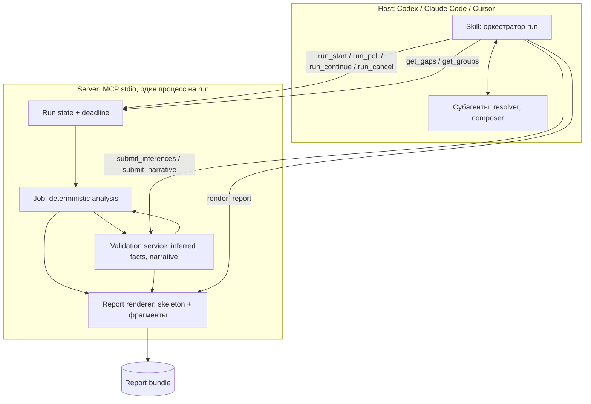
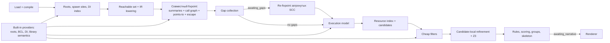

# Implementation Specification: Concurrency Hunter

| Поле | Значение |
|---|---|
| Статус | Второй драфт, пересмотрен по итогам interview 2026-09-12; основа для плана фаз |
| Дата | 2026-09-12 |
| Продуктовые требования | [PRD](PRD.md) |
| Словарь | [CONTEXT.md](../CONTEXT.md) |
| Решения | [ADR 0001](adr/0001-the-skill-drives-the-run.md), [ADR 0002](adr/0002-points-to-smt-and-a-normalized-ir-are-in-the-first-version.md), [ADR 0003](adr/0003-the-server-renders-the-report-and-the-ai-writes-only-narrative.md), [ADR 0004](adr/0004-z3-ships-inside-the-executable-and-degrades-to-unknown.md), корневой [ADR 0001](../../../docs/adr/0001-shared-code-lives-in-plugins-common.md) |

## 1. Назначение и статус

Спецификация описывает архитектуру, компоненты, алгоритмы, модели данных, plugin integration и подход к проверке текущей версии Concurrency Hunter для race/lost-update analysis. При противоречии с PRD приоритет имеет PRD; примеры не задают дополнительных продуктовых требований. Термины из словаря используются без переопределения; раздел 3 содержит только внутренние термины анализа, которых в словаре нет.


## 2. Архитектура



Внутри job:



### 2.1. Компоненты

| Компонент | Ответственность | Не отвечает за |
|---|---|---|
| Skill | Единственный оркестратор run: target, `run_start`, polling, interludes resolver и composer через субагентов host-а, `render_report`, возврат статуса и ссылки | Verdicts, валидация, рендер |
| Run State | Run id, deadline, фаза, checkpoints, учёт late responses, отмена | Анализ |
| Project Loader (`Common.Roslyn`) | MSBuild/Roslyn workspace, compilation boundary, coverage inventory | Анализ concurrency |
| Roslyn Frontend | Symbols/IOperation/CFG → normalized IR | Framework-specific verdicts |
| Reachability | Reachable set от roots и spawn sites по CHA-графу | Точный граф вызовов |
| Whole-program Fixpoint | Summaries, граф вызовов, points-to, escape, ownership в одном worklist | Попарное сравнение accesses |
| Semantic Gap Builder | Определение gap, модель unknown call по умолчанию, пакет на callee, materiality | Домыслы о semantics |
| Validation Service | Проверка inferred facts и narrative fragments; вызывается tool-handlers и, в будущем, server-driven режимом | Генерация narrative |
| Execution Model | Roots, instances, intervals, may-overlap, happens-before | Resource identity |
| Resource Index | Canonical buckets и candidate lookup | Expensive path proof |
| Protection Engine | Locksets, atomics, modes, compound operations | DB protection |
| Refinement Engine | Candidate-local context/alias/lock/path refinement, Z3 | Initial whole-program discovery |
| Finding Engine | Единая процедура conflict, классификация rule ID, scoring, fingerprint, группировка, event skeleton | Свободный narrative |
| Report Renderer | `findings.json`, skeleton `report.md`, вставка принятых фрагментов, `run-metadata.json` | Добавление фактов |
| Built-in Provider Registry | Root providers, BCL semantics, DI semantics, library semantics table | Runtime/user extensions |
| `metrics` | CLI-подкоманда для benchmark-прогонов, как у cache-detective | MCP tools |

### 2.2. Dependency direction

Core IR, fixpoint, execution model и rule engine не зависят от Roslyn object model за границей frontend, от host-а и от AI. Root providers преобразуют framework-specific discovery в канонический `ExecutionRootDescriptor`; downstream engines не знают источник root. Skill никогда не получает граф: только пакеты, дайджесты и статус, каждый ответ ≤ 8 КБ с paging из `Common.Mcp`. AI-ответы попадают в анализ только через Validation Service; tool-handlers `submit_*` это тонкие обёртки над ним, чтобы будущий server-driven режим по ADR 0001 шёл тем же путём. Safety suppression разрешает только deterministic evidence. Report Renderer получает immutable structured results; narrative не может изменить verdict физически.

### 2.3. Основные технические решения

- Roslyn как frontend; собственный normalized SSA-like IR отделяет core от compiler API.
- Compositional method summaries; граф вызовов, points-to и escape считаются одним совместным fixpoint по SCC.
- Lowering и анализ только reachable set; все проекты компилируются один раз.
- Field-sensitive allocation-site points-to с ограниченной hybrid context sensitivity и ownership/escape выполняются до candidate pairing; доказанно unshared regions исключаются рано.
- Дешёвые фильтры и resource index предшествуют дорогому candidate-local refinement; глобальное декартово сравнение не используется.
- Execution model описывает logical instances и spawn/join intervals независимо от OS threads.
- Защита определяется identity и operation semantics; Z3 это budgeted last-mile refinement с деградацией в `Unknown`.
- AI работает через bounded packets и validated facts; сервер ничего не запускает сам.
- Сервер рендерит отчёт; AI дописывает narrative групп.
- Кэша анализа нет; каждый run это clean full scan.
- Persistence-вызовы остаются opaque calls; DB identity, rules и protection model не добавляются.

## 3. Внутренние термины

Термины run, skill, server, deadline, late response, terminal status, execution root, spawn site, execution instance, fire-and-forget, reachable set, heap region, access path, resource, ownership, access, candidate, finding, protection, semantic gap, gap packet, inferred fact, materiality, coverage, finding group, skeleton, narrative, report bundle, suppression определены в словаре. Ниже только внутренние.

| Термин | Определение |
|---|---|
| Root provider | Встроенное расширение, обнаруживающее roots конкретного framework и выдающее core канонические descriptors, multiplicity и evidence. |
| Execution interval | Отрезок от старта execution instance до его завершения или неизвестности; единица отношений ниже. |
| MayOverlap | Консервативное отношение: два интервала могут существовать одновременно в одном процессе. |
| Happens-before | Доказанный порядок, исключающий одновременность конкретных accesses. |
| Protection set | Набор identity синхронизаторов и modes, must-held во время access. |
| Method summary | Компактное symbolic описание эффектов метода, инстанцируемое на call site без повторного анализа тела. |
| ContextKey | Ключ инстанциации summary: абстрактный receiver для instance methods, непосредственный call site для static methods. |
| ElementSelector | Представление индекса или ключа: `Exact`, `ExpressionOrRange`, `Unknown`. |
| Unknown-call model | Консервативная модель вызова без семантики: читает всё достижимое из receiver и аргументов, захватывает делегаты, аргументы escape в `Unknown`, запись это `UnknownEffect`. |
| Round | Один проход resolver по очереди пакетов; round 2 обрабатывает только gaps, порождённые принятыми фактами round 1. |
| Checkpoint | Состояние job, в котором он ждёт skill: `awaiting_gaps`, `awaiting_narrative`. |

## 4. Компоненты анализа и внутренние контракты

### 4.1. Загрузка и границы программы

**TD-005.** Project loading использует design-time build и MSBuild evaluation в той же trust boundary, что и обычная сборка repository, через `Common.Roslyn`. Analyzer не запускает application assemblies и не инициирует restore/network activity.

**TD-006.** Один run обслуживается одним конечным server process. После terminal status не остаётся daemon, watcher или фоновой работы.

**TD-007.** Analyzer executable это внутренняя деталь plugin package: не устанавливается как global command, не имеет поддерживаемого headless entry point кроме `metrics` для benchmark, принимает запуск только через launcher плагина.

Поддерживаемые target frameworks анализируемых проектов:

| Target framework | Стабильная версия C# по умолчанию |
|---|---|
| .NET 8 (`net8.0`) | C# 12 |
| .NET 9 (`net9.0`) | C# 13 |
| .NET 10 (`net10.0`) | C# 14 |

Preview frameworks, language features и SDK не входят в matrix. Multi-targeted project анализируется по одному target framework, самому новому из поддерживаемых; выбор записывается в coverage. Runtime самого сервера net10.0, как у cache-detective.

**TD-008.** Reachable set строится от execution roots и spawn callbacks по class-hierarchy графу вызовов до lowering; в IR lowering-ятся только его тела. Coverage считает bodies относительно reachable set и отдельно называет число тел вне него.

### 4.2. Roslyn frontend и normalized IR

**TD-010.** Frontend использует Roslyn symbols, `IOperation`, control-flow graph и data-flow facts и не передаёт Roslyn-specific objects за границу frontend layer; граница это IR и method summary.

**TD-011.** Каждое тело reachable set преобразуется в SSA-подобный normalized IR с explicit basic blocks, branches, exceptional exits и source provenance.

**TD-012.** IR представляет как минимум: parameter/receiver/local/temporary values; allocation и assignment; field/property/array/collection load и store; read-modify-write dependency; direct, virtual, interface, delegate и local-function calls; return, capture и escape; spawn, join, await/order edges; acquire/release и synchronization modes; atomic operations; branch predicates и path condition references; unknown/opaque effects.

**TD-013.** Frontend сохраняет source span, containing symbol, syntax kind и transformation provenance для каждой IR operation, используемой в finding.

**TD-014.** `x++`, `x += y`, property getter-compute-setter и разнесённый по CFG read/compute/write нормализуются в dependency, позволяющую классифицировать non-atomic RMW.

**TD-015.** `async`/`await`, iterator и compiler-generated state machine анализируются на уровне исходной семантики по CFG исходного тела; детали lowering не создают ложные heap resources или execution roots. `await` это order edge внутри одного execution instance.

### 4.3. Compositional method summaries

**TD-020.** Для каждого метода reachable set вычисляется summary, переиспользуемое во всех call sites.

**TD-021.** Summary содержит: symbolic heap accesses относительно `this`, arguments, statics, allocation sites и return value; operation kind и value dependency для RMW; escapes/captures/returns; points-to transfer facts; synchronization events и protection sets; spawn/join/order events; path predicates эффектов; resolved и unresolved callees; unknown effects с причинами; source/evidence provenance; `InputHash` и `DependencyHash`.

**TD-022.** На call site symbolic resources summary инстанцируются фактическими receiver/arguments и их points-to sets. Общий symbolic summary переиспользуется; context-specific instantiations различаются по `(MethodId, ContextKey)`.

**TD-023.** Рекурсивные SCC анализируются до fixpoint с документированным widening и termination budget на SCC.

**TD-024.** Summary schema versioned. Хэши входов и зависимостей вычисляются с первой версии, хотя в v1 не хранятся между runs; это условие будущего кэша по PRD 8.

**TD-025.** Для metadata-only метода без source применяется built-in semantics provider, таблица семантики библиотек или unknown-call model. Неизвестный метод не считается no-op.

### 4.4. Совместный fixpoint, граф вызовов и semantic gaps

**TD-030.** Граф вызовов поддерживает direct calls, constructors, virtual/interface dispatch, delegates, lambdas, local functions и recognized reflection-free factory patterns.

**TD-031.** Virtual/interface target set сужается type constraints, reachability, points-to facts и DI registrations/lifetimes из built-in providers внутри того же fixpoint, что points-to.

**TD-032.** Для каждого target хранится причина включения: exact symbol, override set, points-to type, DI binding, delegate assignment, built-in semantics provider, inferred fact или fallback unknown.

**TD-033.** Expensive refinement запускается только для targets, влияющих на candidate, либо для построения evidence path.

**TD-034.** Вызов без семантики получает unknown-call model. Semantic gap создаётся только когда такой вызов получает receiver или аргумент, указывающий на изменяемый регион с ownership не `Owned`, либо делегат, либо его результат сохраняется в разделяемый регион. Вызов только с примитивами и строками gap не создаёт. Reflection, `dynamic` и unresolved dispatch подчиняются тому же условию. Неограниченное соединение неизвестного вызова со всеми методами solution не допускается.

**TD-034a.** Таблица семантики библиотек: встроенный список методов BCL и популярных пакетов с эффектами по аргументам (`reads-deep`, `writes-arg:n`, `captures-delegate:n`, `returns-arg:n`, `pure`, `spawns`), привязанный к exact symbol и version range по TD-122. Первый состав: `System.*` по аннотациям immutability и чистоты, `Microsoft.Extensions.Logging`, `System.Text.Json`, `Newtonsoft.Json`, `HttpClient`, EF Core `DbContext`/`DbSet` как opaque persistence, MediatR, AutoMapper, FluentValidation, Polly. Метод из таблицы gap не создаёт.

**TD-035.** Gap packet создаётся один на callee symbol независимо от числа call sites и содержит: сигнатуру и метаданные callee, обрезанную XML-документацию, до трёх сниппетов call sites, points-to типы receiver и аргументов, deterministic constraints, допустимые виды гипотез, unknown reason code, materiality и evidence ids. Размер пакета ограничен константой сервера, ориентир 1,5 КБ.

**TD-036.** Resolver возвращает schema-constrained hypotheses: possible call targets, reads/writes/RMW по аргументам, captures/escapes, spawn/callback behavior, returned aliases и supporting evidence references из пакета. Ответ без evidence references или с invented symbol/location отклоняется.

**TD-037.** Validation Service проверяет гипотезы против compilation symbols, type compatibility, accessible methods, видимых CFG/data-flow фактов и hard facts built-in providers. Принятый факт получает `AI-Inferred` provenance и validation status; отклонённый не влияет на analysis и записан с причиной.

**TD-038.** Принятый inferred fact может расширить граф вызовов, summary, escape propagation и candidate set через повторный fixpoint затронутых SCC. Он не может удалить deterministic edge/effect или доказать synchronization/happens-before safety.

**TD-039.** Неразрешённый gap остаётся bounded `Unknown` и перечисляется в coverage с materiality; finding, чей путь его пересекает, получает uncertainty и штраф к component score. Gap не меняет terminal status. Analyzer не придумывает target/effect ради завершения pipeline.

**TD-039a.** Materiality gap это ранг по числу roots и разделяемых регионов, до которых callee дотягивается через receiver/аргументы, и по числу call sites. Очередь пакетов и секция coverage упорядочены по нему.

### 4.5. Field-sensitive allocation-site points-to

**TD-040.** Heap abstraction идентифицирует объекты по allocation site с ограниченным контекстом создания, static storage, modeled DI instance, symbolic parameter/receiver и bounded summary region. DI lifetime это свидетельство для `DiInstance`-региона и его ownership, а не замена points-to.

**TD-041.** Points-to field-sensitive: `H1.Left.Value` и `H1.Right.Value` не считаются одним resource без alias/summary evidence. Один объект в двух полях, `_a = _b`, даёт один регион и один resource для одинаковых путей от него.

**TD-042.** Access path depth ограничен константой сервера; при превышении путь сворачивается в wildcard region с явной потерей precision.

**TD-043.** Индексы arrays/spans и keys collections представлены `ElementSelector`: `Exact` для доказанно известного типизированного значения; `ExpressionOrRange` для простого символического выражения или консервативного диапазона с guards, где переменные связаны с canonical value identities и контекстом, а не с текстом имени; `Unknown` для wildcard. Неподдержанное выражение или превышение complexity budget расширяет selector до безопасного диапазона либо `Unknown`. Различие selectors доказывает только различие ячеек при доказанно непересекающихся значениях; объекты в разных ячейках всё ещё могут alias. Для spans/slices сравнение использует underlying region и offset. Numeric types, conversions и overflow моделируются в solver через `QF_BV`; без solver algebraic simplification не используется как доказательство. Equality keys определяется фактическим comparer коллекции; неизвестный или custom comparer это `Unknown` equality. Дешёвые сравнения constants/ranges выполняются до solver.

**TD-044.** Hybrid context sensitivity: для instance methods context это абстрактный receiver (`receiver-object sensitivity`) через allocation/DI region; для static methods непосредственный call site (`1-call-site sensitivity`); для fresh allocations из factory summary call site входит в allocation context, у instance factory сохраняется связь с receiver; возвращаемый существующий alias, static object или DI singleton сохраняет исходную identity. Базовый проход использует эти контексты; более глубокое различение выполняется только для оставшихся candidates по TD-033. Число контекстов на метод, глубина refinement и widening ограничены константами сервера, значения выбираются на demo и eShop в фазе 2. При объединении контекстов сохраняется консервативное объединение may-targets, aliases и effects; потеря precision видна в uncertainty; must-held protection и ordering остаются доказанными для всех охваченных executions. Разный `ContextKey` не доказывает разные объекты.

**TD-045.** Lock identity использует тот же points-to mechanism, что и data resource identity.

### 4.6. Ownership и escape analysis

**TD-050.** Каждая heap region получает `Owned`, `ThreadConfined`, `Escaped`, `Shared` или `Unknown` с evidence chain.

**TD-051.** Объект `ThreadConfined`, если создан внутри execution instance, не возвращается, не сохраняется в shared/static/escaped object, не передаётся неизвестному capturing call и не захватывается конкурирующим spawn.

**TD-052.** Escape propagation учитывает field assignment, return, ref/out, closure capture, task/thread capture, delegate storage, collection insertion, static assignment, передачу в channel и opaque calls.

**TD-053.** Регион, захваченный двумя may-overlap instances или доступный из singleton/static root и многократно вызываемого root, классифицируется `Shared` при отсутствии более точного доказательства.

**TD-054.** Conflicts над двумя доказанно разными owned regions не становятся candidates даже при одинаковом type/field.

**TD-055.** `Unknown` ownership не трактуется как thread confined; uncertainty влияет на confidence и coverage.

### 4.7. Execution и concurrency model

**TD-060.** Core оперирует execution instances/intervals и отношениями `MayOverlap`/`HappensBefore`.

**TD-061.** BCL provider обнаруживает callbacks `System.Threading.Timer` и `System.Timers.Timer.Elapsed` по exact symbols. Descriptor сохраняет callback target, timer identity, `state`, captured aliases и evidence. Multiplicity учитывает доказанно отключённый timer, однократную активацию, периодические запуски и повторную активацию через `Change`; периодические callbacks одного timer могут overlap друг с другом; `Change` и `Dispose()` не создают completion edge; успешно завершённый `await DisposeAsync()` либо подтверждённое `Dispose(WaitHandle)` дают edge только для доказанно того же timer и завершившихся invocations, не для отделившейся async работы.

**TD-061a.** `PeriodicTimer` не создаёт root: цикл `WaitForNextTickAsync` это часть execution instance, в котором он ждёт; итерации не overlap друг с другом и overlap с другими roots.

**TD-062.** HTTP invocations, включая gRPC, потенциально concurrent друг с другом внутри процесса. Sharing зависит от DI lifetime/escape/resource identity.

**TD-063.** Core получает framework roots только через `IExecutionRootProvider`; контракт в разделе 11.

**TD-064.** Один `BackgroundService.ExecuteAsync` на одном доказанном instance не размножается автоматически; overlap с HTTP, другими hosted services и своими spawns.

**TD-065.** Spawn sites BCL: `Task.Run`, `Task.Factory.StartNew`, `ContinueWith`, `ThreadPool.QueueUserWorkItem`/`UnsafeQueueUserWorkItem`, `Thread.Start`, тело `Parallel.For`/`ForEach`/`ForEachAsync`, fire-and-forget task, вызов `async void`. Для каждого моделируется interval от spawn до completion с overlap с parent segment до доказанного join и с другими roots. Fire-and-forget и `async void` не имеют join. Handle, сохранённый и awaited где-то ещё, это spawn с join по identity handle.

**TD-066.** `Task.WhenAll`: lifetimes аргументов могут overlap; continuation после успешного join имеет happens-before от completion всех tasks; синхронные части до фактического старта task не считаются параллельными.

**TD-067.** `Thread.Join`, awaited task completion, `Wait`, `WhenAll` создают happens-before только при доказанной identity handle. `WhenAny` не создаёт join для не завершившихся tasks.

**TD-068.** Iterations `Parallel.*` may-overlap; loop index/partition predicates передаются resource/path analysis.

**TD-069.** Exception/cancellation paths: join или release, который может быть пропущен, не считается безусловным.

### 4.8. Resource identity и conflict semantics

**TD-070.** Heap resource имеет форму `(HeapRegion, AccessPath, ElementSelector?)` и стабильное identity независимо от имени переменной. Element storage и структура коллекции моделируются отдельно: доказанно разные keys не устраняют конфликт concurrent mutations обычного `Dictionary`, затрагивающих structural resource.

**TD-071.** Access kinds: `Read`, `Write`, `ReadModifyWrite`, `AtomicRead`, `AtomicWrite`, `AtomicReadModifyWrite`, `CompoundOperation`, `UnknownEffect`.

**TD-072.** Два accesses конфликтуют, если may refer to overlapping resource, могут overlap, минимум один non-atomic write/RMW, не упорядочены happens-before и не имеют общей достаточной защиты.

**TD-073.** Lost-update требует data dependency от предшествующего read к последующему non-atomic write и конкурирующего write/RMW.

**TD-074.** Read/read пары не conflicts.

**TD-075.** Candidate index группирует accesses по canonical region/path prefix и execution compatibility; `Unknown` selectors сопоставляются со всеми потенциально пересекающимися selectors того же resource. Full Cartesian comparison запрещён.

**TD-076.** Deduplication объединяет одинаковую root/resource/call-path cause в одну finding group с representative locations и occurrence count.

### 4.9. In-memory synchronization semantics

**TD-080.** Моделируются `lock`, `Monitor.Enter/Exit/TryEnter` с lexical/CFG region, `try/finally` и условным успехом `TryEnter` как guard; `System.Threading.Lock.EnterScope` как та же семантика.

**TD-081.** Два accesses mutually excluded только если оба под совместимыми modes одного may-must-alias synchronization object и acquisition доказан на всех путях к каждому.

**TD-082.** `Interlocked.*`, `Volatile.*` и `volatile` fields помечают операцию `Atomic*` на одной location; RMW из volatile read и write не атомарен.

**TD-083.** `SemaphoreSlim` это mutex только при capacity, доказанной константой `1` в конструкторе того же региона, и паре `Wait`/`WaitAsync` и `Release` на всех путях, включая `finally`; иначе `partial`. `Mutex` моделируется как `lock` без межпроцессной семантики. `ReaderWriterLockSlim`: read совместим с read, write и upgradeable несовместимы со всем кроме себя по правилам класса.

**TD-085.** Thread-safe collection моделируется по операциям из таблицы: `GetOrAdd`/`AddOrUpdate`/`TryUpdate` атомарны по slot, `ContainsKey` + indexer, `Count` + `Add`, enumerate + mutate это compound candidates при overlap.

**TD-086.** Новая synchronization semantics добавляется built-in реализацией provider interface и проходит contract validation. Неизвестный тип с методами `Lock/Unlock`, `AsyncLock` и подобные не считаются защитой. `Channel<T>` переводит переданный объект в `Escaped`; event-based ожидания не создают happens-before.

### 4.10. Path conditions и solver

**TD-090.** IR сохраняет bounded path predicates для branch, null/type tests, enum/boolean equality, numeric comparisons, switch cases и index/key expressions.

**TD-091.** Solver запускается только после candidate indexing, ownership, overlap, operation и protection filters.

**TD-092.** Query проверяет satisfiability совместности guard A, guard B и selector equality/overlap; передаются только candidate-relevant expressions, predicates и value dependencies. Значения из независимых execution instances получают отдельные symbolic bindings. `a[0]` и `a[1]` отсекаются без solver; для `a[i]` и `a[j]` проверяется `i == j` вместе с guards в `QF_BV` ширины типа.

**TD-093.** `UNSAT` подавляет candidate с diagnostic trace; `SAT` сохраняет минимальный model; `UNKNOWN`, timeout и недоступный solver не означают safe и снижают confidence.

**TD-094.** Solver это Z3 через `Microsoft.Z3`, теория `QF_BV` и `QF_UF`, без строк и массивов. Лимит 150 мс на query и не более 10% deadline суммарно, константы сервера. Порядок candidates стабилен: по ожидаемому score, чтобы budget тратился там, где меняет verdict. Если нативная библиотека не загрузилась, все queries `Unknown`, coverage сообщает об этом, run продолжается. См. ADR 0004.

**TD-095.** Неподдержанные predicates абстрагируются консервативно и перечисляются в uncertainty.

### 4.11. Finding generation, evidence, suppressions

**TD-101.** Finding содержит: rule, severity, confidence label/score, `EvidenceMode`, canonical resource, access A/B, execution root/branch A/B, ordered code flows, alias evidence, concurrency evidence, protection analysis с `result`, path feasibility, AI contributions, uncertainty, event skeleton и fingerprint. Сервер сохраняет structured findings для всех confidence levels с пометкой generated origin.

**TD-102.** Core формирует deterministic event skeleton `A reads v0 → B reads/writes → A writes f(v0) → update lost`. Narrative объясняет его и не добавляет events.

**TD-103.** Confidence 0–100 только для ranking. Rubric: resource identity/alias 25, MayOverlap 20, conflicting operation/RMW 20, protection analysis 20, path feasibility 15. Labels `High` 80–100, `Medium` 55–79, `Low` 0–54. Unresolved target, wildcard region, opaque effect, solver unknown, неразрешённый gap на пути и incomplete built-in coverage уменьшают соответствующий component и перечисляются. Protection result `partial` или `different-identity` повышает protection component: кто-то уже считал ресурс разделяемым.

**TD-104.** Suppressions. Локальная: атрибут с простым именем `ConcurrencyHunterSuppress` на методе или типе, где лежит access A или B; аргументы rule ID, `Reason` обязателен, `Owner` и `Expiry` необязательны; класс атрибута пользователь объявляет сам. Repository-wide: `.concurrency-hunter/suppressions.json` в корне репозитория, записи `{ fingerprint, reason, owner?, expiry? }`. Сервер сопоставляет и проверяет expiry на каждом run до передачи групп composer-у. Просроченная или невалидная запись не скрывает finding и видна в диагностике. Suppression меняет только reportability; findings/evidence сохраняются; suppressed summary содержит finding id, источник, reason, owner/expiry.

**TD-106.** Fingerprint устойчив к сдвигу строк и включает rule, containing symbols, canonical resource shape, execution roots, operation roles, protection result kind и operation kind.

**TD-108.** Self-reported AI confidence не добавляет баллы. Name-based или слабо подтверждённая inference ограничивает finding уровнем `Medium`; `High` только при exact symbol/type/source/config подтверждении всех необходимых inferred facts и отсутствии неразрешённого gap на пути.

**TD-109.** Fingerprint AI-assisted finding включает hypothesis kind и deterministic anchors, не текст ответа.

### 4.12. Хэши без кэша

**TD-110.** В v1 результаты анализа между runs не хранятся; каждый run это clean full scan. Summaries, points-to и candidate artifacts несут `InputHash` и `DependencyHash` по TD-021 и TD-024; они пишутся в `run-metadata.json` как диагностика и являются условием будущего кэша по PRD 8.

**TD-111.** Кэш inferred facts ключуется по payload hash пакета, provider/model identity, prompt/schema version и engine/provider version; hit не освобождает ответ от валидации. Хранится в artifact directory плагина.

### 4.13. Built-in providers

**TD-120.** Provider contracts описывают: execution root и invocation multiplicity; spawn/join/ordering semantics; DI registration и lifetime; synchronization/atomic operation semantics; callback/delegate capture; ownership transfer и immutability; opaque external effects и таблицу семантики библиотек; supported package/version range.

**TD-121.** Built-in implementations v1: BCL semantics provider для tasks, threads, parallel, timers, `PeriodicTimer`, spawn sites TD-065 и примитивов раздела 4.9; DI semantics provider для `Microsoft.Extensions.DependencyInjection` и hosting abstractions; `AspNetCoreRootProvider` для controllers, minimal APIs и gRPC service methods; `HostingRootProvider` для `BackgroundService`/`IHostedService`; library semantics table TD-034a.

**TD-122.** Built-in semantics resolution привязана к exact symbol identity и supported version range.

**TD-123.** Providers регистрируются в одном composition root и проходят общий contract-test harness; duplicate provider id, invalid version declaration или conflicting semantics ломают build/test либо startup self-check.

**TD-124.** Отсутствующая или out-of-range семантика видна в coverage.

**TD-125.** Новый root type добавляется одним классом `IExecutionRootProvider`, одной регистрацией и tests, без изменений IR, points-to, ownership, candidate, protection, finding или report engines.

**TD-126.** Root provider не создаёт findings и не назначает severity/confidence/status.

### 4.14. AI layer: две роли, один validating путь

**TD-130.** Две роли: `SemanticGapResolver` между fixpoint и execution model, обязательный при непустой очереди; `ReportComposer` после skeleton, обязательный для каждого complete run. Обе выполняются субагентами host-а по правилам skill. При пустой очереди resolver не вызывается; run metadata записывает `semanticResolverInvoked=false`, `semanticResolverSkipReason=NoSemanticGaps`.

**TD-131.** Resolver обрабатывает пакеты TD-035 по materiality; budget на число пакетов нет; round 2 только для gaps, порождённых принятыми фактами round 1; третьего round нет.

**TD-132.** Composer получает дайджесты групп в порядке High, Medium, Low и возвращает narrative группы и один executive summary. Narrative обязателен для High и Medium; Low получает его, если deadline позволяет, иначе skeleton с пометкой. Composer не может менять rule, severity, confidence, fingerprint, source paths, evidence mode или coverage.

**TD-133.** AI runtime это сессия host-а; модель и её identity записываются в evidence. Server-driven режим через vendor CLI отложен по ADR 0001 и должен войти через Validation Service.

**TD-135.** AI получает минимальные пакеты и дайджесты, не solution. Host, model, prompt version, schema version и payload hashes записываются в run metadata.

**TD-136.** Каждый submit проходит schema validation, evidence-reference validation и contradiction checks на сервере. Отклонённый фрагмент или гипотеза возвращается с причинами; один повтор на пакет или группу. Повторный отказ фиксируется; для High/Medium группы это `Incomplete`.

**TD-139.** Inferred synchronization, atomicity или happens-before не подавляют deterministic candidate.

**TD-140.** Deadline. После него `get_gaps`, `get_groups` и `run_continue` отвечают `deadlineExceeded`, `submit_*` записывают late response и не применяют. Skill не стартует новых субагентов и отменяет запущенные средствами host-а; сервер не полагается на это.

## 5. Data model

Логическая схема; представление это immutable records и compact tables.

```text
RunState
  RunId
  Target
  StartedAt
  Deadline
  Phase
  Checkpoint?: AwaitingGaps | AwaitingNarrative
  Round
  LateResponses[]
  Cancellation?

MethodId
  AssemblyIdentity
  MetadataName
  GenericInstantiationShape

HeapRegion
  Id
  Kind: AllocationSite | Static | Parameter | Receiver | DiInstance | Summary
  Type
  Origin
  ContextKey
  Ownership
  PrecisionFlags[]

AccessPath
  Segments: Field | PropertyBackingField | Element | Wildcard
  MaxDepthReached

ResourceId
  HeapRegionId
  AccessPath
  ElementSelector?

ElementSelector
  Kind: Exact | ExpressionOrRange | Unknown
  ValueType
  ConstantOrExpressionOrRange?
  ValueBindings[]
  EqualitySemanticsRef?
  GuardId?
  PrecisionFlags[]

AccessEffect
  ResourceExpression
  Kind
  ValueDependency?
  GuardId
  ProtectionSetId
  ExecutionIntervalId
  SourceLocation
  Provenance[]

Protection
  PrimitiveKind
  SynchronizerRegion
  Mode
  AcquireGuard
  MustHold

ExecutionInterval
  Kind: Root | Spawn
  RootOrSpawnSite
  Parent?
  StartEvent
  EndEvent?
  JoinHandle?
  Multiplicity
  ProcessScope

MethodSummary
  MethodId
  ContextKey
  AccessEffects[]
  Escapes[]
  PointsToTransfers[]
  Calls[]
  SpawnJoinEvents[]
  Guards[]
  UnknownEffects[]
  Provenance[]
  InputHash
  DependencyHash
  SchemaVersion

SemanticGapPacket
  GapId
  CalleeSymbol
  Kind: Reflection | Dynamic | UnresolvedDispatch | UnknownLibrary | ModelGap
  Materiality
  Round
  CallSites[<=3]
  SourceAndSymbolEvidence[]
  DeterministicConstraints[]
  CandidateTargets[]
  AllowedHypothesisKinds[]
  PayloadHash

AIInference
  InferenceId
  GapId
  Kind: Target | Read | Write | RMW | Capture | Escape | Spawn | ReturnAlias
  Hypothesis
  SupportingEvidenceIds[]
  ModelConfidence
  ValidationStatus: Accepted | Rejected | Late
  RejectionReasons[]
  ProviderModelPromptSchemaIdentity

FindingGroup
  GroupId
  RuleId
  Severity
  ConfidenceLabel
  ResourceId
  RootCauseKey
  FindingIds[]
  RepresentativeLocations[]
  OccurrenceCount
  NarrativeStatus: Required | Optional | Accepted | Rejected | Skipped

NarrativeFragment
  Target: GroupId | ExecutiveSummary
  Text
  CitedEvidenceIds[]
  Attempt
  ValidationStatus
  RejectionReasons[]
```

### 5.1. Invariants

- Source location всегда сопровождается symbol identity.
- `Atomic*` классифицируется только built-in семантикой, никогда по имени пользовательского метода.
- `Shared` относится к одному process scope.
- `MustHold=true` требуется для suppression через lock.
- Unknown facts сохраняют reason code и provenance.
- Все ID в fingerprint имеют versioned canonical serialization.
- `ExecutionRootDescriptor` не содержит framework-specific runtime objects.
- AI inference без существующих `SupportingEvidenceIds` или со статусом, отличным от `Accepted`, не попадает в граф, summary или finding.
- `AIInference.Kind` не содержит `SynchronizationProof`/`HappensBeforeProof`.
- Narrative fragment со статусом, отличным от `Accepted`, не попадает в `report.md`.
- Один resource, одна пара accesses, одна finding.

## 6. Flow одного run

**Job** это фоновая работа сервера между `run_start` и terminal status; skill опрашивает её через `run_poll`. **Interlude** это участок, где skill работает с AI host-а.

1. **Старт.** `run_start` разрешает target, создаёт run id и deadline, возвращает немедленно. Job загружает MSBuild workspace и компилирует все проекты один раз с общими metadata references. Это главный фиксированный расход времени.
2. **Roots и DI index.** Root providers находят roots, BCL provider находит spawn sites по exact symbols, DI provider собирает регистрации и lifetimes. Результаты дают seeds points-to: `DiInstance`-регионы и symbolic receivers roots.
3. **Reachable set и lowering.** От roots и spawn callbacks строится CHA-граф вызовов; lowering-ятся только достижимые тела, параллельно по методам.
4. **Совместный fixpoint.** Worklist по SCC снизу вверх: локальное summary, инстанциация callees, распространение points-to и escape, сужение dispatch, новые рёбра ставят затронутые SCC обратно. Widening и termination budget на SCC. Выход: summaries, points-to граф, ownership, граф вызовов с причинами рёбер, opaque calls с unknown-call model.
5. **Сбор gaps.** Таблица семантики библиотек снимает известные вызовы; остаток по TD-034 становится пакетами, один на callee, с materiality. Job в checkpoint `awaiting_gaps`; при нуле пакетов сразу шаг 8 с `NoSemanticGaps`.
6. **Interlude resolver.** Skill забирает `get_gaps` постранично, режет на батчи по несколько пакетов на субагента, запускает субагентов параллельно, насколько host позволяет, и приносит `submit_inferences`. Сервер валидирует, применяет принятое, возвращает причины отказов; один повтор на пакет. По концу очереди или deadline skill вызывает `run_continue`.
7. **Повторный fixpoint** только для SCC с затронутыми call sites и их зависимостей. Новые gaps от принятых фактов идут во второй round по шагам 5–6; после него остаток в coverage.
8. **Execution model.** Roots и spawn sites дают интервалы; join через identity handle даёт happens-before. Граф над roots и spawns, не над accesses.
9. **Index и кандидаты.** Accesses в buckets по region и path prefix; пары только внутри bucket, с хотя бы одной записью, совместимым process scope и may-overlap интервалами; дедупликация в группы. Дешёвые фильтры: read/read, disjoint константы, общий must-held lock, atomic пары.
10. **Candidate-local refinement.** Разделение receiver/allocation contexts, уточнение lock identity, guards, Z3 по TD-094 в порядке ожидаемого score.
11. **Rules и skeleton.** Классификация по разделу 7, scoring, fingerprints, suppressions, группировка, event skeleton. Сервер пишет `findings.json` и skeleton `report.md`: fallback-отчёт существует до первого AI-фрагмента. Checkpoint `awaiting_narrative`.
12. **Interlude composer.** Skill забирает `get_groups` в порядке High, Medium, Low, батчами по несколько групп на субагента, параллельно; `submit_narrative` на группу; один повтор. Executive summary после принятия всех обязательных групп.
13. **Финал.** `render_report` собирает bundle, фиксирует terminal status, timings, AI identities и late responses, возвращает статус, счётчики и ссылку.

Экономия токенов: агент никогда не получает путь целиком, только evidence ids; пакеты дедуплицированы по callee; контекст агента растёт как число gaps плюс число групп. Экономия времени: компиляция один раз, lowering только reachable set, один fixpoint, пары только внутри buckets, solver только для выживших в порядке пользы, skeleton до narrative.

## 7. Conflict decision procedure

```text
Conflict(A, B) =
    SameProcessScope(A, B)
    && MayResourcesOverlap(A.Resource, B.Resource)
    && MayExecutionOverlap(A.Interval, B.Interval)
    && OperationsConflict(A.Operation, B.Operation)
    && !OrderedByHappensBefore(A, B)
    && !ProtectedByCommonSufficientPrimitive(A, B)
    && PathPairIsNotUnsatisfiable(A.Guard, B.Guard)

LostUpdate(A, B) =
    Conflict(A, B)
    && (A.Operation == NonAtomicRMW || B.Operation == NonAtomicRMW)
    && StaleReadCanInfluenceLaterWrite(A, B)
```

Результат каждой проверки это `(True | False | Unknown, Evidence[])`. `False` подавляет candidate только там, где это безопасно по семантике проверки; `Unknown` переносится дальше и снижает confidence.

Классификация rule ID, одна на пару, в порядке приоритета:

| Условие | Rule ID |
|---|---|
| `LostUpdate` и обе операции `Atomic*` или `CompoundOperation` над modeled cell коллекции, последовательность зависит от результата первой | DCA1004 |
| `LostUpdate` | DCA1002 |
| `Conflict` и `protectionAnalysis.result` ∈ {`partial`, `different-identity`, `incompatible-mode`} | DCA1003 |
| `Conflict` | DCA1001 |

`protectionAnalysis.result` ∈ {`unprotected`, `partial`, `different-identity`, `incompatible-mode`, `sufficient`}; `sufficient` подавляет candidate.

## 8. Finding schema

### 8.1. Логическая схема

```json
{
  "schemaVersion": "2.0",
  "findingId": "stable-fingerprint",
  "groupId": "group-fingerprint",
  "ruleId": "DCA1002",
  "title": "Non-atomic update of shared Counter",
  "severity": "high",
  "evidenceMode": "deterministic",
  "confidence": {
    "label": "high",
    "score": 94,
    "isProbability": false,
    "components": {
      "resourceIdentity": 25,
      "executionOverlap": 20,
      "operation": 20,
      "protection": 19,
      "pathFeasibility": 10
    }
  },
  "resource": {
    "domain": "managed-heap",
    "region": "allocation:SharedState.cs:18@Singleton",
    "accessPath": ["Counter"]
  },
  "accesses": [
    { "role": "A", "operation": "read-modify-write", "root": "HTTP PUT /counter",
      "source": { "path": "CounterService.cs", "span": [42, 9, 42, 22], "symbol": "CounterService.Increment()" },
      "codeFlow": ["..."], "heldProtection": [] },
    { "role": "B", "operation": "read-modify-write", "root": "CounterRefreshWorker.ExecuteAsync",
      "source": { "path": "CounterRefreshWorker.cs", "span": [31, 13, 31, 26], "symbol": "CounterRefreshWorker.ExecuteAsync(CancellationToken)" },
      "codeFlow": ["..."], "heldProtection": [] }
  ],
  "concurrencyEvidence": ["roots may overlap in one process", "singleton region shared"],
  "aliasEvidence": ["both receivers point to the same DI singleton region"],
  "protectionAnalysis": { "result": "unprotected", "commonProtection": [] },
  "pathFeasibility": { "result": "sat", "solver": "z3/4.x" },
  "scenario": [
    "A reads Counter = v0",
    "B reads Counter = v0",
    "A writes f(v0)",
    "B writes g(v0), overwriting A's update"
  ],
  "uncertainty": [],
  "aiContributions": [],
  "suppression": null,
  "analysis": {
    "engineVersion": "x.y.z",
    "builtInProviders": ["bcl", "di", "aspnetcore-roots", "hosting-roots", "library-table"],
    "ai": {
      "semanticResolverInvoked": false,
      "semanticResolverSkipReason": "NoSemanticGaps",
      "rounds": 0,
      "acceptedInferenceCount": 0,
      "composer": "host/model/prompt-schema"
    },
    "coverageState": "complete-for-finding"
  }
}
```

`findings.json` содержит также `groups[]` с полями `FindingGroup` и `narrative[]` с принятыми фрагментами; remediation живёт в narrative группы, не в finding.

### 8.2. Narrative группы

Skill требует от composer следующий порядок в narrative группы, со ссылками на evidence ids:

1. Что может быть потеряно/повреждено.
2. Почему accesses могут overlap, своими словами по concurrency evidence.
3. Почему найденная защита недостаточна, по `protectionAnalysis`.
4. Минимальный interleaving словами по event skeleton.
5. `Deterministic` или `AI-Assisted`, с принятыми inferred facts.
6. Uncertainty.
7. Remediation: категории синхронизация/атомарность, владение/организация состояния, порядок выполнения; каждая рекомендация с `verify manually` и конкретными проверками из контекста кода.

Валидатор фрагмента проверяет: все cited evidence ids существуют и принадлежат группе; нет source locations, symbols, runtime values или events вне evidence; есть пометка `verify manually` и непустые проверки у каждой рекомендации; размер в пределах константы сервера. Skeleton уже содержит пути, evidence и сценарий; narrative их не пересказывает.

## 9. Plugin integration и artifacts

### 9.1. Target resolution

```text
/concurrency-hunter [target]
```

Без аргумента: единственная `.sln`/`.slnx` под корнем workspace, иначе project graph из корня. При неоднозначности skill один раз спрашивает пользователя до `run_start`; без ответа или в non-interactive режиме `Failed` с diagnostic report и списком вариантов. Subcommands нет; повторная проверка это новый run.

### 9.2. Tool contract сервера

Все ответы компактный JSON ≤ 8 КБ с paging из `Common.Mcp`; `run_id` обязателен везде кроме `run_start`.

| Tool | Вход | Выход | Замечания |
|---|---|---|---|
| `run_start` | `target?` | `run_id`, `deadline`, `resolvedTarget`, `candidates[]` при неоднозначности | Запускает job |
| `run_poll` | | `phase`, `state: running \| awaiting_gaps \| awaiting_narrative \| done \| failed`, `counts`, `elapsed`, `remaining`, `warnings[]` | Skill опрашивает с backoff |
| `get_gaps` | `page` | пакеты TD-035 по materiality, `round` | После deadline `deadlineExceeded` |
| `submit_inferences` | `inferences[]` | `accepted[]`, `rejected[{id, reasons}]`, `late[]` | Один повтор на пакет |
| `run_continue` | | `state` | Продолжает job после resolver |
| `get_groups` | `page`, `level?` | дайджесты `FindingGroup` в порядке High, Medium, Low | ~1,5 КБ на группу |
| `submit_narrative` | `target: group_id \| summary`, `text` | `accepted \| rejected{reasons}` | Один повтор на цель |
| `render_report` | | `status`, `counts`, `bundlePath`, `reportPath` | Terminal |
| `run_cancel` | | `status: Cancelled` | Останавливает job |

`metrics` это CLI-подкоманда сервера для benchmark-прогонов и не MCP tool.

### 9.3. Правила skill

| Правило | Значение |
|---|---|
| Оркестрация | Skill и только skill; `disable-model-invocation: true`; порядок tools по разделу 6 |
| Минимальный confidence отчёта | Low: показывать High, Medium и Low |
| Представление Medium | Сразу после High, полностью |
| Находки в generated code | Не включать в отчёт; generated code участвует в анализе |
| Source snippets | Короткие фрагменты после redaction, рендерит сервер |
| Suppressions | TD-104; сервер проверяет match и expiry |
| Resolver | Обязателен при непустой очереди; вся очередь по materiality; ≤ 2 rounds; batching по несколько пакетов на субагента; параллельные субагенты, насколько host позволяет |
| Composer | Обязателен; High и Medium группы обязательны, Low при остатке времени; executive summary после обязательных групп |
| Fix suggestions | Только в narrative; каждый с `verify manually` и проверками |
| Deadline | Skill не стартует AI-работу после `deadlineExceeded` и отменяет запущенных субагентов средствами host-а |
| AI runtime | Сессия текущего host-а |

### 9.4. Run status contract

Значения статусов определены в PRD 5. `render_report` возвращает terminal status, duration, counts и путь. Пропуск resolver при пустой очереди не ошибка. Ошибка resolver при gaps, отказ narrative для High/Medium группы после повтора, deadline и load failure дают `Incomplete` с fallback bundle из skeleton; явная отмена даёт `Cancelled`. Gaps статус не меняют.

### 9.5. Report bundle

```text
%LOCALAPPDATA%\concurrency-hunter\runs\<repo-hash>\<run-id>\
  report.md
  findings.json
  run-metadata.json
```

Обязательные разделы `report.md`: статус, target, timestamp, версии, duration; executive summary; coverage с reachable set, gaps по materiality и неподдержанными boundaries; findings по High, Medium, Low, внутри по группам с narrative или пометкой его отсутствия, для каждой finding два code paths, resource/alias evidence, overlap proof, protection analysis, event skeleton, uncertainty; suppressed summary; diagnostics appendix. Внутри секции группы сортируются по severity, confidence score, project, resource и primary symbol.

### 9.6. Host parity

Один analyzer binary, один skill, одни схемы и prompts для трёх hosts; host-specific wrapper регистрирует команду и отдаёт ссылку. Детерминированные результаты совпадают по построению и проверяются одним suite. На релиз выполняется по одному прогону skill на demo в каждом host с сохранённым `report.md` в `skills/hunt/evals/<host>/`. Live-AI quality оценивается по разделу 12 на demo и OSS-корпусах.

### 9.7. Packaging

Плагин содержит: `src/ConcurrencyHunter.slnx` с проектами `ConcurrencyHunter.Core`, `ConcurrencyHunter.Cli`, тестами; ссылки на `plugins/Common/Common.Roslyn` и `Common.Mcp`; `bin/` с launcher по образцу cache-detective; `build/package.ps1` и `build/check-test-baseline.ps1` из Common; `skills/hunt/SKILL.md` с evals; `demo/`; манифесты `.claude-plugin`, `.codex-plugin`, `.cursor-plugin`. Publish: один self-extracting framework-dependent exe win-x64 по образцу cache-detective ADR 0001 с `IncludeNativeLibrariesForSelfExtract` для `libz3`. Корневые `plugins/Directory.Build.props` и `plugins/Directory.Packages.props`, общая `plugins/AiCodingPlugins.slnx` для IDE; gates и packaging на `src/ConcurrencyHunter.slnx`. Installation/update не запускают анализ.

## 10. Precision strategy и бюджеты

### 10.1. Staged hybrid analysis

Cheap compositional stage: fixpoint, ownership pruning, execution compatibility, resource buckets. AI semantic-gap stage только при gaps. Candidate refinement stage: context, DI/dispatch, lock identity, guards, Z3. Дорогая precision оплачивается только для пары с shared resource, conflict operations и возможным overlap.

### 10.2. Что является доказательством безопасности

Candidate подавляется, если доказано хотя бы одно: resources disjoint; region thread confined/owned одним non-overlapping instance; intervals не overlap или accesses упорядочены happens-before; path conjunction/resource equality UNSAT; обе операции покрыты одной достаточной atomic abstraction; оба accesses must-hold один совместимый synchronization identity/mode. AI inference не доказывает безопасность. Отсутствие информации не доказывает безопасность.

### 10.3. Как ограничивается false-positive rate

Не сравнивать accesses по type/field name; исключать unescaped allocations до индексации; использовать DI lifetimes и exact registrations; сохранять field sensitivity и bounded context sensitivity; требовать source-backed operation pair для High; отделять `AI-Assisted`, валидировать ссылки, ограничивать weak inference уровнем Medium; понижать confidence при wildcard, unresolved dispatch, opaque effects, unknown path, неразрешённом gap; deduplicate root cause в группы; версионировать providers и показывать coverage gaps.

### 10.4. Ограниченная soundness

Analyzer стремится не пропускать defects внутри supported subset. Неразрешённые gaps остаются `Unknown` и видны в coverage. Native/unsafe memory, runtime-generated code, `Channel<T>`, event-based ожидания это опубликованные ограничения.

### 10.5. Внутренние бюджеты

| Параметр | Значение |
|---|---|
| Deadline run | 30 минут от `run_start`, константа сервера; единый отсчёт, фазы и rounds его не сбрасывают |
| Solver | 150 мс на query, ≤ 10% deadline суммарно |
| Rounds resolver | ≤ 2 |
| Пакет gap | ~1,5 КБ, ≤ 3 сниппетов |
| Дайджест группы | ~1,5 КБ |
| Ответ tool | ≤ 8 КБ, paging |
| Access-path depth, контексты на метод, глубина refinement, widening SCC, unknown-node bounds | Константы сервера, выбираются на demo и eShop в фазах 2–4 |

Cold performance targets в PRD 6.1. Превышение внутреннего budget отражается в coverage/uncertainty; порядок candidates стабилен.

### 10.6. Deadline и отмена

1. По deadline сервер переводит run в завершение с причиной `OverallTimeout`: job останавливается на ближайшей безопасной точке, `get_*` и `run_continue` отвечают `deadlineExceeded`, `submit_*` записывают late responses.
2. Skill прекращает старт субагентов и отменяет запущенных средствами host-а; сервер этого не ждёт.
3. `render_report` формирует fallback bundle из skeleton и принятых фрагментов со статусом `Incomplete`.
4. Явная отмена через `run_cancel` или host использует тот же порядок со статусом `Cancelled`.

### 10.7. Диагностика

`run-metadata.json` и diagnostics appendix: timings и counts по шагам раздела 6, размер reachable set и число тел вне него, число пакетов, rounds, accepted/rejected/late inferences, unresolved calls, wildcard regions, candidates до и после каждого фильтра, SAT/UNSAT/UNKNOWN/timeouts и доступность solver, группы с narrative и без, AI token/latency при доступности, memory high-water mark, причина завершения. Telemetry наружу отсутствует.

## 11. Built-in execution-root provider contract

`IExecutionRootProvider` это единственная extension boundary для обнаружения новых framework roots.

```text
IExecutionRootProvider
  ProviderId
  SupportedAssemblyVersions[]
  Discover(RootDiscoveryContext) -> RootDiscoveryResult

RootDiscoveryContext
  CompilationIndex
  SymbolResolver
  CallAndRegistrationIndex
  ConfigurationFacts
  EvidenceFactory

RootDiscoveryResult
  Roots: ExecutionRootDescriptor[]
  Diagnostics: RootDiscoveryDiagnostic[]

ExecutionRootDescriptor
  StableRootId
  RootKind
  ProviderId
  EntryMethodOrCallback
  InstanceBindings
  InvocationPolicy
  ProcessScope
  ActivationCondition
  CompletionEvents[]
  OrderingConstraints[]
  DiscoveryEvidence[]
  PrecisionFlags[]

InstanceBindings
  Receiver
  Arguments[]
  LifetimeOwner

InvocationPolicy
  Multiplicity: AtMostOnce | Repeated | Unknown
  SelfOverlap: MayOverlap | Serialized | Unknown
  ScopeBinding

OrderingConstraint
  BeforeEventRef
  AfterEventRef
  GuardRef
  EvidenceIds[]

RootDiscoveryDiagnostic
  ProviderId
  Code: UnsupportedAssemblyVersion | UnsupportedPattern | UnresolvedBinding | DiscoveryFailed
  AffectedScope
  Reason
  EvidenceIds[]
```

Provider получает read-only context и возвращает immutable данные; не имеет доступа к candidate/finding engine, не назначает severity/confidence, не реализует concurrency rules. `StableRootId` основан на canonical provider/symbol/registration anchors и сохраняется при сдвиге строк. `InstanceBindings` описывает symbolic receiver, аргументы, включая timer `state`, и владельца lifecycle; отсутствующий по семантике receiver отличается от неизвестного binding. `InvocationPolicy` описывает число и пересечение invocations в `ScopeBinding`; `AtMostOnce` относится к scope, не ко всем instances типа; `Serialized` требует deterministic evidence. Activation/completion и ordering описываются canonical guards и event/handle references; core применяет ограничение только при подтверждённых bindings и evidence. Diagnostics поступают в coverage. Проверенная область без roots допускает пустой результат; непроверенная не выдаётся за успешный пустой результат.

V1 поставляет `AspNetCoreRootProvider` (controllers, minimal APIs, gRPC) и `HostingRootProvider`; runtime roots и spawn sites создаёт BCL provider. Новый root: один класс, одна регистрация, provider-specific tests, новая версия плагина; изменения core не требуются, core не содержит `if (framework == ...)`.

Contract tests каждой реализации: positive/negative discovery, supported/out-of-range versions, overload resolution, generic substitution, duplicate roots, stable IDs, instance bindings, invocation policy/scopes, activation/completion/ordering evidence, unsupported configuration. Общий data-driven fixture: case это небольшой набор source files, target framework, версии assemblies и независимо заданный ожидаемый `RootDiscoveryResult`; сравнение не зависит от порядка сериализации; `StableRootId` проверяется отдельно при сдвиге строк; expectations не генерируются из результата provider-а. Имя case `Provider_Scenario_ExpectedOutcome`. Для каждого provider, включая synthetic, обязателен сквозной сценарий root → finding → отчёт.

## 12. Validation и test strategy

### 12.1. Test layers

1. **IR golden tests:** snippet → canonical IR + provenance.
2. **Summary contract tests:** local/interprocedural effects, generic substitution, recursion/widening.
3. **Points-to/ownership tests:** allocations, fields, alias через два поля, escapes, captures, DI instances, hybrid contexts, консервативное объединение при context budget.
4. **Execution tests:** roots, все spawn sites TD-065, timers, `PeriodicTimer`, join и exception paths.
5. **Synchronization tests:** same/different locks, modes, Interlocked, volatile, SemaphoreSlim с известной и неизвестной capacity, RWLS, compound collections.
6. **Path/solver tests:** exact/symbolic/range/unknown selectors, key equality, SAT/UNSAT/UNKNOWN, timeout, недоступный solver.
7. **Provider tests:** общий fixture для ASP.NET Core, hosting и synthetic provider.
8. **Resolver evals:** пропуск при пустой очереди, пакет на callee, materiality, accepted/rejected/late, второй round, отсутствие третьего.
9. **Composer evals:** grounding по evidence ids, отказ invented locations/events, `verify manually`, полнота High/Medium, пометка Low без narrative.
10. **Plugin tests:** tool contract, lifecycle, deadline, cancellation, bundle, schema compatibility, stable fingerprints, suppressions обоих видов.
11. **Corpus snapshots:** behaviour snapshots на eShopOnContainers, nopCommerce, OrchardCore, eShopOnAbp; перезапись только осознанная.
12. **Benchmarks:** `metrics` на eShop и OrchardCore, один записанный прогон на фазу.
13. **Robustness:** malformed/incomplete projects, generated code, multi-targeting, недоступный AI, malformed response, deadline с late responses, недоступный Z3.
14. **Root extensibility:** synthetic provider без изменений core assemblies.
15. **Common:** изменение `plugins/Common` проходит baseline cache-detective без перезаписи снапшотов.

### 12.2. Ground-truth corpus

`demo/` содержит один маленький файл на supported construct и на правило, positive и hard negative рядом: per-request/scoped state, distinct allocation sites, alias через два поля, same/different locks, sequential awaits, disjoint indices, mutually exclusive paths, semaphore с неизвестной capacity, fire-and-forget против awaited handle, reflection/`dynamic`/unknown-library cases с ожидаемыми accepted/rejected inferences, DB/ORM examples без DB verdicts. `expected-findings.json` пишется руками до реализации и никогда не генерируется из результата анализатора.

Формат `expected-findings.json`:

- `findings[]` и `notDefects[]`; у каждой записи уникальный `id` вида `<case>` или `<case>/<suffix>`, где `<case>` это kebab-имя файла case-а.
- Идентичность находки: `rule`, `resource` и неупорядоченная пара `accesses`. Roots и `id` в неё не входят. `resource.region` пишется символьно: `static:<Type>`, `di:<ImplementationType>@<Lifetime>`, `alloc:<ContainingMethod>#<CreatedType>[#n]`, где `#n` это порядок `new` этого типа в методе, а инициализаторы полей принадлежат `..ctor(…)` или `..cctor()`. Регион без контекста совпадает с регионом анализатора из этого сайта в любом `ContextKey`. `resource.accessPath` называет поля и auto-properties по имени. `access.symbol` это ближайший обычный член, в теле которого стоит access, включая лямбды и локальные функции; `access.operation` из TD-071. Self-pair repeated root записывается двумя одинаковыми accesses.
- Запись `notDefects` без `accesses` запрещает любую находку на resource, с `accesses` только на этой паре.
- `phase` это фаза, с гейта которой запись проверяется; содержимое записи это окончательный ответ v1 и при переходе фаз не переписывается. До своей фазы запись игнорируется в обе стороны. Находка, не совпавшая ни с одной записью, это false positive на любой фазе.
- `confidence` (метка, без score) проверяется отдельно от идентичности, с фазы `max(phase, 2)`. Case-ы фаз 1–2 не содержат guards, spawn sites и вызовов, способных стать semantic gap, поэтому поздние фазы их метку не меняют.
- Гейт demo это точное совпадение по записям с `phase ≤ N`, стабильное на трёх прогонах; recall и precision High по G1/G3 печатаются, но гейт не ослабляют.

High findings eShopOnContainers и nopCommerce разбираются вручную с записанным adjudication в `skills/hunt/evals/<corpus>/expected.json`.

### 12.3. Regression policy

Любой подтверждённый false positive/negative получает минимальный demo case. Изменение finding set на demo или снапшота корпуса блокирует release без reviewed expectation update. Изменение provider тестируется отдельно. Prompt/schema upgrade прогоняет resolver и composer evals заново.

### 12.4. Технические acceptance checks

- **TC-01:** Interprocedural finding через три project/method layers без повторного whole-body анализа на root; provenance всех summary substitutions.
- **TC-02:** Benchmark resource index подтверждает отсутствие Cartesian algorithm.
- **TC-03:** Synthetic provider добавляется одним class file, одной регистрацией и tests и участвует в меж-root finding и отчёте.
- **TC-04:** Duplicate provider ID, invalid version declaration и conflicting semantics ломают build/test или startup self-check.
- **TC-05:** При пустой очереди resolver не вызывается; при непустой обязателен; пакет один на callee; очередь по materiality; второй round только для gaps от принятых фактов; третьего нет; gaps не меняют статус.
- **TC-06:** Validation Service отвергает invented locations, symbols, runtime values и events; после одного повтора High/Medium группа без narrative даёт `Incomplete`, Low остаётся со skeleton и run `Complete`.
- **TC-07:** Reachable set: тело вне него не lowering-ится и не занижает coverage; число тел вне него в диагностике.
- **TC-08:** Cold performance targets PRD 6.1 на записанном `metrics`-прогоне без ухудшения demo.
- **TC-09:** Недоступный resolver без gaps не препятствует `Complete`; с gaps даёт `Incomplete`.
- **TC-10:** Deadline 30 минут охватывает AI; после него `get_*` отвечают `deadlineExceeded`, `submit_*` записывают late responses и не применяют; `Incomplete`/`OverallTimeout` с fallback bundle.
- **TC-11:** Отчёт с секциями High/Medium/Low, Medium полностью, без generated code, с redacted snippets; все High/Medium группы с narrative.
- **TC-12:** Timer corpus: callback-vs-HTTP, callback-vs-callback, sharing через `state`/captures, `Change`, неактивированный timer, однократная активация; `Dispose()` не подавляет; доказанное ожидание исключает только упорядоченные accesses. Плюс `PeriodicTimer`, fire-and-forget, `async void`, `QueueUserWorkItem`, `ContinueWith`, `ForEachAsync`.
- **TC-13:** Suppressions обоих видов скрывают только exact match; пустой reason, некорректный или истёкший expiry не скрывают; matching переживает сдвиг строк и не переживает смену semantic cause; suppression не меняет coverage.
- **TC-14:** Composer evals по всем категориям fix suggestions; фрагмент без `verify manually` или проверок отклонён; application code не изменён.
- **TC-15:** Hybrid context corpus: независимые receivers и fresh objects из разных factory call sites различаются, возвращаемый alias/static/singleton сохраняет sharing; малый context budget не теряет may-effects и не создаёт неподтверждённую protection/confinement/disjointness.
- **TC-16:** `RootDiscoveryResult` различает успешное отсутствие roots и непроверенную область; unknown bindings не доказывают безопасность.
- **TC-17:** Selector corpus: разные array cells и disjoint ranges различаются; `Unknown`, неизвестный comparer, возможное равенство индексов из независимых executions сохраняют candidates; overflow и conversions решаются в `QF_BV`; недоступный Z3 даёт `Unknown`, не suppression.
- **TC-18:** Каждый provider проходит общий fixture с именами `Provider_Scenario_ExpectedOutcome` и сквозным case.
- **TC-19:** Один binary для трёх hosts; по одному прогону skill на demo в каждом host с сохранённым отчётом.
- **TC-20:** Alias через два поля, `_a = _b`, даёт один resource и finding.
- **TC-21:** Изменение `plugins/Common` проходит baseline cache-detective с неизменёнными снапшотами.

## 13. Риски и mitigation

| Риск | Последствие | Mitigation |
|---|---|---|
| Alias explosion | Время/память и шум | Allocation-site + field sensitivity, ownership pruning, bounded contexts, candidate-local refinement, reachable set |
| Call graph explosion | Ложные paths | Type/points-to/DI refinement в одном fixpoint, bounded unknown nodes |
| Framework drift | Неверная семантика | Version ranges, symbol identity, contract tests, coverage warnings |
| Async semantics слишком грубо | FP/FN | Source-level task lifetime, explicit spawn/join tests, exception paths |
| Custom synchronization не распознана | FP | Visible partial protection, suppressions with reason, новая built-in semantics |
| Слишком агрессивная защита | FN | Suppress only on must-hold/common identity; negative tests |
| Solver непредсказуем | Долгий run | Per-query и global budgets, stable order, `Unknown` retained, деградация без Z3 |
| Слишком много legacy findings | Отчёт не читают | Группы, narrative по группам, Low без narrative при deadline |
| Неполный проект как clean | Ложная безопасность | `Incomplete`, coverage, запрет clean wording |
| Hosts расходятся | Разные результаты | Один binary, один skill, один suite, прогон на demo в каждом host |
| Новый root требует правок core | Не расширяется | Provider contract, synthetic provider test |
| LLM подрывает доверие | Hallucinated target/cause/fix | Bounded packets, Validation Service, deterministic safety gate, redaction, evidence mode |
| AI недоступен или throttled | Нет отчёта | Skeleton до narrative, deadline, fallback bundle, `Incomplete` |
| Скоуп смешается с DB | Путаница | Heap domain discriminator, no DB rules |
| Ошибочная inference | FP/FN | Target bounds, anchors, validation, Medium cap, evals |
| Common ломает соседа | Регресс cache-detective | Baseline обоих потребителей на каждое изменение Common |

## 14. Дальнейшая инженерная проработка

### 14.1. Что уточняется в планах фаз

1. Константы TD-042, TD-044, widening SCC, unknown-node bounds: выбираются на demo и eShop в фазах 2–4 и фиксируются в коде.
2. Serialization contracts разделов 5 и 8, canonical IDs, schema evolution.
3. Форматы bindings, guards, events и diagnostic codes раздела 11; fixture API.
4. Prompt и schema resolver и composer; размеры батчей на субагента для каждого host.
5. Состав таблицы семантики библиотек TD-034a и её формат.
6. Синтаксис `suppressions.json`, формат expiry, repository identity.
7. SDK feature bands и версии Roslyn/MSBuild для .NET 8/9/10.

### 14.2. Отдельная будущая версия: deadlock detection

Реализуется по собственным PRD и SPEC; переиспользует frontend, points-to, summaries, execution facts и report workflow. В текущем ядре сохраняются explicit acquire/release, spawn/join/await events, identities, guards и provenance по TD-012/TD-021.

### 14.3. Фазы реализации

Каждая фаза это один или несколько forge-ранов по 5–8 задач; каждая задача имеет gate из baseline-скрипта и проверки, что снапшоты не перезаписаны; каждая фаза заканчивается работающим плагином и записанным `metrics`-прогоном.

| Фаза | Что сдаётся | Gate фазы |
|---|---|---|
| **0** | Этот документ, PRD, `CONTEXT.md`, ADR; `demo/` с expectations для фаз 1–2 | Приёмка владельца |
| **1a** | `plugins/Common` из каркаса cache-detective: `Common.Roslyn`, `Common.Mcp`, скрипты, launcher; корневые build files; общая solution; cache-detective переведён на Common. Каркас `concurrency-hunter`: манифесты, launcher, `src/ConcurrencyHunter.slnx`, tools `run_start`, `run_poll`, `get_groups`, `submit_narrative`, `render_report`, Validation Service, Report Renderer, SKILL.md; анализатор умеет только статические поля и `lock` intraprocedurally; roots это временно public actions наследников `ControllerBase`, до `AspNetCoreRootProvider` в 1b; DCA1001 | Baseline cache-detective без перезаписи снапшотов; demo даёт ожидаемый DCA1001 в трёх hosts |
| **1b** | IR в финальной форме; providers `AspNetCore` и `Hosting` с registry и fixture; DI provider; `DiInstance`-регионы; overlap между roots; must-hold `lock` по CFG; skeleton отчёта полный | Demo фазы 1 целиком |
| **2** | Совместный fixpoint: summaries, граф вызовов всех видов, allocation-site points-to с hybrid contexts и константами, ownership/escape, reachable set, RMW и DCA1002, bucket index, группы, fingerprints | Demo через три слоя; первый `metrics` на eShop |
| **3** | Execution model: все spawn sites TD-065, join/happens-before по handle, exception paths, timers и `PeriodicTimer`, gRPC root | Demo TC-12 |
| **4** | Protection и selectors: Interlocked, volatile, `SemaphoreSlim`, RWLS, `Lock`, Mutex, TryEnter, таблица collections, DCA1003/1004, `ElementSelector`, guards, Z3 в пакете с деградацией | Demo TC-17; размер exe измерен |
| **5** | Semantic gaps: unknown-call model, таблица библиотек, пакеты по callee, materiality, `get_gaps`/`submit_inferences`/`run_continue`, два rounds, `AI-Assisted`, Medium cap | Resolver evals; `metrics` eShop с числом пакетов |
| **6** | Triage: suppressions, coverage и diagnostics appendix, redaction, generated code, выбор TFM, executive summary, категории fix suggestions, README и guides | TC-11, TC-13, TC-14 |
| **7** | Масштаб: nopCommerce, OrchardCore, eShopOnAbp до terminal status; performance targets; ручной triage High на eShop и nopCommerce; прогон skill в трёх hosts | `metrics` по PRD 6.1; `evals/*/expected.json` |
| **8** | По PRD 8: incremental cache, вторая волна providers, `Channel`/events, server-driven AI mode, Linux | Свои PRD-правки |

Порядок последовательный; forge работает в одном working tree.
