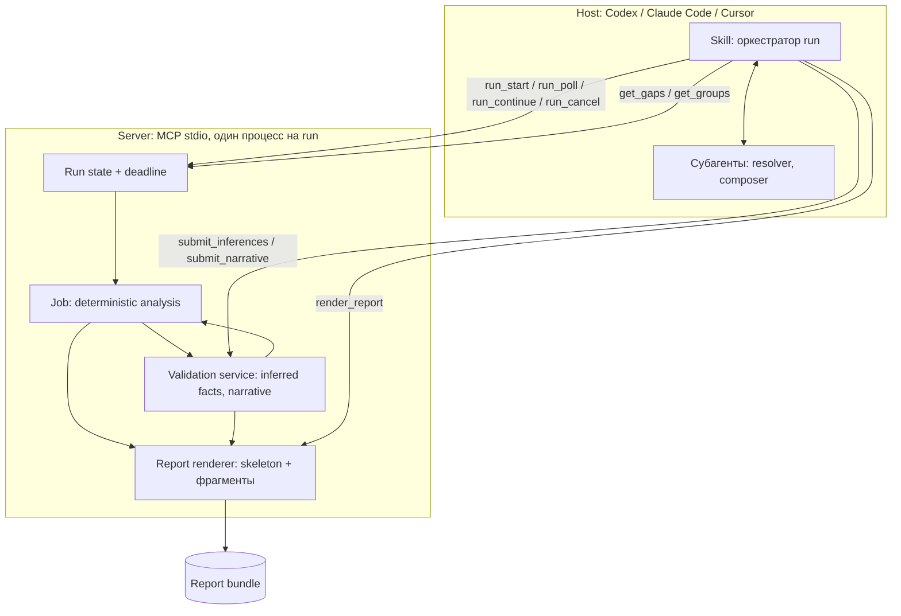

# Implementation Specification: Concurrency Hunter

| Поле | Значение |
|---|---|
| Статус | Второй драфт |
| Продуктовые требования | [PRD](PRD.md) |
| Словарь | [CONTEXT.md](../CONTEXT.md) |
| Решения | [ADR 0001](adr/0001-the-skill-drives-the-run.md), [ADR 0002](adr/0002-points-to-smt-and-a-normalized-ir-are-in-the-first-version.md), [ADR 0003](adr/0003-the-server-renders-the-report-and-the-ai-writes-only-narrative.md), [ADR 0004](adr/0004-z3-ships-inside-the-executable-and-degrades-to-unknown.md), [ADR 0005](adr/0005-a-process-scope-is-an-executable-and-the-projects-it-loads.md), [ADR 0006](adr/0006-a-construction-belongs-to-the-execution-that-triggers-it.md), [ADR 0007](adr/0007-a-finding-is-a-pair-of-access-sites.md), [ADR 0008](adr/0008-ordering-is-a-happens-before-graph-trusted-inside-one-instance-tree.md), [ADR 0009](adr/0009-a-synchronization-wrapper-is-transparent-never-a-lock-type.md), [ADR 0010](adr/0010-a-collections-structure-is-a-resource-of-its-own.md), [ADR 0011](adr/0011-an-iterator-runs-where-it-is-enumerated.md), [ADR 0012](adr/0012-library-semantics-are-data-the-analysis-derives-from-decompiled-code.md), корневой [ADR 0001](../../../docs/adr/0001-shared-code-lives-in-plugins-common.md) |

## 1. Назначение и статус

Спецификация описывает архитектуру, компоненты, алгоритмы, модели данных, plugin integration и подход к проверке текущей версии Concurrency Hunter для race/lost-update analysis. При противоречии с PRD приоритет имеет PRD; примеры не задают дополнительных продуктовых требований. Термины из словаря используются без переопределения; раздел 3 содержит только внутренние термины анализа, которых в словаре нет.


## 2. Архитектура


```mermaid
flowchart TD
    subgraph Host["Host: Codex / Claude Code / Cursor"]
        SK[Skill: оркестратор run]
        SA[Субагенты: resolver, composer]
        SK <--> SA
    end
    subgraph Server["Server: MCP stdio, один процесс на run"]
        RS[Run state + deadline]
        J[Job: deterministic analysis]
        V[Validation service: inferred facts, narrative]
        RR[Report renderer: skeleton + фрагменты]
        RS --> J
        J --> V
        V --> J
        J --> RR
        V --> RR
    end
    SK -- run_start / run_poll / run_continue / run_cancel --> RS
    SK -- get_gaps / get_groups --> RS
    SK -- submit_inferences / submit_narrative --> V
    SK -- render_report --> RR
    RR --> B[(Report bundle)]
```

Внутри job:


```mermaid
flowchart LR
    A[Load + compile] --> B[Roots, spawn sites, DI index]
    B --> C[Reachable set + IR lowering]
    C --> D[Совместный fixpoint:<br/>summaries + call graph + points-to + escape]
    D --> E[Gap collection]
    E -->|awaiting_gaps| D2[Re-fixpoint затронутых SCC]
    D2 --> F[Execution model]
    E -->|no gaps| F
    F --> G[Resource index + candidates]
    G --> H[Cheap filters]
    H --> I[Candidate-local refinement + Z3]
    I --> K[Rules, scoring, groups, skeleton]
    K -->|awaiting_narrative| RR[Renderer]
    P[Built-in providers:<br/>roots, BCL, DI] --> B
    P --> D
    P --> F
    P --> H
    LM[Library models:<br/>built-in, project, generated, AI] --> D
    C -->|opaque members without a model| MG[Model generator:<br/>decompile + drivers]
    MG --> LM
```

### 2.1. Компоненты

| Компонент | Ответственность | Не отвечает за |
|---|---|---|
| Skill | Единственный оркестратор run: target, `run_start`, polling, interludes resolver и composer через субагентов host-а, `render_report`, возврат статуса и ссылки | Verdicts, валидация, рендер |
| Run State | Run id, deadline, фаза, checkpoints, учёт late responses, отмена | Анализ |
| Project Loader (`Common.Roslyn`) | MSBuild/Roslyn workspace, compilation boundary, coverage inventory | Анализ concurrency |
| Roslyn Frontend | Symbols/IOperation/CFG → normalized IR | Framework-specific verdicts |
| Reachability | Reachable set от roots и spawn sites по CHA-графу | Точный граф вызовов |
| Whole-program Fixpoint | Summaries, граф вызовов, points-to, escape, ownership в одном fixpoint | Попарное сравнение accesses |
| Semantic Gap Builder | Определение gap, модель unknown call по умолчанию, пакет на callee, materiality | Домыслы о semantics |
| Validation Service | Проверка inferred facts и narrative fragments; вызывается tool-handlers и, в будущем, server-driven режимом | Генерация narrative |
| Execution Model | Roots, instances, intervals, may-overlap, happens-before | Resource identity |
| Resource Index | Canonical buckets и candidate lookup | Expensive path proof |
| Protection Engine | Locksets, atomics, modes, compound operations | DB protection |
| Refinement Engine | Candidate-local context/alias/lock/path refinement, Z3 | Initial whole-program discovery |
| Finding Engine | Единая процедура conflict, классификация rule ID, scoring, fingerprint, группировка, event skeleton | Свободный narrative |
| Report Renderer | `findings.json`, skeleton `report.md`, вставка принятых фрагментов, `run-metadata.json` | Добавление фактов |
| Built-in Provider Registry | Root providers, BCL semantics, DI semantics | Runtime/user extensions |
| Library Models | Модели библиотек по слоям TD-034a: встроенные, проектные и сгенерированные из `.concurrency-hunter/models/`, AI; lock, precedence, known call по модели | Вывод новых моделей |
| Model Generator | Декомпиляция библиотек, синтез драйверов, анализ драйверов тем же движком, запись сгенерированных моделей по TD-034b | AI, решения о времени вызова, которых драйвер не показал |
| `metrics` | CLI-подкоманда для benchmark-прогонов, как у cache-detective | MCP tools |

### 2.2. Dependency direction

Core IR, fixpoint, execution model и rule engine не зависят от Roslyn object model за границей frontend, от host-а и от AI. Root providers преобразуют framework-specific discovery в канонический `ExecutionRootDescriptor`; downstream engines не знают источник root. Skill никогда не получает граф: только пакеты, дайджесты и статус, каждый ответ ≤ 8 КБ с paging из `Common.Mcp`. AI-ответы попадают в анализ только через Validation Service; tool-handlers `submit_*` это тонкие обёртки над ним, чтобы будущий server-driven режим по ADR 0001 шёл тем же путём. Safety suppression разрешает только deterministic evidence. Report Renderer получает immutable structured results; narrative не может изменить verdict физически.

### 2.3. Основные технические решения

- Roslyn как frontend; собственный normalized SSA-like IR отделяет core от compiler API.
- Compositional method summaries; граф вызовов, points-to и escape считаются одним совместным fixpoint над instances `(method, context)`.
- Lowering и анализ только reachable set; все проекты компилируются один раз.
- Field-sensitive allocation-site points-to с ограниченной hybrid context sensitivity и ownership/escape выполняются до candidate pairing; доказанно unshared regions исключаются рано.
- Дешёвые фильтры и resource index предшествуют дорогому candidate-local refinement; глобальное декартово сравнение не используется.
- Execution model описывает logical instances и spawn/join intervals независимо от OS threads.
- Защита определяется identity и operation semantics; Z3 это budgeted last-mile refinement с деградацией в `Unknown`.
- AI работает через bounded packets и validated facts; сервер ничего не запускает сам.
- Сервер рендерит отчёт; AI дописывает narrative групп.
- Кэша анализа нет; каждый run это clean full scan. Модели библиотек — не кэш анализа: это данные о библиотеках, сгенерированные хранятся в репозитории и коммитятся (TD-034c).
- Семантика библиотек — данные моделей по слоям; большая часть выводится движком из декомпилированного кода библиотеки, а недоказанное остаётся unknown execution по правилу открытого мира (ADR 0012).
- Persistence-вызовы остаются opaque calls; DB identity, rules и protection model не добавляются.
- Ядро сохраняет explicit acquire/release, spawn/join/await events, identities, guards и provenance по TD-012 и TD-021: их переиспользует deadlock detection, отдельная будущая версия с собственными PRD и SPEC (PRD 8), вместе с frontend, points-to, summaries, execution facts и report workflow.

## 3. Внутренние термины

Термины run, skill, server, deadline, late response, terminal status, execution root, spawn site, execution instance, fire-and-forget, reachable set, heap region, access path, resource, ownership, access, candidate, finding, protection, semantic gap, gap packet, inferred fact, materiality, coverage, finding group, skeleton, narrative, report bundle, suppression, library model, model layer, delegate fate, holder, model generator, driver, open-world rule определены в словаре. Ниже только внутренние.

| Термин | Определение |
|---|---|
| Root provider | Встроенное расширение, обнаруживающее roots конкретного framework и выдающее core канонические descriptors, multiplicity и evidence. |
| Execution interval | Отрезок от старта execution instance до его завершения или неизвестности; единица отношений ниже. |
| MayOverlap | Консервативное отношение: два интервала могут существовать одновременно в одном процессе. |
| Happens-before | Доказанный порядок, исключающий одновременность конкретных accesses. |
| Protection set | Набор identity синхронизаторов и modes, must-held во время access. |
| Method summary | Компактное symbolic описание эффектов метода, инстанцируемое на call site без повторного анализа тела. |
| ContextKey | Ключ инстанциации summary: абстрактный receiver для instance methods, непосредственный call site для static methods. |
| ElementSelector | Представление индекса или ключа: `Exact`, `ExpressionOrRange`, `Unknown`. |
| Probe | Запись в поле-метку, которую лямбда драйвера TD-034b делает при исполнении; исполнение, в котором запись оказалась, — ответ о судьбе делегата. |
| Unknown-call model | Консервативная модель неразрешённого вызова (opaque-вызов, которого не описывает модель TD-034a, virtual, interface и delegate call без receiver object, операция `dynamic`): `UnknownEffect` — чтение и запись каждого поля, структуры и ячейки коллекции, достижимых из receiver и аргументов, до глубины summaries и wildcard дальше, одним видом доступа, который конфликтует как запись той же атомарности (TD-072). Через аргумент видно всё, что из него достижимо; через receiver — только состояние типа, объявившего член, так что библиотечный член, вызванный на объекте из исходников (базовый конструктор, `base.X()`, унаследованные `HttpContext`, `View`, `Ok`), полей исходников не видит, а у `dynamic` receiver виден целиком. Собственное состояние библиотечного объекта не ресурс: через него `UnknownEffect` достаёт только до того, что куча в нём знает (структура и ячейки коллекций ADR 0010, поля `IrFieldRef`), и никогда не даёт wildcard на регион типа из метаданных; на структуре thread-safe коллекции он атомарен, как её члены. Вызов ничей ownership не меняет: на регионе одного исполнения (`Owned` или `ThreadConfined`) `UnknownEffect` — только чтение, потому что вызов такой объект не меняет и не оставляет у себя, а на разделяемом (`Escaped`, `Shared`, `Unknown`) — чтение и запись; `readonly`-поле объекта — тоже только чтение (присвоить его вне construction объекта нельзя), кроме gap вида `reflection`, который пишет и его, а то, на что оно указывает, получает эффект целиком; решение принимается по каждому региону, так что singleton, достижимый из объекта одного исполнения, получает полный эффект. Construction, передающая неразрешённому вызову создаваемый разделяемый объект, его публикует (ADR 0006); объект одного исполнения так не публикуется. Переданный делегат исполняется в unknown execution (ADR 0011): одно на регион делегата, перекрывается с каждым исполнением своего process scope, включая себя, ничем не упорядочено, кроме конца startup, и то только когда каждое исполнение, отдающее делегат, стартует после startup (отданный в startup делегат вызов может запустить сразу, пока startup ещё идёт; то, что запускает unknown execution, и делегат, отданный внутри него, упорядочены после startup, только когда упорядочено оно само), и не держит lock-ов на входе; с собой оно не перекрывается, только когда делегат отдан в одном месте исполнением, которое запускается один раз и проходит это место один раз, — как spawn из такого места; захваченное из объектов создавшего исполнения оно трогает как само это исполнение, так что такие объекты остаются confined, а на разделяемых оно перекрывается со всеми. Исключение распознавателей действует на передачу, а не на делегат: тот же делегат, отданный ещё и неразрешённому вызову, исполняется и в unknown execution. Вызов, который моделирует распознаватель движка (типы `LibrarySemanticsTable.RecognizedTypes`, регистрация и locator DI, срезы `AsSpan`/`AsMemory`/`Slice`, `Map*` minimal API), unknown-call model не получает. |
| Round | Один проход resolver по очереди пакетов; round 2 обрабатывает только gaps, порождённые принятыми фактами round 1. |
| Checkpoint | Состояние job, в котором он ждёт skill: `awaiting_gaps`, `awaiting_narrative`. |

## 4. Компоненты анализа и внутренние контракты

### 4.1. Загрузка и границы программы

**TD-005.** Project loading использует design-time build и MSBuild evaluation в той же trust boundary, что и обычная сборка repository, через `Common.Roslyn`. Analyzer не запускает application assemblies и не инициирует restore/network activity.

**TD-006.** Один run обслуживается одним конечным server process. После terminal status не остаётся daemon, watcher или фоновой работы.

**TD-007.** Analyzer executable это внутренняя деталь plugin package: не устанавливается как global command, не имеет поддерживаемого headless entry point кроме `metrics` для benchmark и `generate` для генератора моделей (TD-034b). `generate` пишет ответ одного члена: ровно одну запись модели в формате записи проектного файла либо `model: null` и одну причину `modelReason`, если член классифицирован; отказ классификации называет `reason`. Частичная запись и запись `opaque` не генерируются. Запуск принимается только через launcher плагина.

Поддерживаемые target frameworks анализируемых проектов:

| Target framework | Стабильная версия C# по умолчанию |
|---|---|
| .NET 8 (`net8.0`) | C# 12 |
| .NET 9 (`net9.0`) | C# 13 |
| .NET 10 (`net10.0`) | C# 14 |

Preview frameworks, language features и SDK не входят в matrix. Multi-targeted project анализируется по одному target framework, самому новому из поддерживаемых; выбор записывается в coverage. Runtime самого сервера net10.0, как у cache-detective.

**TD-008.** Reachable set строится от execution roots и spawn callbacks по class-hierarchy графу вызовов до lowering; в IR lowering-ятся только его тела. Coverage считает bodies относительно reachable set и отдельно называет число тел вне него.

### 4.2. Roslyn frontend и normalized IR

**TD-010.** Frontend использует Roslyn symbols, `IOperation`, control-flow graph и data-flow facts и не передаёт Roslyn-specific objects за границу frontend layer; граница это IR и method summary.

**TD-011.** Каждое тело reachable set преобразуется в SSA-подобный normalized IR с explicit basic blocks, branches, exceptional exits и source provenance.

**TD-012.** IR представляет как минимум: parameter/receiver/local/temporary values; allocation и assignment; field/property/array/collection load и store, включая чтение и запись через ref-returning индексатор, ref local, ref return и `out`/`ref`/`in` аргумент; read-modify-write dependency; direct, virtual, interface, delegate и local-function calls; return, capture и escape; spawn, join, await/order edges; acquire/release и synchronization modes; atomic operations; branch predicates и path condition references; unknown/opaque effects. Взятие ссылки само по себе не является access; чтение или запись через неё относится ко всем доказанным местам points-to в точке эффекта. Если связь с местом не доказана, эффект учитывается в coverage, а не приписывается предполагаемому месту. При присваивании цели, которую возвращает вызов с ref-возвратом (`At(ref x) = v`, `Unsafe.Add(ref first, 1) = v`), `ref`/`out` аргументы этого вызова действуют в порядке lowering, до записи; тело с таким присваиванием сохраняет остальные доступы и диагностики `lowering:` не даёт. Ref-локации параметров и результатов распространяются до неподвижной точки без предела длины цепочки — и у `ref`, переданных вниз по вызовам, и у ссылок, возвращённых вверх; рекурсия завершается и возвращает все локации цикла. Константный индекс в такой цепочке остаётся точным, меняющийся через цикл становится неизвестным; известный срез вокруг рекурсивного вызова ограничивает его диапазоном, а внешние срезы сдвигают этот диапазон. Предел глубины access path полей (TD-042) действует и здесь. Составное присваивание и инкремент (`t op= v`, `t++`, `++t`, `t--`, `--t`) — их полная запись `t = t op v`: получатель и каждый индекс вычисляются один раз, в порядке C# — получатель, индексы, чтение цели, правая часть, запись; значение постфиксной формы — прочитанное, префиксной и составной — записанное. Элемент массива любого ранга — чтение и запись элемента; индексатор без ref-возврата и свойство с телами аксессоров, виртуальное, абстрактное, интерфейсное или статическое вычисляемое — вызов getter и вызов setter с теми же получателем и аргументами. Цель, которую lowering не моделирует, всё равно вычисляет получатель, индексы и правую часть, и они становятся операндами её unknown. Подписка `x.E += h` и отписка `x.E -= h` (static-события тоже) — вызов аксессора add или remove события с обработчиком аргументом, каким бы маршрутом ни шёл вызов: прямой, виртуальный, override, через интерфейс и явную реализацию, `base.E`; аксессор без тела в ране — known call по модели TD-034a или opaque-вызов, которому отдан делегат. Field-like событие (объявлено declarator-ом `EventFieldDeclarationSyntax`, не `abstract` и не `extern`) — поле делегата, которое объявляет компилятор; `FieldLikeEvents.FieldRef` строит его `IrFieldRef` из события (ADR 0014). Его аксессоры — тела компилятора: подписка читает поле и пишет атомарным compare-and-swap, чей comparand — прочитанное значение, комбинацию поля с обработчиком, отписка — поле без обработчика (удаление не отслеживается); инициализатор (`event Action E = h;`, instance и static) пишет поле как инициализатор поля. Внутри типа вызов события (`E(…)`, `E?.Invoke(…)`, вызов его копии) читает поле и исполняет каждый делегат, который оно может держать, в исполнении вызывающего; `E = …` пишет поле, `ref E` называет его (`Interlocked.CompareExchange(ref E, …)`, `Interlocked.Exchange(ref E, …)`). Доступы к полю образуют пары как у любого поля (TD-072). `System.Timers.Timer.Elapsed` остаётся распознавателю таймера: подписка распознаётся один раз и unsupported операции не оставляет, отписка ничего не делает.

**TD-013.** Frontend сохраняет source span, containing symbol, syntax kind и transformation provenance для каждой IR operation, используемой в finding.

**TD-014.** `x++`, `x += y`, property getter-compute-setter и разнесённый по CFG read/compute/write нормализуются в dependency, позволяющую классифицировать non-atomic RMW.

Комбинация делегатов — одна операция `IrCombineDelegatesOperation`. Каждая форма, которая комбинирует, — бинарный `+`, `+=` на любом месте (local, параметр, поле, auto-property, свойство или индексатор с аксессорами, элемент массива, `ref` local), `Delegate.Combine` двух делегатов, массива или делегатов, перечисленных в вызове (развёрнутый `params`, создание массива, collection expression без spread), — даёт делегат, который может исполнить всё, что может исполнить любой операнд; каждая форма удаления — `-`, `-=` на тех же местах, `Delegate.Remove`, `Delegate.RemoveAll` — делегат, который может исполнить всё, что может исполнить левый операнд: удаление ничего не удаляет из того, что прослеживает анализ. Предопределённую комбинацию, никогда не пользовательский оператор, и её операнды в порядке параметров решает `DelegateCombination.Of`; `ContributingOperands` — операнды, чьи объекты и происхождения результат может держать: все у комбинации, левый у удаления, — в том числе происхождение, за которым анализ не идёт. Результат зависит от всех операндов, так что запись комбинации в место, которое она прочитала, — read-modify-write. `+=` и `-=` события — не такая форма, а вызов аксессора (TD-012); только тела компилятора field-like события комбинируют и удаляют по этому правилу, через тот же построитель `IrLowering.CombineDelegates`. `Delegate.Combine` от span-значения, построенного до вызова, и collection expression со spread остаются opaque-вызовом.

**TD-015.** `async`/`await`, iterator и compiler-generated state machine анализируются на уровне исходной семантики по CFG исходного тела; детали lowering не создают ложные heap resources или execution roots. `await` это order edge внутри одного execution instance.

### 4.3. Compositional method summaries

**TD-020.** Для каждого метода reachable set вычисляется summary, переиспользуемое во всех call sites.

**TD-021.** Summary содержит: symbolic heap accesses относительно `this`, arguments, statics, allocation sites и return value; operation kind и value dependency для RMW; escapes/captures/returns; points-to transfer facts; synchronization events и protection sets; spawn/join/order events; path predicates эффектов; resolved и unresolved callees; unknown effects с причинами; source/evidence provenance.

**TD-022.** На call site symbolic resources summary инстанцируются фактическими receiver/arguments и их points-to sets. Общий symbolic summary переиспользуется; context-specific instantiations различаются по `(MethodId, ContextKey)`.

**TD-023.** Fixpoint сохраняет проходы по instances `(method, context)` в порядке их создания, пока проход что-то меняет; worklist обрабатывает новый instance и повторно обрабатывает его только после изменения факта, прочитанного при последней обработке. Чтения и записи отслеживаются по ключам состояния, включая параметры, получателей, поля, ячейки, результаты и ref-локации; вклад пропущенного instance сохраняется. Проверка членства читает ключ своего элемента, а добавление в множество не читает ничего: пока идёт solve, множества только растут, и повторное добавление ничего не меняет; удаление из отслеживаемого множества делает грязными все истории. Найти контейнер в записи словаря не значит прочитать его содержимое, а проверка пустоты читает только переход между пустым и непустым. Новые instances создаются по требованию от roots и конструкций, которые они запускают, и обрабатываются в том же проходе. Порядок проходов и подсчёт изменившихся раундов для бюджета SCC сохраняются. Points-to множества только растут над конечным универсумом, поэтому проходы сходятся; число контекстов и изменившихся проходов ограничивают два бюджета. Тело, у которого больше `MaxContextsPerMethod` (16) контекстов, или подстановка с открытым type parameter уходит в один контекст `@merged` (счётчик `merged-context`). Instance, который продолжает меняться дольше `MaxSccIterations` (16) проходов, получает свою компоненту сильной связности в графе вызовов instances; если она циклическая, тела компоненты сливаются так же (счётчик `scc-budget-exceeded`). SCC вычисляется только при исчерпании этого бюджета.

После неподвижной точки для вызовов экземпляра без объекта получателя создаётся одна волна receiverless instances, затем проходы продолжаются; после следующей неподвижной точки может быть ещё волна. В одной волне fallbacks создаются вместе: объект, возвращённый одним receiverless телом, не отменяет fallback другого вызова той же волны. Fallback никогда не отзывается. Вызов, у которого все объекты получателя исключены проверкой типа в точке использования, мёртв и fallback не получает.

**TD-024.** Summary живёт в памяти одного run: не сериализуется, не версионируется и хэшей не несёт. Версию схемы имеет IR (`IrSchema.VERSION`, строка `IR schema` заголовка отчёта). Хэшей входов и зависимостей у summaries нет: они нужны только incremental cache, а он — развитие по PRD 8.

**TD-025.** Для metadata-only метода без source применяется built-in semantics provider, модель библиотеки TD-034a (при её отсутствии — генератор TD-034b в пределах бюджета) или unknown-call model. Неизвестный метод не считается no-op.

### 4.4. Совместный fixpoint, граф вызовов и semantic gaps

**TD-030.** Граф вызовов поддерживает direct calls, constructors, virtual/interface dispatch, delegates, lambdas, local functions и recognized reflection-free factory patterns.

**TD-031.** Virtual/interface target set сужается type constraints, reachability, points-to facts и DI registrations/lifetimes из built-in providers внутри того же fixpoint, что points-to.

**TD-032.** Для каждого target хранится причина включения: exact symbol, override set, points-to type, DI binding, delegate assignment, built-in semantics provider, inferred fact или fallback unknown.

**TD-033.** Expensive refinement запускается только для targets, влияющих на candidate, либо для построения evidence path.

**TD-034.** Неразрешённый вызов — opaque-вызов метода, конструктора или getter-а, которого не описывает модель TD-034a (в том числе в версии сборки, которой модель не покрывает), virtual, interface и delegate call без receiver object, операция `dynamic` (вызов, чтение и запись члена и индексатора) — получает unknown-call model раздела 3. `out`-аргумент вызова без тела записан в точке вызова, и создание объекта конструктором без тела пишет его по тому же правилу: `new External(out state.Value)` пишет `state.Value` в точке создания. Вызов, который моделирует распознаватель движка, не неразрешён. Вызов через интерфейс на массиве или коллекции таблицы ADR 0010 решается объектом, на который указывает получатель (TD-070): на каждом объекте, который знает куча, он — член, которым тип объекта реализует интерфейсный член, с эффектами этого члена, и неразрешён только на объектах, которые так не решены; вызов, решённый на всех объектах получателя, gap не создаёт, а решённый на части — сохраняет unknown effect и gap только для остальных. Semantic gap создаётся, только когда `UnknownEffect` вызова достаёт до изменяемого разделяемого региона, когда вызову передан делегат, или когда его результат в вызывающем теле записывается в поле или ячейку разделяемого региона, в том числе через `stores`, `outputs` или `keeps` модели; хранилище типа keeper без объекта тоже разделяемое. Разделяемый — с ownership `Escaped`, `Shared` или `Unknown`; объект одного исполнения (`Owned` или `ThreadConfined`), отданный вызову, gap не даёт, потому что вызов ничей ownership не меняет (раздел 3). Вызов partial-метода без реализации — не вызов: компилятор удаляет его вместе с вычислением аргументов; массив, созданный в точке вызова для его аргументов (`params` или создание массива на месте аргумента), судится по элементам, так что строки и числа, переданные так, gap не дают. Вызов только со строками, примитивами и неизменяемыми типами gap не создаёт, как и вызов, который трогает только собственное состояние библиотечных объектов. Locator с неконстантным типом или provider неизвестного происхождения — место gap по тому же условию. Gap один на callee в пределах process scope; callee операции `dynamic` — её вид и имя члена (`dynamic invoke Record`, `dynamic get Name`, `dynamic set Name`), у индексатора только вид (`dynamic index get`, `dynamic index set`). Виды gap пять: `reflection` (callee в `System.Reflection` или `System.Activator`), `dynamic`, `unresolved-dispatch`, `model-gap` (locator) и `unknown-library` (остальные). Учитываются только вызовы в телах, до которых дошёл анализ. Неограниченное соединение неизвестного вызова со всеми методами solution не допускается.

**TD-034a.** Модели библиотек (ADR 0012). Вызов метода, конструктора или аксессора без тела в ране — known call, когда его описывает модель библиотеки: запись о члене — `DocumentationCommentId` исходного определения (у generic — определения, а не конструкции), сборка (имя и диапазон версий, у сгенерированной — версия и MVID; у BCL допустимы и reference-, и implementation-сборка), эффекты по имени параметра и слой. Другая перегрузка, версия, которой модель не покрывает, и член без модели остаются opaque. Эффект на аргумент: без эффекта; `reads-deep` — **Deep read** аргумента, чтение каждого поля каждого региона, достижимого из него, до глубины summaries и wildcard-чтение дальше, без исполнения геттеров, конвертеров, `ToString` и `Equals` пользовательских типов; `writes-arg` — запись каждого поля собственных регионов аргумента, один уровень; `writes-cells` — обычная запись всех ячеек каждого массива цели с селектором `[?]`, никогда не atomic и не read-modify-write, без удаления того, что хранилище элементов держало. Эффект на коллекцию-аргумент относится к её держателю — любому полю, которое на неё указывает: экземплярному полю объекта из исходников, статическому полю или полю библиотечного объекта (`StrongBox<List<T>>.Value`), — каким бы путём вызов её ни получил: через локальную переменную, параметр или ячейку другой коллекции, — и читается и пишется так же, как обычное чтение или запись того же поля. Тем же правилом читается готовый срез массива, переданного через локальную переменную; срез, которого не держит никакое поле, остаётся недоказанной ссылкой (TD-012). За глубиной summaries и у библиотечного объекта остаётся wildcard. Цель `writes-cells` — параметр типа массива любого ранга или `System.Array`, либо `this` у instance-члена `System.Array`; только этот вид эффекта допускает `this`. Судьба делегата — одно из исполнений движка, и судеб в формате пять: `invoke-now` — делегат вызывается в месте вызова, в исполнении вызывающего и под его lock-ами, 0..n раз, как прямой вызов, и после вызова не удерживается; `iterator` — делегат удерживает возвращённая library sequence, и он исполняется при её перечислении по ADR 0011; `holder` — делегат удерживает держатель: `result` — новый объект типа результата, созданный в месте вызова и возвращённый им, или объект, который создаёт конструктор, `this` — объекты получателя; каждый вызов без тела, чей получатель куча решает в держатель (прямо, виртуально или через интерфейс), исполняет его делегаты в исполнении вызывающего, передавая `holder-arg:N` N-й аргумент этого вызова, а держатель, ушедший в вызов без тела, пойманный делегатом unknown execution или туда, где куча его не прослеживает, исполняет их ещё и в unknown execution; `startup` — исполняется в startup, а вызов вне startup исполняет его в unknown execution; `unknown-execution` — исполняется в unknown execution по ADR 0011 как известное поведение, без gap. Шестая судьба, `di-factory` — делегат регистрируется фабрикой сервиса и исполняется там, где сервис разрешается, так часто, как велит lifetime (TD-040). Седьмая судьба, `not-run` ([ADR 0015](adr/0015-a-delegate-that-does-not-run-is-not-run-and-a-holder-runs-its-own.md)), — вызов делегат не исполняет и не удерживает (отписка `remove_Changed`): у неё нет держателя и входов, и ни одно значение `returns:` не называет её делегат; сама судьба делегат не достаёт и не исполняет, и вызов known. Делегат, который получатель вызова уже держит, по-прежнему может исполниться при вызове по правилу держателя, как при любом вызове члена держателя без тела, а тот же делегат, переданный другому параметру вызова, следует судьбе того параметра. Делегат, для которого куча не знает объекта делегата, или method group без тела в ране — unresolved dispatch там, где его исполнила бы судьба. Член с параметром-делегатом known, только когда модель даёт судьбу каждому делегату; expression tree делегатом не считается. Аксессоры описываются каждый отдельно, своим `M:` id: getter, setter (и init), аксессоры индексатора по их собственным именам (`get_Item`, `set_Item` или имя, которое даёт `IndexerName`) и add или remove события — точно и паттерном, во встроенном и проектном читателе и в model lock, как getter; `P:` и `E:` id членами модели не являются. Вызов аксессора без тела, который описывает модель, — known call, чьи эффекты связываются с аргументами (аргументы индексатора, присваиваемое значение, обработчик) как у метода, в каждой форме, которая зовёт аксессор: присваивание, инициализатор объекта, каждая половина составного присваивания, префиксного и постфиксного инкремента и `??=`, цель деконструкции, чтение, подписка и отписка; без модели вызов остаётся прежним. Правило состояния библиотеки действует на аксессоры без изменений: setter, который меняет состояние библиотечного объекта сверх удержания переданного, модели не имеет.

Словарь записи. Встроенная и проектная запись с `effects` может нести `stores`, `outputs`, `keeps`, `result` и `fates`; запись `opaque` не несёт этих форм. `fates` сопоставляет имени параметра-делегата объект с `fate` (обязателен), `holder` (`result` или `this`, только при `holder`), `inputs` (у `not-run` запрещены; по массиву значений на каждый параметр `Invoke` делегата; пустой массив и отсутствующие `inputs` передают параметру ничего известного) и `note`. Грамматика, без пробелов: `value := "arg:" name | "returns:" name | "holder-arg:" digits | "new" | "this" | "kept:" keeper | "elements(" value ")" | "sequence(" value {"," value} ")" | "grouping(" value "," value ")" | "completion(" value ")"`, `keeper := "this" | name`, `result := "sequence(" value {"," value} ")" | "collection(" value {"," value} ")" | "dictionary(" value "," value ")" | "[" value {"," value} "]" | "new" | "task(" result ")"`. `arg:P` — объекты аргумента P; `returns:D` — всё, что возвращает любой запуск делегата D (запуски не упорядочены, так что и сам D получает все свои возвраты); `this` — объекты получателя, у конструктора — созданный объект; `kept:K` — всё, что держат объекты keeper K, а без объектов — его хранилище типа; `kept:result` запрещён. `elements(v)` — то, что даёт перечисление v: хранилище элементов массива или коллекции ADR 0010, выдача library sequence или группы, иначе каждый объект, достижимый из v на любой глубине и через любого держателя, тип которого совместим с `T` её `IEnumerable<T>`, а без `T` или при `T = object` — каждый достижимый объект. Known call такой перечислитель не исполняет; держатели по пути и объекты другого типа читаются, но не пишутся. `sequence(…)` — новая library sequence; `grouping(k,v)` — новый объект с `Key` k, дающий v; `holder-arg:N` — N-й аргумент вызова члена держателя; `completion(v)` — completion value задач, которые называет v (`completion(arg:p)` — то, чем завершается задача аргумента p). Результат `task(r)` — задача, которую член возвращает и которая завершается тем, что называет r, любой формой результата, `task(…)` включительно; `task(…)` описывает только результат члена, никогда выход `outputs`, а `holder` `result` и `iterator` у такого члена описывают completion value самой внутренней задачи.

Результат `collection(…)` — новая коллекция типа результата (массив или конкретная коллекция ADR 0010), созданная в месте вызова и хранящая значения в элементах; `dictionary(k,v)` — новый словарь с ключами k отдельно от значений v; `[…]` — вызов возвращает один из названных объектов; `sequence(…)` — library sequence, созданная в месте вызова. Тот, кто её перечисляет (`foreach`, known call с deep read или с `elements(…)` её, копия ADR 0010, перечисление построенной на ней последовательности), исполняет её делегаты `iterator`, перечисляет её источники и делает эффекты члена на аргументы в своём исполнении; ушедшая, как ушёл бы пользовательский итератор, она перечисляется ещё и unknown execution, без gap. Те же потребители перечисляют пользовательский итератор в месте вызова, а не отдают его unknown enumeration. Результат, который модель не описывает, по-прежнему ни с чем не связан.

`stores` — объект, сопоставляющий цели непустой массив значений; цель обязана иметь эффект `writes-cells`. После вызова хранилище элементов каждого массива цели дополнительно держит названные значения. `outputs` — объект, сопоставляющий параметру `out` или `ref` строку грамматики результата. После вызова новая версия local или parameter указывает ровно на названные объекты; поле, ячейка или reference location получает запись в это место и дополнительно держит объекты, как `out` body-less вызова. Если два выхода называют одну переменную или место (`M(out x, out x)`), после вызова там объединение обоих, поскольку порядок присваиваний неизвестен. `ref`, которому модель ничего не присваивает, сохраняет прежнюю семантику. Форма `new`, `collection(…)`, `dictionary(…)` или `sequence(…)` в выходе создаёт собственные объекты типа этого параметра после подстановки аргументов типа, отдельно для каждого выхода и отдельно от результата вызова; у `out`/`ref` берётся тип, на который параметр ссылается. `void Make(out Profile value)` допускает `"outputs": {"value": "new"}`.

`keeps` — объект, сопоставляющий keeper (`this`, имя параметра или `result`) непустой массив значений. Каждый объект keeper держит эти значения в отдельном kept storage, достижимом обычными рёбрами кучи; kept storage не ячейка и не сегмент access path. Разделяемый keeper разделяет kept object, keeper одного исполнения сохраняет его ownership; хранение само по себе не access и не исполнение делегата. `keeps.result` допустим при результате `new`, в том числе `task(new)` или `new` под более глубоким `task(…)`, — держит корень нового графа, то есть самый внутренний completion value, — и рядом с судьбой `holder` `result`, когда явного результата нет: держит возвращённый или созданный конструктором объект держателя. Слот делегата и kept storage остаются разными местами. `this` требует instance-член или конструктор, у которого обозначает создаваемый объект. Keeper без объекта держит в одном разделяемом static storage на определение своего объявленного типа и process scope (тип параметра, либо содержащий тип члена для `this`, не generic-конструкция); ничего из хранилища не удаляется. Пустоту решают только после fixpoint, в отдельной fallback-волне по TD-023 и разделу 6: объект, пришедший при распространении до fallback, держит значения сам, без хранилища типа; fallback не отзывается, даже если объект приходит позднее.

Результат `new` создаёт в месте вызова объект типа результата после подстановки аргументов типа вызывающего. Граф новый по каждому пути от корня, до глубины summaries (8 по умолчанию), считая каждый шаг поля и элемента. Instance-поле source-класса, включая backing field auto-property и захваченный параметр конструктора, держит новый объект этого класса; поле массива или конкретной коллекции ADR 0010 держит новую коллекцию и новый элемент, если его тип — source-класс. Словарь держит отдельно новый ключ, если его тип — source-класс, перед новым значением. Построение повторяется по каждому пути, так что два поля одного типа держат два объекта; за границей глубины объектов нет. Поля interface, abstract, struct и metadata-типа ничего не держат. Корень-массив или конкретная коллекция строится так же: `Deserialize<Profile[]>`, `Deserialize<List<Profile>>` и `Deserialize<Dictionary<string, Profile>>` возвращают новые `Profile`; корень типа `object`, interface или abstract — объект этого типа без полей и элементов, включая `IEnumerable<Profile>`. Объекты графа не exact, построение не делает accesses, и результат вызова не fresh object по CONTEXT (**Fresh object**). `new` — целая форма результата или выхода, а также целый вход параметра делегата только у `invoke-now` или `holder`, никогда вложенное значение внутри `[…]`, `elements(…)`, `sequence(…)` или `grouping(…)`. Каждый запуск делегата получает отдельный свежий регион типа своего параметра после подстановки типов, без полей; каждое место `new` создаёт свой объект, отдельно от результата и выходов. Результат `new` запрещён на `void`.

Значения `this` и `kept:K` допустимы во входах судеб, результате, `stores`, `outputs`, `keeps` и вложенных `elements(…)`, `sequence(…)`, `grouping(…)`.

Время перечисления определяется местом значения. `stores`, `outputs`, `keeps` и входы `invoke-now` действуют при вызове: `elements(…)` в них перечисляет источник там, даже при результате `sequence(…)`, который никто не перечислит. При перечислении результата `sequence(…)` действуют только эффекты члена на аргументы, перечисления собственных значений результата и входов `iterator`. Выход `sequence(…)` — исключение: его собственные значения перечисляются там, где перечисляют этот выход; он не воспроизводит эффекты члена или входы `iterator`, которые принадлежат результату-sequence, а без такого результата действуют при вызове. Один аргумент, названный в оба момента, перечисляется дважды, но внутри каждого момента только один раз, сколько бы раз модель его ни называла; правило действует и на `elements(returns:D)`.

Проверка записи идёт двумя шагами. Шаг записи требует только файла: неизвестный ключ запрещён; каждая строка разбирается грамматикой; `stores` без `writes-cells`, `reads-deep` или `writes-arg` на `this`, вложенный `new`, `kept:result`, `task(…)` в `outputs`, `completion(…)` над `sequence(…)` или `grouping(…)`, которые задачи не строят, и `keeps.result` без результата `new` (под любой глубиной `task(…)`) и без судьбы `holder` `result` запрещены. `returns:D` называет судьбу той же записи и стоит только там, где запуски D есть (`invoke-now` где угодно, `iterator` только внутри результата `sequence(…)` или во входах другого `iterator`, `holder`, `startup`, `unknown-execution` и `not-run` нигде); `holder-arg:N` — только целым входом судьбы `holder`; `iterator` требует результата `sequence(…)`, в том числе под любой глубиной `task(…)`; запись с `holder` `result` результата не несёт, `task(…)` включительно. Шаг члена требует символа исходного определения: у каждого параметра-делегата судьба и каждая судьба называет параметр-делегат, входов столько, сколько параметров у `Invoke`, `new` только целый вход `invoke-now` или `holder` с типом своего параметра `Invoke`, `arg:P` называет параметр не делегатного типа, `returns:D` — делегат с не-`void` `Invoke`, держатель подходит члену, а результат — типу результата. Член, возвращающий `Task<T>` или `ValueTask<T>`, берёт результат `task(r)`, где r проверяется против `T` как результат члена, возвращающего `T`, или `[…]` задач, которые он возвращает; `task(…)` у члена, возвращающего иное, и любой результат у `Task` или `ValueTask`, которые завершаются без значения, запрещены; `completion(v)` требует, чтобы v был `Task<T>` или `ValueTask<T>`, и имеет тип `T`; v, статического типа которого шаг члена не знает (`kept:K`, `holder-arg:N`, `elements(…)` от такого листа), задачей не показан и запрещён, как любой v не задачи. `writes-cells` требует массив любого ранга или `System.Array`, для `this` — instance-член `System.Array`; `this` на static-члене, отсутствующий keeper-параметр и `outputs` на параметре без `out`/`ref` запрещены.

Преобразования проверяются по каждому листу независимо от порядка: `arg:P`, `returns:D`, `this`, `kept:K`, `holder-arg:N` или `elements(v)` от листа v. Каждый лист со статическим типом должен преобразовываться тождеством, ссылочным преобразованием, boxing или unboxing в тип своего места: тип результата или его элемента, тип параметра `outputs`, тип элемента массива `stores` (`object` для `System.Array`), тип ключа или элемента внутри `dictionary(…)`/`grouping(…)`, тип параметра делегата во входе судьбы. Контейнеры `sequence(…)`, `collection(…)`, `dictionary(…)`, `grouping(…)` и `[…]` передают нужный тип листьям, никогда не берут тип из первого значения. `this` имеет содержащий тип члена; `kept:K`, `holder-arg:N` и `elements(v)` от листа без типа статического типа не имеют и не проверяются, но соседние типизированные листья проверяются. Встроенный файл, нарушающий шаг записи, не загружается (`LibraryModelException`); шаг члена для всех встроенных записей с формами словаря — `ModelVocabularyTests.Every_built_in_fate_and_result_fits_its_member` на метаданных, против которых компилируются тесты движка. Проектная запись проходит оба шага в scope; отказ называет правило и считается как `model-entry-rejected`. Known call с этими формами считается в своём слое и gap не создаёт.

Слои моделей: встроенные (в exe), проектные (пишет команда), сгенерированные (TD-034b) и AI. Проектная модель перекрывает любую другую, в том числе записью `opaque`, которая оставляет член неописанным; остальные применяются в порядке встроенные, сгенерированные, AI. Модель слоя generated или AI может снять пары, которые дал бы `UnknownEffect` того же вызова; coverage считает их по слою (TD-124). Модель не доказывает ни защиту, ни happens-before. Модель применяется только к вызову, который без неё был бы opaque: вызов, чей dispatch может прийти в исходное тело (override или реализацию интерфейса в ране), обрабатывается этими телами, а невиртуальный вызов базового члена из такого тела (`base.Add(entity)`) known по общему правилу. Возврат источника или его элементов — результат, а не эффект: `collection(elements(arg:source))`, `sequence(elements(arg:source))`, `[elements(arg:source)]`; виды эффекта — `reads-deep`, `writes-arg` и `writes-cells`. Правило неизменяемых типов: у перечисленных неизменяемых типов `System.*` член, все параметры которого неизменяемого типа, известен без эффекта, член с изменяемым параметром известен только явной записью с эффектом по нему, а эффект на аргумент неизменяемого типа пуст. Состояние библиотечного объекта не ресурс ([CONTEXT.md](../CONTEXT.md)): член, который его меняет, модели не имеет, член, который его только читает, — модель без эффекта, а член, чьё единственное изменение — удержать то, что ему передали (`RepeatedField<T>.Add` держит свой элемент), известен и описывается `keeps`; При удержании допустима запись в любое поле keeper, который что-то держит в этом вызове: счётчик, версия и прочее служебное состояние входят в удержание, как у `RepeatedField<T>.Add`. Допустима и запись в каждый существовавший до вызова библиотечный объект на пути от этого keeper к удержанному значению; запись в иной прежний библиотечный объект модели не даёт. Объект, созданный самим вызовом, прежним состоянием не считается; исключение — члены `DbContext` и `DbSet` как opaque persistence, их эффект только по аргументам. Слот делегата держателя — не состояние, а место, где делегат ждёт вызова; kept storage — достижимые объекты, которые keeper оставил у себя, и само по себе делегат не исполняет. Чтение структуры и ячеек коллекции в deep read имеет атомарность её собственного перечисления по ADR 0010: у thread-safe коллекции атомарное, у обычной обычное; поля элементов читаются обычным чтением. Встроенные ручные семейства: `System.*`, `Microsoft.Extensions.Logging`, `System.Text.Json`, `Newtonsoft.Json` (зеркало System.Text.Json: `JsonConvert.SerializeObject` и `JsonConvert.DeserializeObject`), `HttpClient`, LINQ без делегатов и компараторов и `Queryable` (expression tree это данные), EF Core `DbContext`/`DbSet` как opaque persistence; семейства судеб делегатов — операторы `Enumerable` с делегатом по таблице LINQ (без компаратора; `Skip`, `Take`, `Cast`, `OfType` и `Union` — library sequences своих источников, `AsEnumerable` возвращает свой источник, `ToList` и `ToArray` — коллекцию его элементов, элементные операторы — один из элементов), `Comparer<T>.Create` (`holder` результата, сравнение получает два аргумента вызванного члена) и статики `System.Array` с делегатом и без `IComparer<T>` (`invoke-now` с ячейками массива; `Find`/`FindLast` возвращают одну из ячеек, `FindAll` — новый массив их, `ConvertAll` — новый массив того, что вернул конвертер), включая `Sort<T>(T[], Comparison<T>)`: comparison исполняется при вызове на элементах массива, а `writes-cells` пишет все его ячейки. В диапазоне 8.0.0.0–11.0.0.0 ровно по одной встроенной модели получают 25 публичных cell writers и присваивающих массив членов `System.Array` reference-сборки .NET 10: `Clear` (2), `Copy` (4), `ConstrainedCopy` (1), `CopyTo` (2), `Fill` (2), `Resize` (1), `Reverse` (4), `SetValue` (8) и этот `Sort` (1). Члены формы массива `Length`, `LongLength`, `Rank`, `GetLength`, `GetLongLength`, `GetLowerBound` и `GetUpperBound` — known calls встроенной модели без эффекта: граница цикла по `Length` не даёт доступа, пары или gap. Шестнадцать перегрузок `Sort` через `IComparable`/`IComparer` и `Initialize` остаются opaque: они исполняют пользовательский код, не делегат. Десять синхронных десериализаторов, описанных семействами System.Text.Json и Newtonsoft.Json, имеют результат `new`; шесть non-generic возвращают `object` без полей, и аргумент `Type` у четырёх из них тип графа не выбирает. Асинхронные десериализаторы и дополнительные перегрузки моделей не имеют. Члены `List<T>` с делегатом и `HashSet<T>.RemoveWhere` — не модели, а строки таблицы ADR 0010. Состав ручного семейства берётся переписью: члены, встреченные среди вызовов метаданных в demo и корпусах, и их перегрузки по правилам семейства; исключения из переписи — `GC.KeepAlive(Object)`, без эффекта: это сток использования в тестах, а его семантика известна точно, — и семейство `Enumerable` целиком: каждый публичный член `System.Linq.Enumerable` reference-сборки .NET 10 с параметром-делегатом и без `IComparer<T>` и `IEqualityComparer<T>` описан ровно одной встроенной моделью в диапазоне 8.0.0.0–11.0.0.0, как и `Comparer<T>.Create` и названные статики `Array`. Встроенные сгенерированные модели популярных пакетов строит генератор TD-034b. Known call gap не создаёт.

Проектная модель — JSON-файл схемы 1 в `.concurrency-hunter/models/`. На верхнем уровне допустимы только `schemaVersion`, `note`, `assemblies`, `versions`, `models` и `immutableTypes`; обязательны `schemaVersion: 1` и массив `models`. `note` — строка, `assemblies` — непустой массив непустых имён, `versions` — диапазон с `minimum` и `maximumExclusive` из четырёх числовых частей, причём минимум меньше максимума. Запись `models` называет `member` как `M:` declaration id метода, конструктора или аксессора — getter-а, setter-а (и init), аксессора индексатора, add или remove события (с `~ReturnType` или без него; оператор преобразования требует суффикс) либо паттерн `M:Namespace.Type.Name(*)`. Каждый declaration id файлов встроенных и проектных моделей и `models.lock.json` — члена, типа и паттерна — проверяет один разбор грамматики ECMA-334 D.4.2 в той форме, какую пишет `DocumentationCommentId.CreateDeclarationId`: имена пространств, типов и членов, каждый тип параметра и тип после `~`; id вне грамматики (`M:A.B.Run(A-B)`, `M:A.B.Run~A-B`, `M:A.B.Run!`, `M:A.B.Run!(*)`) отклоняется там, где встречен. Записи нужна хотя бы одна сборка из собственной или файловой `assemblies`. Её собственные `assemblies` и `versions` перекрывают значения файла. `versions` может отсутствовать только у проектной модели: тогда запись применяется ко всем версиям; встроенная запись и встроенный неизменяемый тип обязаны получить диапазон. Запись содержит ровно одно из `effects` и `opaque: true`. `effects` сопоставляет имени параметра (или `this` только для `writes-cells`) непустой массив разных `reads-deep`, `writes-arg` и `writes-cells`; пустой объект означает known call без эффекта. Запись с `effects` может нести `stores`, `outputs`, `keeps`, `result` и `fates` словаря выше, запись `opaque` — нет. `immutableTypes` допустим в формате встроенного файла, но каждый его элемент в проектном файле отклоняется.

Проверка проектного файла идёт тремя шагами. Сначала целиком проверяются чтение, строгий UTF-8 JSON (BOM допустим; комментарии, завершающие запятые и повторные свойства нет), схема и свойства верхнего уровня. Затем каждая запись отдельно проверяется по форме и шагом записи словаря: плохая запись не лишает силы соседние. Наконец, в каждом scope проверяется член каждой записи с правильной формой: сборка и версия, точный символ, параметры эффектов, отсутствие тела в ране, параметра-делегата без судьбы и типа, которым владеет распознаватель движка, и шаг члена словаря для эффектов, `stores`, `outputs`, `keeps`, результата и судеб. Запись сборки, на которую scope не ссылается, в этом scope игнорируется. Каждое отклонение считается и называется в диагностике этого scope; ошибка файла или формы записи считается в каждом scope. Валидная проектная запись решает член до встроенной записи и до правила неизменяемого типа, включая решение `opaque`. Совпадающие решения (одинаковый набор пар цель/эффект, те же `stores`, `outputs`, `keeps`, результат и судьбы — у каждого делегата та же судьба, держатель и те же множества входов, отсутствующие `inputs` равны пустым, — либо оба `opaque`) действуют как одно, независимо от порядка написанного; при разногласии член opaque, и каждая спорящая запись отклоняется с отдельной диагностикой. Член без проектного решения следует встроенной модели.

**TD-034b.** Генератор моделей (ADR 0012, ADR 0013). Вне рана `generate` классифицирует одного члена и пишет целую запись TD-034a либо одну причину отсутствия записи; в ране генератор строит сгенерированный слой (TD-034c). Кандидат получает делегат или значение, способное нести пользовательский объект, даже без делегата. У каждого общего вопроса один владелец: `TypeShape.Of` — что тип может нести; `ParameterKinds.Of` — как заполнить параметр; `DriverExecutions` — setup, вызов, перечисление и триггер; `Allocations.Of` — кто и когда создал регион; `HeapReachability` — пути; `EngineClaims.Of` — что забирает движок; `SeedableFields` поверх `TypeShape.Of` — что поле или auto-property может держать и проходит ли через него драйвер; `GenerationHandoffs` — передачи невидимому и другим исполнениям, а также полученное свидетелем; `EffectReader` — эффекты на значения аргументов; `ValueProvenance` — имена объектов в словаре и удержание; `FieldLikeEvents` — field-like ли событие и его хранилище как поле (индекс программы, lowering, seeds генератора, `DriverSynthesizer.IsFieldLikeEventAccessor`); `DelegateCombination` — комбинация ли операция и её операнды (TD-014); `FateClassifier` — каждая судьба, `not-run` включительно; `DriverSynthesizer.IsAccessor` — какие id отвечают `accessor`; `DriverSynthesizer.OriginalAccessibility` — мог ли вызывающий позвать член до открытия копии; `ValueProvenance.SymbolicName` — у каких значений есть имя; `EffectReader.IsDelegateSlotStore` — какая запись в поле делегатного типа не состояние библиотеки. Каждое правило зовёт владельца своего вопроса.

Implementation-сборка. Вход — имя сборки, версия, declaration id члена, необязательный id пакета и необязательная платформа `netX.0`. Имя сборки — сегменты из букв, цифр, `_` и `-` через одиночные точки; id пакета — по правилам NuGet (те же символы, не длиннее 100, без точки в начале, в конце и двух подряд); иное, в том числе разделитель пути, диск и `..`, — usage error. С id пакета член пакетный: пакет называется явно, а не угадывается, потому что одна сборка бывает и во фреймворке, и в пакете (`System.Text.Json`). Его папка — `<packages>/<id в нижнем регистре>/<нормализованная версия>/lib/`, где `<packages>` — `NUGET_PACKAGES`, иначе `%USERPROFILE%\.nuget\packages`; lib-папка — ближайшая к платформе (`--framework`, иначе major запущенного runtime): сама `netX.0`, иначе старшая `netY.0` с Y < X, иначе `netstandard2.1`, `netstandard2.0` и `netstandard1.*` от старшей, папка .NET Framework — никогда; сборка — `<имя>.dll` в ней. Без id пакета член принадлежит фреймворку: major — первая часть версии (`8`, `8.0` и `8.0.0.0` — это 8), сборка берётся из `<dotnet root>/shared/Microsoft.NETCore.App/` самого старшего установленного patch этой major, никогда из другой major; dotnet root — тот, из которого запущен runtime. Нет папки пакета, совместимой lib-папки, сборки в ней или установленного shared framework нужной major — `no-implementation`, как и файл, который после `Path.GetFullPath` лежит не под выбранной для него папкой. `System.Private.CoreLib` — `corelib` по одному имени, до чтения и декомпиляции: её замыкание — сама corlib. Сборка с `ReferenceAssemblyAttribute` (тела `throw null`) не декомпилируется никогда — её тело прочиталось бы как «ничего не делает» — и даёт `reference-assembly`. Ссылки сборки фреймворка — остальные managed-сборки той же папки shared framework, CoreLib как метаданные. Ссылки пакетной сборки — остальные managed-сборки её lib-папки, зависимости пакета рекурсивно и managed-сборки shared framework платформы, чьих имён те не дают: копия пакета выигрывает, и сборка не компилируется рядом со своей копией из фреймворка. Зависимости читаются из nuspec: имена групп `targetFramework` нормализуются в короткие имена папок NuGet (`.NETStandard2.0` — `netstandard2.0`), группа выбирается тем же правилом ближайшей, список без групп действует для всех платформ. Версия зависимости — диапазон NuGet (`a`, `[a]`, `[a,b]`, `[a,b)`, `(a,b]`, `(a,b)`, `[a,)`, `(a,)`, `(,b]`, `(,b)`); версии сравниваются по SemVer 2.0 в форме NuGet — до четырёх числовых частей, недостающая часть 0, prerelease ниже своего релиза, метаданные сборки игнорируются; папка версии — её нормализованная форма (нижний регистр, не меньше трёх частей, четвёртая только ненулевая), и так же ищется `--version` с `--package`. Каждый id зависимости разрешается один раз на всё замыкание — самой младшей версией в папке пакетов, которую допускают все приводящие к нему диапазоны; версия вне диапазона не берётся никогда, а зависимость без такой версии или без совместимой lib-папки пропускается и называется в записи генерации (`<id>@<ranges>`, `<id>@<version>: no compatible lib folder`). Ничего не скачивается: разбор версий собственный, сборки `NuGet.*` не используются, резолвер читает только файловую систему.

Компиляция библиотеки. Модуль декомпилируется в памяти ICSharpCode.Decompiler, как его whole-project decompiler: дерево на тип верхнего уровня, общий type system, трансформации `EscapeInvalidIdentifiers` (без неё async state machines сохраняют имена вида `<ReadAtLeastAsyncCore>d__46`, и их ошибки каскадируют) и `RemoveCLSCompliantAttribute`, дерево атрибутов сборки; тип верхнего уровня, на котором декомпилятор бросил исключение, молча не выпадает: вся библиотека — `library-does-not-compile`, тип назван в причине, потому что пропавший тип спрятал бы объявления и тела; разбор — C# preview; `CSharpCompilation` с именем сборки, `AllowUnsafe` и без nullable компилируется против ссылок выше, без emit. Тело, которое не компилируется, тела не имеет и переписывается как `extern`: член с ошибкой в теле — ошибка в лямбде или локальной функции принадлежит объемлющему члену, flow-ошибка на объявлении (CS0161, CS0171, CS0177, CS0843) тоже, — если это метод, оператор, преобразование или деструктор, теряет тело и `async` (CS1994 запрещает `async` без тела); свойство или индексатор с аксессором в ошибке становится `extern` с обоими аксессорами без тел; событие с аксессорами в ошибке — field-like `extern` событием; конструктор теряет тело и инициализатор `: base(…)`/`: this(…)`; ошибка в инициализаторе поля или свойства убирает у типа инициализаторы этого вида (instance или static) и делает `extern` каждый его конструктор этого вида, объявляя неявный, если его нет. Движок уже читает исходный метод без тела как вызов без тела — прямой вызов opaque, virtual, interface и delegate маршруты — unresolved dispatch, `out` объявления `extern` получает opaque-обработку, — поэтому генератор движка не меняет; флаг «тела нет» в индексе программы отвергнут: «есть ли тело» решают пять мест (индекс программы, opaque `out`, вид объекта коллекции, распознавание перечисления, root providers), а флаг дошёл бы только до первого. Компиляция повторяется, пока ошибки в телах остаются, не больше трёх раз; предупреждения CS0626 и CS0824, которые получает член `extern`, ожидаемы. Ошибка в теле после этого или ошибка, которую оставила сама правка, — `library-does-not-compile`, как и ошибка вне тел, кроме трёх артефактов декомпилятора, которые ничего не связывают неверно: CS0102 (field-like событие рядом со своим backing field), CS0216 (`==` без `!=`, удалённого trimmer-ом), CS8335 (атрибуты модуля); здесь кончается и пропущенная зависимость, которая нужна объявлениям библиотеки. Член, чьё собственное объявление переписано, — `body-does-not-compile`; запись генерации считает тела `extern`. Компиляция одна на процесс для пути implementation, папки shared framework и путей зависимостей, так что одна сборка `netstandard2.0` под `net8.0` и под `net10.0` — две компиляции.

Драйвер. Синтезируется из символа члена в компиляции библиотеки рецептом `docs/research/library-models.md` («Driver synthesis») и связывается с ней `CompilationReference`. Генератор берёт `M:` id методов, конструкторов, операторов, преобразований и аксессоров — getter, setter, getter и setter индексатора, add и remove события, instance и static — по всем правилам этого TD, как метод. `P:` и `E:` id отвечают причиной классификации `accessor`, и её detail называет `M:` id аксессоров этого свойства или события; `F:` и иной неподдержанный вид — `driver-not-synthesized`. Init-only setter в этом ране не генерируется: его `M:` id отвечает `driver-not-synthesized`, detail называет init-аксессор. Ни одна форма драйвера не зовёт init-аксессор на получателе, состояние которого выбрал setup: инициализатор объекта создаёт свежий получатель и теряет состояние, которое дают другой конструктор или клон `with`, а замена `init` на `set` в копии компилируется только там, где это уже делает открытие (seed auto-property, откатываемая, где ломает копию), потому что init-аксессор с телом может писать `readonly` поле или реализовать init-контракт другой сборки. Init ли аксессор, читается по неоткрытой компиляции, и публичен ли член — по доступности его самого и содержащих типов до того, как копию открыли для seeds (`DriverSynthesizer.OriginalAccessibility`). Член классифицируется, когда получает делегат по значению, `in` или `ref` либо holding-параметр, способный держать пользовательский объект, даже когда проб-делегатов в нём нет; instance-аксессор — кандидат через получатель, как instance-метод; иначе — `not-a-candidate`; `out` ничего члену не передаёт, кандидатом его не делает и не классифицируется. Параметр `Task<T>` или `ValueTask<T>` — кандидат ровно тогда, когда кандидатом было бы само `T`, переданное прямо, так что `Task<int>`, `Task` и `ValueTask` им не бывают; генератор отвечает на него, как синхронному двойнику, а результат, который есть задача-аргумент или её completion value, называет `arg:p` или `completion(arg:p)`. Что тип может нести, решает `TypeShape.Of` — первое подходящее из ref-like или указателя, делегата, задачи от T, задачи, неизменяемого типа (правило неизменяемых типов TD-034a, примитивы и enum), struct без ссылок, struct со ссылками и ссылочного типа. Вид параметра решает `ParameterKinds.Of` по первой подходящей оси, после замены `ref`, `out` и `in` типом, на который они ссылаются: ref-like или указатель — `driver-not-synthesized`; делегат — пробная лямбда; неизменяемый тип или struct без ссылок — готовое значение, не holding; массив — два значения (при ранге больше 1 все измерения длины 1, кроме последнего длины 2; jagged — по тому же правилу) и `IEnumerable<T>`, `ICollection<T>`, `IList<T>`, `IReadOnlyCollection<T>`, `IReadOnlyList<T>` — `List<T>` из двух значений, holding; `object`, другой интерфейс, абстрактный класс с доступным конструктором и параметр типа — объект собственного класса-пробы параметра, holding; незапечатанный конкретный класс с доступным конструктором и переопределяемым членом — экземпляр его собственного подкласса `Sub_<parameter>`, holding; остальные классы и struct со ссылками (`KeyValuePair<,>`, `ValueTuple`, `Memory<T>`) — значение рецепта, holding. Класс-проба запечатан и у каждого параметра свой (`Probe_<parameter>`; параметр типа — один `Probe_<T>` на параметры типа `T`, `T[]` и последовательности `T`), у него два ссылочных поля и одно `int`, и первое ссылочное держит второй его экземпляр. Каждый член, который мог бы переопределить пользователь, — `ToString`, `Equals`, `GetHashCode`, virtual и abstract члены базы, члены интерфейсов, включая default-реализации, — у класса-пробы, у подкласса `Sub_`, у подкласса получателя `Sub_Recv` (кроме генерируемого члена и того, что он переопределяет; получатель без доступного конструктора берёт значение рецепта), у маркера `R_`, у seed и у заглушек интерфейсных ограничений — свидетель: его тело записывает всё полученное, включая собственный объект, и строит возврат рецептом. Это относится и к аксессорам событий. Член с ref-like или pointer-параметром, ref-like возвратом или возвратом, который драйвер не строит, остаётся `extern`: переданное ему судится как передача вызову, за которым движок не идёт. Значение аргумента или достижимое из него, полученное свидетелем, даёт `reads-deep` аргумента; полученная им проба-делегат расширяет свою судьбу до `unknown-execution`. Конструктор класса драйвера зовёт базовый конструктор, который выбрало бы правило значений рецепта; база без доступного конструктора не наследуется — берётся выбор рецепта или `driver-not-synthesized`. Параметр типа получает `Probe_<T>`, когда ограничения это позволяют (без `struct` и `unmanaged`, не больше одного базового класса, и у того доступный конструктор), иначе — выбор рецепта; generic-определение классифицируется на этой одной конструкции. Holding-значение — параметр, получатель, ссылочный возврат пробной лямбды и любое holding-значение внутри них до глубины рецепта, — которое рецепт даёт только как `default!`, делает член `driver-not-synthesized`; `default!` допустим только у не-holding значения и называется в записи генерации; рецепт выбирает одно построение, а поля, которые могли держать пользовательское значение, дополняются seeds по правилу ниже. Одной конструкции generic-определения достаточно; второй конструкции генератор не делает. Пробная лямбда создаётся своей фабрикой на пробу и вариант, кладёт каждый свой параметр в статическое поле `In_*` и возвращает ничего для `void`, `Task.CompletedTask` или `default` для `Task` и `ValueTask`, `Task.FromResult(v)` и `new ValueTask<T>(v)` для задач от T, готовое значение для неизменяемого типа, иначе новый объект, созданный в её теле (`Probe_<T>`, маркер `R_<parameter>`, конструктор рецепта), а без него — `default!` и отказ выше. Всё, что драйвер строит до вызова, — получатель, каждое значение аргумента с содержимым (элементы контейнера, продукт фабрики, объект библиотечного конструктора) и промежуточные значения, — строит действие `V_Setup` и кладёт в статические поля `Recv_*`, `Arg_*` и `Keep.<n>`, свои у каждого варианта, так что никакие два варианта не делят объект; `V_Call` и `V_Enum` читают свои поля, создают свои пробные лямбды и вызывают член, ожидая результат `Task` или `ValueTask`, чтобы асинхронное тело члена шло в исполнении действия, а `V_Enum` затем перечисляет результат. Значит, own(`V_Call`) не содержит ничего, что сделал драйвер, кроме создания проб и чтения своих полей: `List<T>`, заполненный для источника `All`, — работа setup, а не члена. Holding-значение, которое рецепт построил с пробными лямбдами внутри (`parser` у `ForMessage`, построенный конструктором, получившим фабрику-пробу), несёт эти пробы, свои у каждого варианта. `ref`-аргумент — поле `Out_*`: setup его инициализирует, а у делегата его ставит на пробу само действие перед вызовом; `out`-аргумент — такое поле, оставленное по умолчанию. Результат хранится в `Keep.R`. Триггеры `T_i` — по одному вызову каждого члена, который вызывающий может позвать на держателе, не больше 24 на весь драйвер (`T0…T23`): держатели `result` и `this` делят их, сначала члены `result`, затем `this`, — остаются в источнике драйвера и нужны только подтверждению держателя (ниже). Драйвер, который не компилируется, и член, которого рецепт не может вызвать, — `driver-not-synthesized`.

Прогон движка. Драйвер и декомпилированная библиотека анализируются как один scope тем же конвейером стадий `ScopePipeline`, что зовёт анализ: индекс DI, root providers, bindings, индекс программы, reachable set, summaries, решение кучи, исполнения и interprocedural accesses. Registry у генератора свой: корни — действия драйвера с id `model-driver:<assembly>:<documentation id действия>`, и прогон судеб берёт корнями только `V_Setup`, `V_Call` и `V_Enum`. Встроенные модели действуют без моделей самой implementation-сборки: встроенный слой обслуживает только вызовы, которые уходят из декомпилированной сборки, так что её тело, ставшее `extern`, остаётся opaque, даже если встроенная модель его описывает, а встроенные модели LINQ остаются независимым оракулом генератора. Распознаватели движка по имени — таблица коллекций ADR 0010, spawn, timer, lock, service call, — которых сборкой не отфильтровать, опрашивает один владелец `EngineClaims.Of`, и implementation-сборка, хоть один метод которой какой-то из них забирает, отклоняется до прогона с `engine-recognized` и именем распознавателя в записи генерации. Проектные модели, model lock и repository root не читаются и не пишутся. Граница замыкания: прогон, чьё reachable set дошло больше чем до 1500 тел — все тела, до которых дошли вызов, делегат или root, включая вложенные и тела с отброшенным lowering, — останавливается после reachable set, до summaries и решения кучи, с причиной `closure-bound` и числом тел; остановленный `ScopeRun` хранит число в `StoppedAtReachableBodies`, а все части после reachable set пусты, никогда не вперемешку. Граница — `private const` генератора; конвейер принимает её необязательным пределом, которого анализ не передаёт никогда. 1500 выбрано замером: драйвер конструктора `MessageParser<T>` с триггерами дошёл до 1766 тел (они тянут JSON-парсер Protobuf, `ParseJson`), и его решение кучи шло дольше 13 минут, тогда как `ForMessage` с 1120 телами решается за 9 с. Прогон, который бросает исключение, и lowering, отбросивший тело самого члена, — `analysis-failed`.

Судьбы. Классифицируется каждый делегат, переданный по значению, `in` или `ref`, и каждый holding-параметр, несущий пробы; `out` — никогда. Исполнения драйвера решает `DriverExecutions`: own(X) — root execution действия X, tree(X) — own(X) и каждое исполнение, корень дерева которого X; setup — tree(`V_Setup`); escape artefact — исполнение `UnknownEnumeration`, чей subject достижим из `Keep.R`, с его поддеревом: ленивый результат, положенный в статический `Keep.R`, уходит, и движок перечисляет его unknown enumeration по ADR 0011; это делает драйвер, а не член — ран, сохранивший результат члена, получает то же перечисление от модели `iterator`, — поэтому правила ниже его не учитывают, кроме случая, когда объект результата отдан невидимому: unknown enumeration на subject одна, что бы его ни увело, и тогда она может быть делом члена. Кто и когда создал регион, решает `Allocations.Of`: объект, который создаёт член-конструктор; драйвер (значение аргумента, проба, возврат пробной лямбды, промежуточное значение, начальное значение `Out_*` или объект библиотечной фабрики, которую позвал setup); библиотека во время X, в дочернем исполнении X, до него (static, type initializer); иначе неизвестно. Достижимость одна на все правила: поля кучи с элементным слотом `[]`, points-to, захваты делегатов, источники и делегаты, которые держит library sequence. `GenerationHandoffs` решает, отдан ли объект невидимому: он достижим из получателя, аргумента или захвата вызова, за которым движок не идёт (opaque-вызов или unresolved dispatch, как их называет `UnknownCalls`), в любом исполнении, включая setup: setup может только расширить. Пробы параметра в варианте X — делегаты, которые X ему отдаёт: одна проба делегата или пробы, которые несёт holding-значение; пробы `V_Call` и `V_Enum` из одного места одной конструкции — парные. Собственное поле параметра — поле драйвера, где лежит переданное значение (`Arg_*`, у `ref` — `Out_*`); у делегата по значению или `in` его нет. Начала путей — статические регионы, кроме полей `In_*` (они держат то, что получили пробные лямбды, а не то, что удержала библиотека); `Keep.R`, `Recv_*`, `Arg_*`, `Out_*` и `Keep.<n>` — начала путей, так что делегат, положенный членом в значение аргумента, `out` или промежуточное значение, удержан. Путь к пробе считается, когда начинается не в собственном поле её параметра или, начавшись в нём, затем проходит поле, которое пишет исполнение, отличное от setup (член положил что-то в переданное ему значение). Проба `V_Call` удержана, когда у неё есть считаемый путь или она отдана невидимому. Удержана только через X, когда каждый считаемый путь проходит объект X, X достижим ни из какого начала, кроме своего поля драйвера (`Keep.R` для объекта результата; `Recv_Call` — и `Keep.R`, когда тот указывает на этого же получателя, — для получателя), и X не отдан невидимому. Тип результата — тип возврата члена за всеми уровнями задач (`TaskTypes.Innermost`): `T` у `Task<T>`, `ValueTask<T>` и `Task<Task<T>>` (драйвер ждёт каждую задачу), у конструктора — создаваемый тип; объект результата — один объект в `Keep.R`, который `Allocations.Of` называет объектом члена-конструктора или созданным библиотекой во время `V_Call`, и не получатель и не возвращённое значение аргумента. Исполнилась в X — запись пробы в own(X), а не просто в tree(X). Исполнилась в другом месте — запись в любом исполнении, кроме own(X): дочернем `Spawn` или timer из tree(X), ленивом конструировании, type initializer, setup, unknown execution; не считаются только escape artefact и root execution другого действия драйвера: каждое действие строит свои значения, так что проба одного действия доходит до root другого только через static, который «удержана» уже расширяет, или через слияние кучей объектов одного allocation site — артефакт анализа, а не поступок члена; исполнение в поддереве другого действия считается. Setup считается тоже: пробу, которую исполнил или отдал невидимому библиотечный код setup (конструктор или фабрика носителя), правила расширяют, а не угадывают, что сделал бы один член, и запись генерации называет параметр в `setupWidened`. Каждая проба p `V_Call` с парной p′ `V_Enum` получает первую подходящую судьбу: `invoke-now` — p исполнилась в `V_Call`, нигде больше и не удержана; `iterator` — p′ исполнилась в `V_Enum` и нигде больше, p не исполнилась нигде и удержана только через объект результата; `holder` `result` — p удержана только через объект результата, не исполнилась нигде и подтверждена; `holder` `this` — p удержана только через объект `Recv_Call` (и когда `Keep.R` — тот же получатель, fluent-член), не исполнилась нигде и подтверждена; `not-run` — p анализ довёл до вызова (параметр члена или аргумент, который её несёт, может указывать на неё на ребре вызова), она не исполнилась нигде, не удержана, не отдана невидимому, и вызов не дошёл до кода, которого анализ не видел: ни dispatch без объекта получателя, ни тела с отброшенным lowering, ни unsupported операции — что анализ не увидел, решает `GenerationHandoffs`; иначе `unknown-execution` — исполнилась при вызове и удержана, исполнилась только в другом месте, не исполнилась и не удержана, но не дошла до вызова или вызов дошёл до невиденного кода, удержана через оба держателя, ушедший держатель, значение аргумента, `out`, промежуточное значение или статику библиотеки. Каждая судьба — один способ исполнения, и делегат, которого движок видел исполняющимся двумя способами, ни одной другой судьбой не покрытыми, получает `unknown-execution`. Параметр получает судьбу своих проб, когда у всех она одна, с тем же держателем, иначе `unknown-execution`. Применимость решается по одному параметру правилами шага члена TD-034a: `holder` `this` — instance-метод, не конструктор; `holder` `result` — конструктор или метод со ссылочным типом результата; `iterator` — метод, тип результата которого реализует `System.Collections.IEnumerable`; судят по типу результата, так что `Task<IEnumerable<T>>` может быть `iterator`, а `ValueTask<Policy>` — `holder` `result`; запись `iterator` описывает completion value формой `task(sequence(…))`, а запись `holder` `result` явной формы результата не несёт, `task(…)` включительно: держатель — самый внутренний completion value члена; отказ даёт `unknown-execution` с отказом в записи генерации. Подтверждение держателя: `holder` стоит, только когда триггеры покрывают держателя — у каждого члена, который вызывающий может позвать на статическом типе держателя (тип результата для `result`, тип получателя для `this`), есть свой триггер `T_i`: instance-методы, generic-методы (с аргументами типа по правилу драйвера), аксессоры свойств и индексаторов, `Invoke` делегата, члены базовых типов и интерфейсов, где бы они ни были объявлены, `ToString`, `Equals` и `GetHashCode` `object`, члены с `ref`, `in` и `out` параметрами и сам член; переопределение стоит за то, что переопределяет; аксессоры события, которое не field-like, — триггеры, которые драйвер зовёт подпиской и отпиской (`+=`, `-=`), как любой член, а аксессоры field-like события, которое не `virtual` и не `override`, написал компилятор, они не исполняют делегатов и триггера не требуют; у `virtual` или `override` field-like события аксессоры — триггеры, как любой член, — и второй прогон, корни которого — ещё и триггеры, укладывается в границу замыкания, завершается и ни одна проба, которую отдаёт триггер, не исполнилась вне root execution действия драйвера (правило между действиями действует; root setup и escape artefact — вне). Член, который драйвер не может позвать (значение ref-like параметра, аргумент, который рецепт не строит, тип, который вызывающий не может назвать, вызов, который не компилируется; может ли вызывающий позвать член, решает его доступность до открытия копии), член сверх 24 триггеров драйвера, общих для обоих держателей, держатель без единого триггера, триггер, исполняющий делегат в `Task.Run`, timer или unknown execution, прогон за границей и прогон с исключением дают `unknown-execution`; непокрытый держатель подтверждающего прогона не получает. Кроме того, держатель стоит, только когда хотя бы один триггер исполнил делегат, который держатель держит, в собственном исполнении этого триггера (`holder-trigger`, ADR 0015): объект, который лишь хранит делегат для другого кода (сумка свойств вроде `SslClientAuthenticationOptions`), держателем не является, и его делегат — `unknown-execution`; какие триггеры исполнили удержанную пробу, решает одна функция, и `generation.holderTriggers` пишет её ответ. Без подтверждения держатель, чей член исполняет делегат в `Task.Run`, ответил бы `holder` — опасное сужение, потому что держатель исполняет свои делегаты в исполнении вызывающего. Триггеры прогона судеб не корни. Входы делегатов держателя читаются из подтверждающего прогона, в котором триггеры — корни, и `generation.holderTriggers` по имени делегата пишет declaration ids членов держателя, которые его исполнили. Наблюдаемый список не ограничивает применение судьбы `holder`: её правило по-прежнему действует на каждый вызов члена держателя.

Поля и seeds. `LibraryFieldOpening` открывает поля только в компилируемой копии декомпилированной implementation-сборки: private становится доступным; readonly снимается только у ссылочных полей, у struct сохраняется семантика копирования. Открываются и backing fields auto-property. Хранилище field-like события (`event-seed`) — слот, куда программа могла положить обработчик: драйвер засевает его, как поле, подпиской свидетеля-обработчика (`recv.E += witness`), а хранилище называет `FieldLikeEvents.FieldRef`. Драйвер перед вызовом дополняет каждый достижимый слот, способный держать пользовательский объект, не спрашивая, был ли он пуст. Глубина получателя 3, аргумента 2; у static — поле и ещё до двух шагов внутри его значения, в том числе после добавления seed в само поле. Static выбираются `SeedableFields.LoadedStatics` только по загрузкам в достигнутом замыкании; после добавления seeds замыкание и набор загрузок пересчитываются до покрытия. Не загруженный достигнутым телом static не заполняется, и все type initializers сборки ради seeds не запускаются. У конкретной коллекции ADR 0010 пользовательское значение несут только элементы, у словаря — ключи и значения; её пользовательский подкласс вне области модели, как в ране. Поле внутри struct, не открытое или за глубиной, записывается в `unseeded`; если вызов его читает, модели нет (`incomplete`). Seed только добавляет к наблюдаемому множеству: значение из вызова без тела неизвестным остаётся.

Эффекты. `EffectReader` читает только то, что собственный вызов и перечисление результата сделали со значениями аргумента, никогда setup. Чтение пробы, элемента или достижимого из них — `reads-deep`; получение свидетелем того же значения тоже deep read. Передача невидимому одновременно seed/свидетеля и значения аргумента требует deep read этого аргумента: пользовательский код там не наблюдён. Чтение, состоящее только из перечисления аргумента, не дублируется эффектом, когда `elements(arg:P)` уже названо в месте того же времени: при вызове — вход `invoke-now`, `keeps`, `stores`, `outputs`; при перечислении — значения результата `sequence(…)` или вход `iterator`. `collection(…)` и `[…]` результата к таким местам не относятся: `ToList` сохраняет `reads-deep`. Запись собственного поля пробы — `writes-arg`, ячеек массива аргумента — `writes-cells`. Запись в поля struct по значению — запись копии, без эффекта; запись в storage struct по `ref`, `out`, `in` или struct-получателя невыразима (`vocabulary`). Запись в объект, лишь достижимый из аргумента, или структуру коллекции ADR 0010 тоже невыразима. Эффект при перечислении результата допустим только рядом с `sequence(…)`, где ран применяет его снова при перечислении; с иным результатом модели нет. Чтение или запись объекта, который вернул пользовательский делегат или свидетель, модели не даёт. Seed получателя, который вызов отдал невидимому или свидетелю (в том числе через поле получателя или его `ToString`), требовал бы эффекта на `this`, которого словарь не выражает: ответ `vocabulary`.

Полнота и причины модели. `GenerationHandoffs` проверяет передачу пробы-объекта, элемента, делегата, возврата пробы-делегата и всего достижимого из них вне setup вызову без прослеживаемого тела, unknown/startup execution либо касание библиотекой в исполнении вне setup и собственных вызова и перечисления. Это `unknown-touch`; setup сам записи модели не касается, но расширяет судьбы по правилам выше. Исключение: `System.Runtime.CompilerServices.Unsafe.As<T>(object)` возвращает тот же объект, который получил, поэтому генератор прослеживает прошедшее через него значение как этот объект — это не передача вызову, за которым движок не идёт, хотя `UnknownCalls.Of` его перечисляет. Закрытый список `modelReason` в порядке проверки: `unknown-touch`, `incomplete` (прочитанное незаполненное поле), `library-state` (запись прежнего библиотечного состояния вне цепи удержания), `vocabulary` (эффект или наблюдаемое значение без формы словаря, либо отказ читателя записи). Выбирается ровно первая подходящая причина; частичной записи нет.

Происхождение. `ValueProvenance` именует каждое наблюдаемое значение результата, kept storage, выхода `out`/`ref`, ячеек массива и входа делегата. Объект, построенный setup для аргумента, называется этим аргументом независимо от его типа. `outputs` присвоенного `ref` объединяет исходное значение `arg:P` со значениями, записанными в его адрес в дереве `V_Call` или `V_Enum`, включая вспомогательные тела и возвращённые ссылки; исходное значение берётся из записи setup в слот аргумента, до аддитивных записей вызова. Пользовательский объект, сделанный библиотекой, seed, объект свидетеля и объект unknown execution имени не имеют. Новый библиотечный объект называется `new` только целым результатом, выходом или входом делегата: весь достижимый граф сделан тем же вызовом и не содержит пользовательских объектов, кроме значений `keeps.result` и достижимого из них у целого результата. Вход держателя — `new` только для объекта, созданного тем вызовом члена держателя, который исполнил делегат. Два места `new` в ране создают два объекта, поэтому один наблюдаемый объект, понадобившийся в двух таких местах, имени не имеет. Свежий библиотечный объект в kept storage именем сам не становится: через него именуются достигаемые значения; положенный в массив аргумента он невыразим. Делегат, чью судьбу даёт запись, kept value не становится. Если имени нет, модели нет (`vocabulary`), никогда «ничего известного» вместо наблюдаемого значения.

Удержание. `ValueProvenance` выводит `keeps` по рёбрам, записанным этим вызовом, включая пути через новые библиотечные оболочки, а не по всему, что keeper мог держать до него. `KeepingChain` — keeper, который что-то держит в этом вызове, и прежние библиотечные объекты по пути к этому значению. Вся запись в их поля разрешена, включая счётчик и версию; иная запись прежнего библиотечного состояния — `library-state`. Созданные вызовом объекты состоянием до вызова не являются. Параметр-делегат никогда не именованное значение записи (`ValueProvenance.SymbolicName`, `delegate-value`): его описывает судьба, а не `keeps` или результат. Запись в поле делегатного типа (или в хранилище field-like события) получателя или статическое — слот делегата, а не состояние библиотеки (`EffectReader.IsDelegateSlotStore`, `delegate-slot`), только когда каждый объект, на который по куче может указывать записанное значение, — проба одного из делегатных параметров члена или seed, который setup положил в тот же слот того же объекта, и у значения нет происхождения, за которым куча не следит; `null` объектов не пишет, удаление держит объекты только левого операнда. Подписка, которая пишет в такой слот комбинацию с пробой, `library-state` не даёт. Всё остальное остаётся записью состояния: делегат, созданный библиотекой (инициализатор события, запись конструктора), — даже прочитанный из того же слота и записанный обратно, — seed другого слота, то же поле другого объекта, поле не получателя и не статическое. Это решает одна функция для `ReadStore` и `ReadUnknownDelegateStateStores`.

Границы решений. Делегат внутри аргумента другого типа описывается тем, что член делает с этим аргументом; отдельной судьбы в записи у него нет. Если carried-проба исполнилась во время вызова, член модели не получает. Куча несёт completion value каждой задачи, так что ответ называет то, чем завершается `Task<T>` или `ValueTask<T>`, результатом `task(…)` и значением `completion(…)`, а итератор и держатель через задачу классифицируются, как у синхронного двойника. Причиной классификации `accessor` отвечают только `P:` и `E:` id.

Ответ G-6. `generate` пишет один JSON-документ — UTF-8 без BOM, LF, конечный перевод строки, каждое свойство всегда: `schemaVersion` 2; `member` и `assembly` (`name`, `version`, `package`), как спрошены; `classified` — объект судьбы и держателя (`result`, `this` или `null`) на каждый классифицированный параметр, либо `null`; `reason` — причина, когда `classified` равен `null`, иначе `null`; `model` — ровно одна запись проектного файла TD-034a либо `null`; `modelReason` — одна причина отсутствия модели для классифицированного члена, иначе `null`. У члена без параметров-делегатов классификация может быть пустым объектом. Запись содержит все выведенные `effects`, `result`, `keeps`, `outputs`, `stores` и входы каждой судьбы; её байты, обёрнутые в проектный файл схемы 1, проходят файловый, записный и членный шаги проектного читателя без отклонений. Схема ответа 2 не меняет схему проектного файла 1. `generation` — объект с `implementation` (`path`, `assemblyVersion`, `fileVersion`, `mvid`) или `implementation: null`, пока сборка не открыта, с `framework` (платформа или `null`), пропущенные зависимости, число тел `extern`, не-holding значения `default!` по имени параметра, отказы применимости, `setupWidened`, число `seeds`, незаполненные пути `unseeded`, `holderTriggers` по имени делегата, число достигнутых тел и время всей генерации в секундах с одним знаком. Причины — закрытый список в порядке проверки, документ несёт первую подходящую: `corelib`, `no-implementation`, `reference-assembly`, `library-does-not-compile`, `member-not-found`, `accessor`, `engine-recognized`, `driver-not-synthesized` для вида члена, `not-a-candidate`, `body-does-not-compile`, `driver-not-synthesized` для драйвера, который не построен, `closure-bound`, `analysis-failed`. Usage error — неизвестная, повторённая или отсутствующая опция, `--framework` не вида `net<major>.0`, неразбираемая `--version` (версия сборки у члена фреймворка, версия NuGet с `--package`), `--member` вне грамматики declaration id, `--assembly` или `--package` вне грамматики выше — файла не пишет и завершается так же, как usage error `metrics`. Генератор не пишет файлов, кроме выходного, — ни в рабочую папку, ни во временную, ни в папку пакетов — и не ходит в сеть: в сборках анализатора нет ссылок на `System.Net` и `NuGet.*` и импортов P/Invoke, а единственная запись файла, достижимая из `generate`, — выходной файл (`GeneratorBoundaryTests`). Декомпилятор поставляется внутри единственного опубликованного exe. Model evals генератора — 12.1, п. 8a.

`startup` и `di-factory` генератор выводит только из видимой регистрации: делегат, отданный `IServiceCollection` фабрикой сервиса, получает `di-factory` с lifetime регистрации; остальное — проектная или AI модель. Генерация идёт по зависимостям: вызов библиотеки в другую библиотеку берёт модели той. Сбой анализа драйвера оставляет член opaque с причиной в coverage. Генерация в ране ограничена бюджетом TD-034c; исчерпание оставляет члены opaque, видно в coverage и terminal status не меняет.

**TD-034c.** Хранение моделей. **Repository root** определяется по [CONTEXT.md](../CONTEXT.md): ближайшая папка на пути от solution вверх с `.concurrency-hunter/`, иначе корень содержащего solution git work tree (метка `.git` может быть папкой или файлом), иначе папка solution. Отсутствующая на диске папка не останавливает поиск. Ручные проектные модели команда хранит в JSON-файлах любой глубины под `.concurrency-hunter/models/`, включая скрытые файлы; каталог-ссылка не обходится. `generated/` и `ai/` непосредственно под `models/` исключены из чтения проектных файлов, как и `models.lock.json`. Нечитаемый файл или каталог отклоняется с диагностикой, остальные файлы применяются. Без `models/` ничего не читается и не пишется; если сам `models/` нельзя перечислить, lock также не читается и не пишется.

Паттерн `M:Namespace.Type.Name(*)` называет все перегрузки члена, объявленные самим типом в каждой сборке и версии scope, включая generic, конструкторы и аксессоры (индексатора — по их собственным именам). Ран сам ведёт `.concurrency-hunter/models/models.lock.json`: строка на паттерн, сборку и версию закрепляет отсортированные exact declaration ids, даже когда позднее у той же версии появляются перегрузки. Новые строки добавляются, строки исчезнувшего паттерна удаляются, но отклонённая форма записи всё ещё удерживает названный ею паттерн, а отказ любого проектного файла или каталога целиком запрещает удаление строк в этом ране. Lock проверяется как строгий UTF-8 JSON без повторных свойств, с четырёхчастными версиями; нечитаемый lock считается пустым, диагностируется и переписывается. Изменившийся lock записывается детерминированно, UTF-8 без BOM, с LF, отступом в два пробела и конечным переводом строки, атомарной заменой через временный файл; неизменившиеся байты не переписываются. Ошибка записи оставляет прежний lock целым и разрешение паттернов в памяти рана. Плагин пишет в репозиторий только этот lock и сгенерированные модели в `generated/<package>/<version>/<mvid>.json`; `ai/` хранит AI-модели. Эти файлы предназначены для коммита. Сгенерированная модель привязана к имени, версии и MVID сборки и к версии генератора; прежняя версия генератора перегенерируется. Встроенные модели — данные внутри exe, по файлу на семейство.

**TD-035.** Gap packet создаётся один на callee symbol независимо от числа call sites и содержит: сигнатуру и метаданные callee, обрезанную XML-документацию, до трёх сниппетов call sites, points-to типы receiver и аргументов, deterministic constraints, допустимые виды гипотез, unknown reason code, materiality и evidence ids. Размер пакета ограничен константой сервера, ориентир 1,5 КБ.

**TD-036.** Resolver возвращает schema-constrained hypotheses: possible call targets, reads/writes/RMW по аргументам, captures/escapes, spawn/callback behavior, returned aliases и supporting evidence references из пакета. Ответ без evidence references или с invented symbol/location отклоняется.

**TD-037.** Validation Service проверяет гипотезы против compilation symbols, type compatibility, accessible methods, видимых CFG/data-flow фактов и hard facts built-in providers. Принятый факт получает `AI-Inferred` provenance и validation status; отклонённый не влияет на analysis и записан с причиной.

**TD-038.** Принятый inferred fact может расширить граф вызовов, summary, escape propagation и candidate set через повторный fixpoint затронутых SCC. Он не может удалить deterministic edge/effect или доказать synchronization/happens-before safety. Модель библиотеки слоя generated или AI (TD-034a) — не inferred fact о call site: она заменяет unknown-call model члена и может снять пары, которые давал его `UnknownEffect`; каждая такая пара учитывается в coverage по слою.

**TD-039.** Неразрешённый gap остаётся bounded `Unknown` и перечисляется в coverage с materiality. Gap решает проверку находки, когда один из двух доступов — `UnknownEffect` этого gap (компонент operation); когда один из доступов исполняется в unknown execution делегата, отданного этому gap (компонент overlap); когда пара не упорядочена потому, что handle join-а или receiver продолжения может прийти из результата этого gap (компонент overlap); когда исполнение одной из сторон — callback таймера, чей объект может прийти из результата этого gap, так что его вид (периодический или нет) не доказан (компонент overlap); когда identity синхронизатора одной стороны пришла из результата этого gap (компонент protection). Каждый решённый gap-ом компонент TD-103 становится 10 баллов, а score такого occurrence ограничен 79, так что его метка не выше `Medium` и по-прежнему выводится из score; `uncertainty` называет gap и проверку. Каждый occurrence оценивается со своими решёнными проверками, а finding берёт occurrence с наибольшим score — его score, компоненты и метку; `uncertainty` finding собирает все occurrences. Occurrence без решённой gap-ом проверки со score 85 обыгрывает occurrence с gap, чей score 90 ограничен до 79, и finding остаётся `High` 85. Gap, который лишь стоит на call path до доступа, finding не меняет. Gap не меняет terminal status. Analyzer не придумывает target/effect ради завершения pipeline.

**TD-039a.** Materiality gap это три числа: число roots, чьи исполнения доходят до его call sites; число регионов, до которых достают его `UnknownEffect` и делегаты; число call sites. Порядок лексикографический по убыванию этих трёх чисел, затем по callee (ordinal); общего score нет. Очередь пакетов и секция coverage упорядочены по нему.

### 4.5. Field-sensitive allocation-site points-to

**TD-040.** Heap abstraction идентифицирует объекты по allocation site с ограниченным контекстом создания, static storage, modeled DI instance, symbolic parameter/receiver и bounded summary region. DI lifetime это свидетельство для `DiInstance`-региона и его ownership, а не замена points-to. Регистрации одного service type, implementation и lifetime нумеруются по позиции вызова в порядке assembly, путь проекта, путь файла, строка, колонка; injection связывается с последней из них, `GetServices` возвращает объекты всех в этом порядке.

**TD-041.** Points-to field-sensitive: `H1.Left.Value` и `H1.Right.Value` не считаются одним resource без alias/summary evidence. Один объект в двух полях, `_a = _b`, даёт один регион и один resource для одинаковых путей от него.

**TD-042.** Access path depth ограничен константой сервера; при превышении путь сворачивается в wildcard resource `["*"]` на регионе, с которого путь начинается (не в wildcard region), с явной потерей precision.

**TD-043.** Индексы arrays/spans и keys collections представлены `ElementSelector`: `Exact` для доказанно известного типизированного значения; `ExpressionOrRange` для простого символического выражения или консервативного диапазона с guards, где переменные связаны с canonical value identities и контекстом, а не с текстом имени; `Unknown` для wildcard. Неподдержанное выражение или превышение complexity budget расширяет selector до безопасного диапазона либо `Unknown`. Различие selectors доказывает только различие ячеек при доказанно непересекающихся значениях; объекты в разных ячейках всё ещё могут alias. Для spans/slices сравнение использует underlying region и offset. Прямой доступ к ячейке коллекции, которую тело получило параметром по значению, — это доступ к ячейке коллекции, переданной вызывающим, со сдвигом его среза и с выражением индекса, связанным по пути вызовов; к ячейке коллекции, которую вернул вызов с телом, — доступ к хранилищу, которое называет `return` вызываемого, с неизвестной ячейкой; так же и для ссылки на такую ячейку. Коллекция, которая и там не прочитана из поля, ресурсом не является, как и в собственном теле, и в coverage не учитывается. У пользовательского среза смещение доказано только из тела через `readonly`-поля (в том числе поля `readonly struct`), заданные при конструировании из связанных входных аргументов, в пределах бюджета глубины; иначе selector `[?]`. Чужой тип не распознаётся по имени члена. Numeric types, conversions и overflow моделируются в solver через `QF_BV`; без solver algebraic simplification не используется как доказательство. Equality keys определяется фактическим comparer коллекции; неизвестный или custom comparer это `Unknown` equality. Дешёвые сравнения constants/ranges выполняются до solver.

**TD-044.** Hybrid context sensitivity: для instance methods context это абстрактный receiver (`receiver-object sensitivity`) через allocation/DI region; для static methods непосредственный call site (`1-call-site sensitivity`); для fresh allocations из factory summary call site входит в allocation context, у instance factory сохраняется связь с receiver; возвращаемый существующий alias, static object или DI singleton сохраняет исходную identity. Базовый проход использует эти контексты; более глубокое различение выполняется только для оставшихся candidates по TD-033. Число контекстов на метод, глубина refinement и бюджет проходов SCC (TD-023) ограничены константами сервера, значения выбраны замером на demo и eShop (`skills/hunt/evals/metrics/limits.md`). При объединении контекстов сохраняется консервативное объединение may-targets, aliases и effects; потеря precision видна в uncertainty; must-held protection и ordering остаются доказанными для всех охваченных executions. Разный `ContextKey` не доказывает разные объекты.

**TD-045.** Lock identity использует тот же points-to mechanism, что и data resource identity.

### 4.6. Ownership и escape analysis

**TD-050.** Каждая heap region получает `Owned`, `ThreadConfined`, `Escaped`, `Shared` или `Unknown` с evidence chain.

**TD-051.** Объект `ThreadConfined`, если создан внутри execution instance, не возвращается, не сохраняется в shared/static/escaped object и не захватывается конкурирующим spawn; передача неразрешённому вызову или захват делегатом, отданным ему, confinement не снимает (раздел 3).

**TD-052.** Escape propagation учитывает field assignment, return, ref/out, closure capture, task/thread capture, delegate storage, collection insertion, static assignment и передачу в channel, а также хранение через keeper: kept object достижим от keeper обычными рёбрами кучи, разделяемый keeper разделяет его, keeper одного исполнения сохраняет принадлежность этому исполнению, и escape evidence называет оставивший объект вызов. Хранилище типа keeper без объекта — разделяемый корень process scope; конструктор, оставляющий у разделяемого keeper свой `this`, публикует его. Сам kept slot не access path и не element storage; неразрешённый вызов ничей ownership не меняет (раздел 3). Хранилища коллекции таблицы ADR 0010 ведут escape так же, как ячейки массива: объект, который держит коллекция, достижимая из разделяемого корня, — `Escaped`, и цепочка называет место вставки (`is stored into [] of` для элементов и значений, `is stored into [keys] of` для ключей словаря); конструктор, кладущий `this` в такую коллекцию, публикует объект.

**TD-053.** Регион, захваченный двумя may-overlap instances или доступный из singleton/static root и многократно вызываемого root, классифицируется `Shared` при отсутствии более точного доказательства.

**TD-054.** Conflicts над двумя доказанно разными owned regions не становятся candidates даже при одинаковом type/field.

**TD-055.** `Unknown` ownership не трактуется как thread confined; uncertainty влияет на confidence и coverage. `Unknown` из merged contexts называется в uncertainty без штрафа confidence .

### 4.7. Execution и concurrency model

**TD-060.** Core оперирует execution instances/intervals и отношениями `MayOverlap`/`HappensBefore`. `HappensBefore` — граф happens-before из ADR 0008: два доступа не образуют пару, только если путь в графе упорядочивает их и каждое ребро на пути верно для всех экземпляров, которые оно связывает (внутри одного дерева исполнений); иначе пара остаётся.

**TD-060a.** Вызов async-метода без немедленного `await` — spawn: синхронный префикс до первого `await` выполняется в вызывающем исполнении, хвост после него — отдельное исполнение, которое начинается в точке возврата вызова; операции вызывающего до вызова предшествуют хвосту, операции после вызова с ним пересекаются, пока handle вызова не дождались доказанным join-ом. Вызывающему поднимаются только удержания, которые префикс открыл и тело не отпускает ни на одной точке, где может вернуть управление, — ни на одном `await`, ни на выходе; захват хвоста его код не защищает, и замок, который хвост отпускает, тоже: отпускание идёт параллельно с кодом вызывающего. Вызов, результат которого сразу ожидается (`await M()` или `await M().ConfigureAwait(…)`), выполняется целиком в вызывающем исполнении.

**TD-060b.** Тело синхронного итератора исполняется при перечислении, а не при вызове ([ADR 0011](adr/0011-an-iterator-runs-where-it-is-enumerated.md)). `foreach` передаёт телу итератора замки заголовка; тело цикла получает только замки, удержанные на каждой достижимой точке `yield return` каждого возможного итератора, если значение не может быть иным. После цикла остаются только удержания на всех нормальных, ранних и пойманных исключительных путях с учётом `finally` итератора и `Dispose` перечислителя. При слиянии свойства удержаний ослабляются, а удержание через `yield return` пересекает приостановку. Итератор, дошедший до непрослеживаемого потребителя или сбежавший через кучу, дополнительно исполняется неизвестным исполнением своего process scope без входных замков и без порядка, кроме конца startup, когда каждое исполнение, создающее итератор, стартует после startup (перечислить итератор до его создания нельзя); оно может пересекаться со всеми исполнениями этой области, включая себя, и находка называет его. Итератор, захваченный делегатом, который сохранён в поле, сбегает так же, как итератор, сохранённый в поле сам: побег проверяется и по ячейкам захвата. Сам делегат, сохранённый в поле без видимого вызова, неизвестного исполнения не получает. Async-итератор этим правилом не описывается: его вызов не spawn (TD-060a), тело исполняется при перечислении, а его точки не упорядочены ни с одним spawn и join исполнения, которое его вызывает.

Явный `GetEnumerator` на итераторе или library sequence только отдаёт перечислитель. Тело итератора, в том числе метод с результатом `IEnumerator` или `IEnumerator<T>`, исполняется при каждом `MoveNext` и при `Dispose` в исполнении вызывающего и под удержанными там замками; замки тела не переносятся из этих вызовов в вызывающий код. Эти члены сами не считаются escape или unknown call; `foreach` перечисляет то же тело один раз, а не ещё раз на собственных `MoveNext` и `Dispose`.

**TD-061.** BCL provider обнаруживает callbacks `System.Threading.Timer` и `System.Timers.Timer.Elapsed` по exact symbols. Descriptor сохраняет callback target, timer identity, `state`, captured aliases и evidence. Multiplicity учитывает доказанно отключённый timer, однократную активацию, периодические запуски и повторную активацию через `Change`: `System.Threading.Timer` выключен при dueTime `Infinite` без достижимого `Change`, однократен при period `Infinite` или `0` без `Change`, иначе периодический; `System.Timers.Timer` выключен без достижимых `Start()` и `Enabled = true`, однократен, только если каждое присваивание `AutoReset` — `false`, оно на всех путях предшествует единственной однократной активации, не достижимой из обработчика `Elapsed`, иначе периодический (`AutoReset` по умолчанию `true`); однократный callback не пересекается сам с собой, только если timer создан однократно; периодические callbacks одного timer могут overlap друг с другом; `Change` и `Dispose()` не создают completion edge; успешно завершённый `await DisposeAsync()` либо подтверждённое `Dispose(WaitHandle)` дают edge только для доказанно того же timer и завершившихся invocations, не для отделившейся async работы.
**TD-061a.** `PeriodicTimer` не создаёт root: цикл `WaitForNextTickAsync` это часть execution instance, в котором он ждёт; итерации не overlap друг с другом и overlap с другими roots.

**TD-062.** HTTP invocations, включая gRPC, потенциально concurrent друг с другом внутри процесса. Sharing зависит от DI lifetime/escape/resource identity.

**TD-062a.** Process scope: исполняемый проект с загружаемыми им проектами; тестовые проекты не scopes; пары accesses только внутри одного scope. См. ADR 0005.

**TD-062b.** Construction: обращения конструктора к создаваемому объекту и type initializer к статикам своего типа не образуют пар, если объект не опубликован; остальные обращения принадлежат исполнению, которое вызвало конструирование. См. ADR 0006. Обход хранит `ConstructionSets` на узел (execution, instance, segment, tail): `MayIn` — объединение строящихся объектов по путям, `MustIn` — их пересечение. Множество — биты над id, который объект получает при первой встрече в обходе; оно не меняется на месте, так что узел делит множество предшественника, пока они не разойдутся. Доступ construction-local на некотором пути, если объект в `MayIn`, и не construction-local на некотором пути, если его нет в `MustIn`; цепочки конструкторов собираются после обхода из итогового `MayIn` каждого узла. Отдельный проход обнаруживает узлы и назначает postorder ranks; распространение идёт в reverse postorder, узел стоит в очереди не более одного раза и обходится повторно только при изменении этих множеств. `CanonicalizeWalk` упорядочивает результат до его читателей; исполнения, ownership и evidence, happens-before и proofs, префиксы путей и собранные accesses не зависят от порядка обхода.

**TD-063.** Core получает framework roots только через `IExecutionRootProvider`; контракт в разделе 11.

**TD-064.** Один `BackgroundService.ExecuteAsync` на одном доказанном instance не размножается автоматически; overlap с HTTP, другими hosted services и своими spawns.

**TD-065.** Spawn sites BCL: `Task.Run`, `Task.Factory.StartNew`, `ContinueWith`, `ThreadPool.QueueUserWorkItem`/`UnsafeQueueUserWorkItem`, `Thread.Start`, тело `Parallel.For`/`ForEach`/`ForEachAsync`, fire-and-forget task, вызов `async void`. `ContinueWith` начинается после завершения antecedent, только если receiver указывает ровно на одну задачу, порождённую однократно в однократном исполнении; с родителем continuation пересекается. Возврат `Parallel.For`/`ForEach` — неявный join всех итераций, в том числе завершившихся исключением. Async-делегат, который spawn не ожидает (`Thread`, `Parallel.For`, `StartNew` без `Unwrap`), выполняет в порождённом исполнении только префикс; его хвост после первого `await` — отдельное исполнение, которое join spawn-а не ограничивает. Для каждого моделируется interval от spawn до completion с overlap с parent segment до доказанного join и с другими roots. Fire-and-forget и `async void` не имеют join. Handle, сохранённый и awaited где-то ещё, это spawn с join по identity handle.

**TD-066.** `Task.WhenAll`: lifetimes аргументов могут overlap; continuation после успешного join имеет happens-before от completion всех tasks; синхронные части до фактического старта task не считаются параллельными.

**TD-067.** `Thread.Join`, awaited task completion, `Wait`, `WhenAll`, `.Result`, `GetAwaiter().GetResult()` и `ValueTask<T>.Result` создают happens-before только при доказанной identity handle. `.Result` и `GetAwaiter().GetResult()` у `Task` и `Task<T>` бросают только после завершения задачи, как `await`; у `ValueTask` и `ValueTask<T>` они могут бросить и до него (значение поверх `IValueTaskSource`), как `Wait()`. Значение, которое и есть та задача, из которой сделано, — та же задача (`AsTask()`, `ValueTask` поверх задачи, `GetAwaiter()`, `ConfigureAwait(…)`, `Task` у `TaskCompletionSource`, задача, которой завершается `WhenAny`): ждать её — ждать ту задачу, и она несёт её completion value и её join. Задача-прокси — задача, которая может завершиться раньше той, которую заменяет, и несёт только значение, никогда join: `WaitAsync(…)` завершается completion value своего получателя, а задача, которую возвращает `WhenAny`, — одной из переданных задач, той же задачей выбранной, которую берёт второе потребление. `WhenAny` не создаёт join для не завершившихся tasks. `TaskCompletionSource` ничего не упорядочивает: `SetResult` и `TrySetResult` отдают значение его `Task`, но не завершают исполнение, так что ни join, ни happens-before от них нет. Связывание параметра именует экземпляр вызывающего, а не summary: handle, переданный параметром, доказан так же, как прочитанный из поля, и `void Run(Task t) => t.Wait();` упорядочивает вызывающего.

Каждая задача, которую видит анализ, несёт completion value — слот `<completion>` своего региона, — и `await`, `.Result`, `GetAwaiter().GetResult()` и `ValueTask<T>.Result` берут его, где бы задача ни прошла: ожидана сразу, лежит в локальной переменной, поле, коллекции или замыкании, передана или возвращена. Его пишут async-тело (то, что тело вернуло), `Task.FromResult`, `ValueTask.FromResult` и конструкторы `ValueTask<T>`, работа `Task.Run`, `StartNew` и `ContinueWith` по перегрузке, которую выбрал вызов, `SetResult`/`TrySetResult` у `TaskCompletionSource<T>`, `WhenAll` и `WhenAny`; `AsTask`, `ConfigureAwait`, `WaitAsync` и `Unwrap` передают его дальше. Задача без видимого производителя завершается неизвестным значением.

**TD-068.** Iterations `Parallel.*` may-overlap; loop index/partition predicates передаются resource/path analysis.

**TD-069.** Exception/cancellation paths: join или release, который может быть пропущен, не считается безусловным.

### 4.8. Resource identity и conflict semantics

**TD-070.** Heap resource имеет форму `(HeapRegion, AccessPath, ElementSelector?)` и стабильное identity независимо от имени переменной. Element storage и структура коллекции моделируются отдельно: доказанно разные keys не устраняют конфликт concurrent mutations обычного `Dictionary`, затрагивающих structural resource. Element storage коллекции держит объекты в куче, как ячейки массива: то, что положили вставка, замена (`set_Item`, `TryUpdate`, `Value` узла), копия (`AddRange`, конструктор из коллекции) или фабрика (TD-085), и есть то, что отдают indexer, `Current` перечислителя, `TryGetValue`, `Peek`/`Dequeue`/`Pop` и их `Try`-формы, значение удаления, узлы `LinkedList<T>` и результат `GetOrAdd`/`AddOrUpdate` ([ADR 0010](adr/0010-a-collections-structure-is-a-resource-of-its-own.md)). Словарь держит ключи в отдельном key storage: `Key` пары, ключ деконструкции и `Keys` отдают только ключи, `Value`, indexer и `Values` — только значения. Ключ хранится и сбегает вместе со словарём, но ячейкой не является: селектор его не называет, и поиск по ключу читает только структуру. `Keys`/`Values` у `Dictionary` — живые представления, у `ConcurrentDictionary` — снимки, атомарно читающие структуру и все ячейки. Хранилище одно на коллекцию, как у массива: ячейки по индексу или ключу в куче не различаются. Член таблицы действует на коллекцию, которой является его получатель, каким бы путём тот ни пришёл — параметр, результат вызова, ячейка другой коллекции, слияние, статическое поле, захват: на каждой коллекции, до которой куча разрешает получатель, названной полем, которое её держит, с ячейкой, которую называет его ключ, его атомарностью, составной операцией проверки перед ним в том же теле и тем, что он кладёт и отдаёт, — как на самом поле; коллекция, которую не держит ни одно поле, доступов не даёт. Вызов через интерфейс решается по каждому объекту получателя: на коллекции таблицы он — член, которым её тип реализует интерфейсный член, явная реализация — публичный член, который она представляет; живое представление `Dictionary` решает только `Count` и перечисление, на своём словаре, снимок `ConcurrentDictionary` — только их же, как собственный список, а остальные их члены остаются неразрешёнными. Словарь, перечисленный через необобщённый `IDictionary`, отдаёт `DictionaryEntry`, и это та же пара словаря: `Key` и `Value` читают хранилище ключей и значений, как у `KeyValuePair`. На одномерном массиве индексатор — элемент по своему индексу, `Contains` и `IndexOf` читают структуру и все ячейки, как `Contains` списка; на массиве любого ранга `Count` и `IsReadOnly` ничего не трогают, перечисление — `foreach` по массиву, член, от которого массив отказывается броском (`Add`, `Insert`, `Remove`, `RemoveAt`, обобщённый `Clear`, а у многомерного и индексатор, `Contains`, `IndexOf`), ничего не трогает, а `ICollection.CopyTo`, `ICollection<T>.CopyTo` и необобщённый `IList.Clear` на массиве любого ранга — known call по модели прямого `Array.CopyTo` или `Array.Clear`, с теми же записями ячеек и переносами элементов. Проектная модель прямого члена, включая `opaque`, управляет и интерфейсным вызовом. Объект любого другого вида и получатель, для которого куча не знает объекта, остаются как прежде.

**TD-071.** Access kinds: `Read`, `Write`, `ReadModifyWrite`, `AtomicRead`, `AtomicWrite`, `AtomicReadModifyWrite`, `CompoundOperation`, `UnknownEffect`.

**TD-072.** Два accesses конфликтуют, если may refer to overlapping resource, могут overlap, минимум один non-atomic write, non-atomic RMW или compound operation, не упорядочены happens-before и не имеют общей достаточной защиты. `UnknownEffect` конфликтует как запись той же атомарности, в том числе с другим `UnknownEffect`: он неатомарная запись везде, кроме структуры thread-safe коллекции, где он атомарная запись — пары с одиночной атомарной операцией там нет, а против составной последовательности, зависящей от первого шага, это DCA1004 (раздел 7).

**TD-073.** Lost-update требует dependency от предшествующего read к последующему non-atomic write и конкурирующего write/RMW. Зависимость через проверку составной операции — проверка решает, выполнится ли изменение, — считается такой же зависимостью, как зависимость по значению (ADR 0010).

**TD-074.** Read/read пары не conflicts.

**TD-075.** Candidate index группирует accesses по canonical region/path prefix и execution compatibility; `Unknown` selectors сопоставляются со всеми потенциально пересекающимися selectors того же resource. Full Cartesian comparison запрещён. Bucket это accesses одного process scope на одном resource; wildcard accesses региона образуют свой bucket; сравнения только внутри bucket, между bucket и wildcard bucket его региона и между open region и closed regions его группы по одному path и member.

**TD-076.** Identity finding это rule, resource и неупорядоченная пара access sites (containing body, operation, позиция); пары roots с call paths это occurrences finding-а, ровно одна на пару roots; protection result finding это наименее защищённый среди occurrences; группа это findings одного rule на одном resource с суммой occurrences и representative locations. См. ADR 0007.

### 4.9. In-memory synchronization semantics

**TD-080.** Моделируются `lock`, `Monitor.Enter/Exit/TryEnter` с lexical/CFG region, `try/finally` и условным успехом `TryEnter` как guard; `System.Threading.Lock.EnterScope` как та же семантика.

**TD-081.** Два accesses mutually excluded только если оба под совместимыми modes одного may-must-alias synchronization object и acquisition доказан на всех путях к каждому.

**TD-082.** `Interlocked.*`, `Volatile.*` и `volatile` fields помечают операцию `Atomic*` на одной location; RMW из volatile read и write не атомарен.

**TD-083.** Моделируются `Monitor`, `System.Threading.Lock`, `Mutex`, `SemaphoreSlim` и `ReaderWriterLockSlim`; `SpinLock` и нераспознанный тип защитой не считаются (TD-086).

*Вид механизма.* Захват, освобождение и вердикт пары сравниваются по объекту **и** по виду примитива: на одном объекте механизмы независимы, поэтому освобождение парно только захвату своего вида, а пара, где стороны вошли разными механизмами, получает `incompatible-mode`.

*Точка захвата.* Безусловные входы захватывают, когда управление нормально пошло дальше: `Monitor.Enter(object)`, `Monitor.Enter(object, ref bool)`, `SemaphoreSlim.Wait()`, `Wait(CancellationToken)`, `Mutex.WaitOne()`, `SemaphoreSlim.WaitAsync()` и `WaitAsync(CancellationToken)` — два последних в точке ожидания результата. У `Monitor.Enter(object, ref bool)` после нормального возврата признак всегда истинен: он существует ради освобождения в `finally`, поэтому ветви по нему не требуется. Условные входы, то есть все перегрузки с тайм-аутом, захватывают только там, где доказан успех: `Monitor.TryEnter` и `TryEnter*` `ReaderWriterLockSlim` — на ветви истинного возвращённого значения, а формы с `ref bool` — на ветви истинного значения `ref`-параметра; `Wait(TimeSpan)`, `Wait(int)`, `WaitOne(TimeSpan)`, `WaitOne(int)` — на ветви истинного результата; `WaitAsync(TimeSpan)` и `WaitAsync(int)` — на ветви, где истинно выжданное значение, потому что `await` может нормально завершиться значением `false`. Проигнорированный признак успеха не доказывает захвата, и невыжданный `WaitAsync` не доказывает ничего.

*Исключительные пути.* Выход по отмене или исключению оставляет примитив незахваченным, и освобождение на таком пути непарное. Исключение одно: `Mutex.WaitOne`, завершившийся `AbandonedMutexException`, захватывает, потому что владение переходит к вызывающему потоку, поэтому `ReleaseMutex` в таком обработчике парный и защиту сохраняет.

*Потоковая привязка.* `Monitor`, `System.Threading.Lock`, `Mutex` и `ReaderWriterLockSlim` принадлежат захватившему их потоку, а продолжение после точки приостановки может выполниться на другом: `Monitor` и `Mutex` рекурсивны, так что один поток войдёт повторно, а у `ReaderWriterLockSlim` с политикой по умолчанию ломается само освобождение. Поэтому защищённая область такого примитива, содержащая `await` или иную точку приостановки между захватом и освобождением, даёт `partial`, а не `sufficient`, и `ReleaseMutex` в `finally` этого не меняет. Свойство сохраняется, когда область открывает вызываемый, а закрывает вызывающий ([ADR 0009](adr/0009-a-synchronization-wrapper-is-transparent-never-a-lock-type.md)). `SemaphoreSlim` из правила исключён: он к потоку не привязан.

*`SemaphoreSlim`* это mutex только при capacity, доказанной константой `1` в конструкторе того же региона, и парных захвате и освобождении на всех путях, включая `finally`; иначе `partial`. Непарность сохраняется и при подъёме области из вызываемого ([ADR 0009](adr/0009-a-synchronization-wrapper-is-transparent-never-a-lock-type.md)). *`Mutex`* моделируется как `lock` без межпроцессной семантики. *`ReaderWriterLockSlim`* исключает по матрице: read и read не исключают, read и upgradeable не исключают, любая пара с write исключает, upgradeable с upgradeable исключает.

**TD-085.** Thread-safe collection моделируется по операциям из таблицы ADR 0010: `GetOrAdd`/`AddOrUpdate`/`TryUpdate` атомарны по slot, а каждый член, меняющий структуру, атомарен и по ней. `ContainsKey` + indexer и `Count` + `Add` это compound operations при overlap. Enumerate + mutate compound-кандидатом не является: на thread-safe коллекции обе операции атомарны и пары нет, на обычной это обычный конфликт по структуре. Фабрики `GetOrAdd` и `AddOrUpdate` исполняются в месте вызова, в вызывающем исполнении, как вызов делегата: параметр ключа — аргумент ключа, текущее значение update-фабрики — то, что держит value storage, аргумент фабрики — аргумент перегрузки. То, что фабрика возвращает, словарь держит и вызов отдаёт; сам делегат не держится. Доступы тела фабрики неатомарны (словарь вызывает фабрику вне своего замка) и защищены только замками, которые вызывающий держит вокруг вызова; такой вызов не считается передачей делегата opaque-вызову.

**TD-086.** Новая synchronization semantics добавляется built-in реализацией provider interface и проходит contract validation. Тип с методами `Lock/Unlock`, `AsyncLock` и подобными не распознаётся как замок: защита не выводится из формы типа ни при каких условиях. Обёртка при этом прозрачна ([ADR 0009](adr/0009-a-synchronization-wrapper-is-transparent-never-a-lock-type.md)): вызов, внутри которого захвачен моделируемый примитив, это захват в точке вызова, а уничтожение объекта, чьё уничтожение освобождает моделируемый примитив, это освобождение в точке уничтожения, и защиту доказывает тот же must-hold анализ, что и для `lock`. Обёртка доказывает защиту только когда выполнены все три условия: захват сводится к моделируемому примитиву — `Monitor`, `System.Threading.Lock`, `Mutex`, `ReaderWriterLockSlim` или `SemaphoreSlim` с ёмкостью, доказанной константой `1`, — на регионе с доказанной identity; освобождение сводится к тому же примитиву на том же регионе; и освобождение происходит на всех путях из области, включая исключительные. Identity защиты это регион примитива, а не обёртки, поэтому две разные обёртки над одним доказанным семафором защищают друг друга, а обёртки над разными семафорами дают `different-identity`. Обёртка над не моделируемым типом или над семафором с недоказанной ёмкостью не даёт защиты вовсе. Потоковая привязка нижележащего примитива и условность перегрузки с тайм-аутом действуют так же, как без обёртки. `Channel<T>` переводит переданный объект в `Escaped`; event-based ожидания не создают happens-before.

### 4.10. Path conditions и solver

**TD-090.** IR сохраняет bounded path predicates для branch, null/type tests, enum/boolean equality, numeric comparisons, switch cases и index/key expressions. Условия точки вызова передаются к access отдельно по каждому пути от execution root; общий экземпляр вызываемого не сливает разные условия путей. Не более 16 путей различаются на access; за пределом условия выше точки слияния отбрасываются только с потерей точности.

Обозначение pattern связывает проверяемое значение, значение названного подшаблоном члена, выхода `Deconstruct`, элемента или среза; property pattern читает член на входе своего шаблона, а extended property path — следующий член на результате предыдущего. Позиционные, list и slice patterns исполняют привязанные компилятором `Deconstruct`, `Length`/`Count`, индексатор и `Slice`/range-indexer; деконструкция вне шаблона вызывает исходный `Deconstruct`, когда его тело доступно, иначе сохраняет разбиение элементов. Cast, `as` и pattern не меняют points-to или identity замка и не отсекают ложную ветку сами по себе.

В точке вызова виртуального, интерфейсного или невиртуального instance member и при явном доступе к полю или auto-property пропускается созданный анализом объект с известным точным типом, если среди записанных supertypes его типа нет определения типа, объявившего член; для обобщённых типов сравниваются определения. Если вызов имел объекты, все исключены и нет неизвестного происхождения получателя, вызов мёртв: не создаёт исполнения, gap или receiverless fallback. DI-объекты, результаты библиотечных методов и регионы без записанного точного типа сохраняются. Правило действует и для делегата method group (включая DI factory), opaque и known calls и их читателей после solve; объявленный return type точным типом не считается.

Интерфейсный вызов и делегат interface method group сопоставляют сконструированный интерфейсный член с map типа объекта, подставив его type arguments, затем виртуально выбирают самый производный override метода реализации; explicit и повторно объявленная реализация побеждают у ближайшего типа. `CollectionObjects.KindOf` по-прежнему решает принадлежность к таблице ADR 0010 по id члена интерфейса, без различения его конструкций.

**TD-091.** Solver запускается только после candidate indexing, ownership, overlap, operation и protection filters.

**TD-092.** Query проверяет satisfiability совместности guard A, guard B и selector equality/overlap; передаются только candidate-relevant expressions, predicates и value dependencies. Guard и индекс из одного значения в теле, в том числе прочитанного из поля, связаны; по пути вызовов связывается только входное значение параметра, переданного по значению, с аргументом, но не `ref`/`out`/`in` и не значение после переприсваивания параметра. Значения из независимых execution instances получают отдельные symbolic bindings. Исключение — поле, которое читают два исполнения, когда доказано всё сразу: его регион представляет ровно один объект на процесс (статическое хранилище, DI singleton или allocation site, исполняющийся не более одного раза), поле `readonly` или get-only auto-property, вне конструирования своего региона его никто не пишет, и чтение происходит после этого конструирования; тогда оба исполнения читают одно значение. Граница односторонняя, потому что ошибка здесь подавила бы настоящую гонку: всё остальное — значение одного исполнения, и пару оно снять не может. `a[0]` и `a[1]` отсекаются без solver, включая константы, переданные аргументами; для `a[i]` и `a[j]` проверяется `i == j` вместе с guards в `QF_BV` ширины типа.

**TD-093.** `UNSAT` подавляет candidate с diagnostic trace; `SAT` сохраняет минимальный model; `UNKNOWN`, timeout и недоступный solver не означают safe и снижают confidence.

**TD-094.** Solver это Z3 через `Microsoft.Z3`, теория `QF_BV` и `QF_UF`, без строк и массивов. Лимит 150 мс на query и не более 10% deadline суммарно, константы сервера. Порядок candidates стабилен: по ожидаемому score, чтобы budget тратился там, где меняет verdict. Если нативная библиотека не загрузилась, все queries `Unknown`, coverage сообщает об этом, run продолжается. См. ADR 0004.

**TD-095.** Неподдержанные predicates абстрагируются консервативно и перечисляются в uncertainty.

### 4.11. Finding generation, evidence, suppressions

**TD-101.** Finding содержит: rule, severity, confidence label/score, `EvidenceMode`, canonical resource, access A/B, execution root/branch A/B, ordered code flows, alias evidence, concurrency evidence, protection analysis с `result`, path feasibility, AI contributions, uncertainty, event skeleton и fingerprint. Сервер сохраняет structured findings для всех confidence levels с пометкой generated origin.

**TD-102.** Core формирует deterministic event skeleton `A reads v0 → B reads/writes → A writes f(v0) → update lost`. Narrative объясняет его и не добавляет events.

**TD-103.** Confidence 0–100 только для ranking. Rubric: resource identity/alias 25, MayOverlap 20, conflicting operation/RMW 20, protection analysis 20, path feasibility 15. Labels `High` 80–100, `Medium` 55–79, `Low` 0–54. Unresolved target, wildcard region, opaque effect, solver unknown и incomplete built-in coverage уменьшают соответствующий component и перечисляются. Path feasibility: 15, когда решатель доказал, что оба пути выполнимы вместе (`sat`); 5, когда его не спрашивали, потому что кандидат не нёс ничего для решателя; 0, когда спросили и ответа нет — `unknown`, timeout или недоступный решатель (TD-093). Компонент, который решает неразрешённый gap по TD-039 (operation, overlap или protection), становится 10 баллов, а score такого occurrence ограничен 79; gap, который лишь стоит на call path, компонентов не меняет. Wildcard region даёт resource identity 10, и score такого occurrence тоже ограничен 79: поле не установлено, поэтому метка не выше `Medium`, что бы ни доказал решатель. Protection result `partial`, `different-identity` или `incompatible-mode` повышает protection component: 20 против 15 у `unprotected`, потому что кто-то уже считал ресурс разделяемым и пара, которую его защита оставила открытой, вероятнее ошибка.

**TD-104.** Suppressions. Локальная: атрибут с простым именем `ConcurrencyHunterSuppress` на методе или типе, где лежит access A или B; аргументы rule ID, `Reason` обязателен, `Owner` и `Expiry` необязательны; класс атрибута пользователь объявляет сам. Repository-wide: `.concurrency-hunter/suppressions.json` в корне репозитория, записи `{ fingerprint, reason, owner?, expiry? }`. Сервер сопоставляет и проверяет expiry на каждом run до передачи групп composer-у. Просроченная или невалидная запись не скрывает finding и видна в диагностике. Suppression меняет только reportability; findings/evidence сохраняются; suppressed summary содержит finding id, источник, reason, owner/expiry.

**TD-106.** Fingerprint устойчив к сдвигу строк и включает rule, process scope, containing bodies обеих access sites, canonical resource shape без контекста, operation kinds и protection result kind, без execution roots: новый вызывающий не меняет fingerprint. См. ADR 0007.

**TD-108.** Self-reported AI confidence не добавляет баллы. Name-based или слабо подтверждённая inference ограничивает finding уровнем `Medium`; `High` только при exact symbol/type/source/config подтверждении всех необходимых inferred facts и отсутствии неразрешённого gap, решающего проверку по TD-039; gap, который лишь стоит на call path, метку не ограничивает.

**TD-109.** Fingerprint AI-assisted finding включает hypothesis kind и deterministic anchors, не текст ответа.

### 4.12. Без кэша между runs

**TD-110.** В v1 результаты анализа между runs не хранятся; каждый run это clean full scan. Модели библиотек TD-034c — данные о библиотеках, а не результаты анализа кода пользователя, и хранятся в репозитории. Summaries, points-to и candidate artifacts хэшей не несут, и `run-metadata.json` их не пишет (TD-024); хэши входов и зависимостей нужны только кэшу, а он — развитие по PRD 8.

**TD-111.** Кэш inferred facts ключуется по payload hash пакета, provider/model identity, prompt/schema version и engine/provider version; hit не освобождает ответ от валидации. Хранится в artifact directory плагина. PRD FR-19 его допускает, но не требует; в v1 его нет и resolver работает без кэша: кэш — развитие по PRD 8.

### 4.13. Built-in providers

**TD-120.** Provider contracts описывают: execution root и invocation multiplicity; spawn/join/ordering semantics; DI registration и lifetime; synchronization/atomic operation semantics; callback/delegate capture; ownership transfer и immutability; opaque external effects и модели библиотек; supported package/version range.

**TD-121.** Built-in implementations v1: BCL semantics provider для tasks, threads, parallel, timers, `PeriodicTimer`, spawn sites TD-065 и примитивов раздела 4.9; DI semantics provider для `Microsoft.Extensions.DependencyInjection`, включая service locator: `GetRequiredService`, `GetService`, `GetServices`, `CreateScope`, и hosting abstractions; `AspNetCoreRootProvider` для controllers, minimal APIs и gRPC service methods; `HostingRootProvider` для `BackgroundService`/`IHostedService`; встроенные модели библиотек TD-034a и генератор моделей TD-034b.

**TD-122.** Built-in semantics resolution привязана к exact symbol identity и supported version range; сгенерированная модель — к версии и MVID сборки (TD-034c). Постоянное исключение: распознаватели движка (коллекции ADR 0010, spawn, timers, `Task`, `ValueTask`, `TaskCompletionSource` и `TaskCompletionSource<T>`, примитивы синхронизации, `Interlocked`/`Volatile`, DI locator) сопоставляют тип из метаданных по имени, потому что семантика их членов одинакова во всех поддерживаемых TFM; они пересматриваются, когда новый TFM изменит хотя бы один такой член. Типы awaiter-ов и configured awaitable (`TaskAwaiter`, `ConfiguredTaskAwaitable` и их родня) типами не распознаются: распознаются только их члены, по одному — `GetResult()` awaiter-а задачи и `GetAwaiter()` configured awaitable, где бы тип ни был объявлен.

**TD-123.** Providers регистрируются в одном composition root и проходят общий contract-test harness; duplicate provider id, invalid version declaration или conflicting semantics ломают build/test либо startup self-check. Встроенные модели проходят те же contract tests и при ошибке файла ломают build/test. Отклонённый файл или запись проектной модели никогда не прерывает ран: каждая причина названа в диагностике `library-models:` и посчитана в `model-entry-rejected` каждого затронутого scope. Сгенерированная или AI модель, которая не разрешается против сборки рана или противоречит самой себе, не применяется и видна в coverage.

**TD-124.** Отсутствующая или out-of-range семантика видна в coverage. В каждом scope `known-call` равен сумме `known-call-built-in` и `known-call-project`; `opaque-by-project` входит также в `opaque-call`, а `model-entry-rejected` считает отклонённые файлы, записи и перегрузки паттернов. Вызов, который модель описывает с судьбами, — known call в счётчике своего слоя. `delegate-to-opaque` считает только делегаты, отданные вызовам, которые не исполняет ни модель библиотеки, ни таблица ADR 0010: члены таблицы, исполняющие делегат, исключены, как `GetOrAdd` и `AddOrUpdate`. Coverage называет члены, для которых генерация не дала модели, с причиной (не компилируется, сбой анализа, бюджет), число сгенерированных в ране моделей и число пар, которые дал бы `UnknownEffect` и не дала модель, по каждому неручному слою.

`unsupported-operation` считает в каждом scope операции внутри достигнутых тел, семантику которых lowering не моделирует: операнды опускаются, но связывание, чтение или вызов самой операции теряется; одна операция одного тела считается один раз при любом числе его контекстов.

**TD-125.** Новый root type добавляется одним классом `IExecutionRootProvider`, одной регистрацией и tests, без изменений IR, points-to, ownership, candidate, protection, finding или report engines.

**TD-126.** Root provider не создаёт findings и не назначает severity/confidence/status.

### 4.14. AI layer: две роли, один validating путь

**TD-130.** Две роли: `SemanticGapResolver` между fixpoint и execution model, обязательный при непустой очереди; `ReportComposer` после skeleton, обязательный для каждого complete run. Обе выполняются субагентами host-а по правилам skill. При пустой очереди resolver не вызывается; run metadata записывает `semanticResolverInvoked=false`, `semanticResolverSkipReason=NoSemanticGaps`.

**TD-131.** Resolver обрабатывает пакеты TD-035 по materiality; budget на число пакетов нет; round 2 только для gaps, порождённых принятыми фактами round 1; третьего round нет.

**TD-132.** Composer получает дайджесты групп в порядке High, Medium, Low и возвращает narrative группы и один executive summary. Narrative обязателен для High и Medium; Low получает его, если deadline позволяет, иначе skeleton с пометкой. Composer не может менять rule, severity, confidence, fingerprint, source paths, evidence mode или coverage.

**TD-133.** AI runtime это сессия host-а; модель и её identity записываются в evidence. Server-driven режим через vendor CLI отложен по ADR 0001 и должен войти через Validation Service.

**TD-135.** AI получает минимальные пакеты и дайджесты, не solution. Host, model, prompt version, schema version и payload hashes записываются в run metadata.

**TD-136.** Каждый submit проходит schema validation, evidence-reference validation и contradiction checks на сервере. Отклонённый фрагмент или гипотеза возвращается с причинами; один повтор на пакет или группу. Повторный отказ фиксируется; для High/Medium группы это `Incomplete`.

**TD-139.** Inferred synchronization, atomicity или happens-before не подавляют deterministic candidate.

**TD-140.** Deadline. После него `get_gaps`, `get_groups` и `run_continue` отвечают `deadlineExceeded`, `submit_*` записывают late response и не применяют. Skill не стартует новых субагентов и отменяет запущенные средствами host-а; сервер не полагается на это.

## 5. Data model

Логическая схема; представление это immutable records и compact tables.

```text
RunState
  RunId
  Target
  StartedAt
  Deadline
  Phase
  Checkpoint?: AwaitingGaps | AwaitingNarrative
  Round
  LateResponses[]
  Cancellation?

MethodId
  AssemblyIdentity
  MetadataName
  GenericInstantiationShape

HeapRegion
  Id
  Kind: AllocationSite | Static | Parameter | Receiver | DiInstance | Summary
  Type
  Origin
  ContextKey
  Ownership
  PrecisionFlags[]

AccessPath
  Segments: Field | PropertyBackingField | Element | Wildcard
  MaxDepthReached

ResourceId
  HeapRegionId
  AccessPath
  ElementSelector?

ElementSelector
  Kind: Exact | ExpressionOrRange | Unknown
  ValueType
  ConstantOrExpressionOrRange?
  ValueBindings[]
  EqualitySemanticsRef?
  GuardId?
  PrecisionFlags[]

AccessEffect
  ResourceExpression
  Kind
  ValueDependency?
  GuardId
  ProtectionSetId
  ExecutionIntervalId
  SourceLocation
  Provenance[]

Protection
  PrimitiveKind
  SynchronizerRegion
  Mode
  AcquireGuard
  MustHold

ExecutionInterval
  Kind: Root | Spawn
  RootOrSpawnSite
  Parent?
  StartEvent
  EndEvent?
  JoinHandle?
  Multiplicity
  ProcessScope

MethodSummary
  MethodId
  ContextKey
  AccessEffects[]
  Escapes[]
  PointsToTransfers[]
  Calls[]
  SpawnJoinEvents[]
  Guards[]
  UnknownEffects[]
  Provenance[]

SemanticGapPacket
  GapId
  CalleeSymbol
  Kind: Reflection | Dynamic | UnresolvedDispatch | UnknownLibrary | ModelGap
  Materiality
  Round
  CallSites[<=3]
  SourceAndSymbolEvidence[]
  DeterministicConstraints[]
  CandidateTargets[]
  AllowedHypothesisKinds[]
  PayloadHash

AIInference
  InferenceId
  GapId
  Kind: Target | Read | Write | RMW | Capture | Escape | Spawn | ReturnAlias
  Hypothesis
  SupportingEvidenceIds[]
  ModelConfidence
  ValidationStatus: Accepted | Rejected | Late
  RejectionReasons[]
  ProviderModelPromptSchemaIdentity

FindingGroup
  GroupId
  RuleId
  Severity
  ConfidenceLabel
  ResourceId
  RootCauseKey
  FindingIds[]
  RepresentativeLocations[]
  OccurrenceCount
  NarrativeStatus: Required | Optional | Accepted | Rejected | Skipped

NarrativeFragment
  Target: GroupId | ExecutiveSummary
  Text
  CitedEvidenceIds[]
  Attempt
  ValidationStatus
  RejectionReasons[]
```

### 5.1. Invariants

- Source location всегда сопровождается symbol identity.
- `Atomic*` классифицируется только built-in семантикой, никогда по имени пользовательского метода.
- `Shared` относится к одному process scope.
- `MustHold=true` требуется для suppression через lock.
- Unknown facts сохраняют reason code и provenance.
- Все ID в fingerprint имеют versioned canonical serialization.
- `ExecutionRootDescriptor` не содержит framework-specific runtime objects.
- AI inference без существующих `SupportingEvidenceIds` или со статусом, отличным от `Accepted`, не попадает в граф, summary или finding.
- `AIInference.Kind` не содержит `SynchronizationProof`/`HappensBeforeProof`.
- Narrative fragment со статусом, отличным от `Accepted`, не попадает в `report.md`.
- Один resource, одна пара accesses, одна finding.

## 6. Flow одного run

**Job** это фоновая работа сервера между `run_start` и terminal status; skill опрашивает её через `run_poll`. **Interlude** это участок, где skill работает с AI host-а.

1. **Старт.** `run_start` разрешает target, создаёт run id и deadline, возвращает немедленно. Job загружает MSBuild workspace и компилирует все проекты один раз с общими metadata references. Это главный фиксированный расход времени.
2. **Roots и DI index.** Root providers находят roots, BCL provider находит spawn sites по exact symbols, DI provider собирает регистрации и lifetimes. Результаты дают seeds points-to: `DiInstance`-регионы и symbolic receivers roots.
3. **Reachable set и lowering.** От roots и spawn callbacks строится CHA-граф вызовов; lowering-ятся только достижимые тела, параллельно по методам.
4. **Совместный fixpoint.** Проходы с worklist до неподвижной точки (TD-023): локальное summary, инстанциация callees, распространение points-to и escape, сужение dispatch. Instances проверяются в порядке создания; новый instance обрабатывается в том же проходе, а уже обработанный — только если изменился прочитанный им факт. Регистрация, до которой ничего не дошло, получает собственный регион, и проходы продолжаются. После неподвижной точки одной волной создаются receiverless fallbacks для вызовов, чьи получатели всё ещё пусты и которые проверка типа не сделала мёртвыми; затем проходы продолжаются до следующей неподвижной точки. Затем keeper, для которого после fixpoint всё ещё нет объекта, получает fallback в static storage определения своего объявленного типа, одно на process scope, и проходы продолжаются. Волна пустых keepers снимается целиком до записи; полученный позже объект не отменяет уже созданное хранилище типа. Цикл заканчивается, только когда default registrations, receiverless fallbacks и keeper fallbacks не добавляют ничего. Fallback не отзывается. Бюджеты контекстов и SCC по TD-023. Выход: summaries, points-to граф, ownership, граф вызовов с причинами рёбер, opaque calls с unknown-call model. После выхода куча заморожена ([ADR 0016](adr/0016-the-heap-is-frozen-after-the-solve.md)): стадии после solve только спрашивают её, и запрос в состояние solver-а не пишет. Объект, значения которого solve не вычислял (объект `lock (new object())`, событие, аллокация, отданная вызову без тела), запрос называет по id без места в куче: поиск региона по id его находит, а перечисление регионов — нет, полей у него нет, и ни один регион на него не указывает. Счётчик `reference-lookups` считает только поиски solve, а запись в отслеживаемое состояние solver-а внутри запроса бросает исключение.
5. **Сбор gaps.** Таблица семантики библиотек снимает известные вызовы; остаток по TD-034 становится пакетами, один на callee, с materiality. Job в checkpoint `awaiting_gaps`; при нуле пакетов сразу шаг 8 с `NoSemanticGaps`.
6. **Interlude resolver.** Skill забирает `get_gaps` постранично, режет на батчи по несколько пакетов на субагента, запускает субагентов параллельно, насколько host позволяет, и приносит `submit_inferences`. Сервер валидирует, применяет принятое, возвращает причины отказов; один повтор на пакет. По концу очереди или deadline skill вызывает `run_continue`.
7. **Повторный fixpoint** только для SCC с затронутыми call sites и их зависимостей. Новые gaps от принятых фактов идут во второй round по шагам 5–6; после него остаток в coverage.
8. **Execution model.** Roots и spawn sites дают интервалы; join через identity handle даёт happens-before. Граф над roots и spawns, не над accesses.
9. **Index и кандидаты.** Accesses собираются по executions; сбор отменяется и при отмене сообщает, сколько executions прошёл и сколько accesses собрал. Сборщик не повторяет поисков без индексов: рёбра обхода индексированы по caller и операции, рёбра кучи — по caller и по региону, который строит конструктор; ресурсы доступа, ключ региона, надтипы проверки точного типа, guards пути и замки перечислений пути считаются один раз на объект или узел, а неизвестный эффект вызова — один раз на набор хранилищ, которые он называет. Accesses в buckets по region и path prefix; пары только внутри bucket, с хотя бы одной записью, совместимым process scope и may-overlap интервалами; дедупликация в группы. Дешёвые фильтры: read/read, disjoint константы, общий must-held lock, atomic пары, два доступа к свежим объектам.
10. **Candidate-local refinement.** Разделение receiver/allocation contexts, уточнение lock identity, guards, Z3 по TD-094 в порядке ожидаемого score.
11. **Rules и skeleton.** Классификация по разделу 7, scoring, fingerprints, suppressions, группировка, event skeleton. Сервер пишет `findings.json` и skeleton `report.md`: fallback-отчёт существует до первого AI-фрагмента. Checkpoint `awaiting_narrative`.
12. **Interlude composer.** Skill забирает `get_groups` в порядке High, Medium, Low, батчами по несколько групп на субагента, параллельно; `submit_narrative` на группу; один повтор. Executive summary после принятия всех обязательных групп.
13. **Финал.** `render_report` собирает bundle, фиксирует terminal status, timings, AI identities и late responses, возвращает статус, счётчики и ссылку.

Экономия токенов: агент никогда не получает путь целиком, только evidence ids; пакеты дедуплицированы по callee; контекст агента растёт как число gaps плюс число групп. Экономия времени: компиляция один раз, lowering только reachable set, один fixpoint, пары только внутри buckets, solver только для выживших в порядке пользы, skeleton до narrative.

## 7. Conflict decision procedure

```text
Conflict(A, B) =
    SameProcessScope(A, B)
    && MayResourcesOverlap(A.Resource, B.Resource)
    && MayExecutionOverlap(A.Interval, B.Interval)
    && OperationsConflict(A.Operation, B.Operation)
    && !OrderedByHappensBefore(A, B)
    && !ProtectedByCommonSufficientPrimitive(A, B)
    && PathPairIsNotUnsatisfiable(A.Guard, B.Guard)

LostUpdate(A, B) =
    Conflict(A, B)
    && (A.Operation ∈ {NonAtomicRMW, CompoundOperation} || B.Operation ∈ {NonAtomicRMW, CompoundOperation})
    && StaleReadCanInfluenceLaterWrite(A, B)
```

Результат каждой проверки это `(True | False | Unknown, Evidence[])`. `False` подавляет candidate только там, где это безопасно по семантике проверки; `Unknown` переносится дальше и снижает confidence.

Классификация rule ID, одна на пару, в порядке приоритета:

| Условие | Rule ID |
|---|---|
| `LostUpdate` и обе операции `Atomic*` или `CompoundOperation` над моделируемым ресурсом коллекции, последовательность зависит от результата первой | DCA1004 |
| `LostUpdate` | DCA1002 |
| `Conflict` и `protectionAnalysis.result` ∈ {`partial`, `different-identity`, `incompatible-mode`} | DCA1003 |
| `Conflict` | DCA1001 |

`protectionAnalysis.result` ∈ {`unprotected`, `partial`, `different-identity`, `incompatible-mode`, `sufficient`}; `sufficient` подавляет candidate.

RMW определяется по ресурсу, а не по маршруту к нему. Запись через ссылку (`ref`-локальная переменная, ref return, параметр `ref` или `out`), значение которой зависит от чтения того же ресурса — через ту же ссылку, через другую ссылку на то же место или через само поле или ячейку, в одном теле или через вызовы, — это `NonAtomicRMW`, как запись поля: против изменения того же ресурса она даёт DCA1002 (`ref int r = ref state.Value; var old = r; r = old + 1;`). Чтение, вошедшее в неё, отдельным доступом не является, и защита должна держаться на всём промежутке от этого чтения до записи. Запись, значение которой от чтения этого ресурса не зависит, остаётся записью, а чтение другого ресурса — чтением.

`UnknownEffect` проходит эту процедуру как запись той же атомарности (TD-072), в том числе против другого `UnknownEffect`. Неатомарный — как non-atomic write: DCA1002, когда другая сторона — RMW, чья зависимость может потерять эту запись, DCA1003 при частичной защите, иначе DCA1001. На структуре thread-safe коллекции, где он атомарен, — как атомарная запись: пары с одиночной атомарной операцией нет, а против составной последовательности, зависящей от первого шага (`if (d.Count < 10) d.TryAdd(k, v)`), — DCA1004.

## 8. Finding schema

### 8.1. Логическая схема

```json
{
  "schemaVersion": "2.2",
  "findingId": "F1",
  "groupId": "G1",
  "fingerprint": "3f9c2a71d04be856",
  "groupFingerprint": "a17e04c9b2d35f60",
  "ruleId": "DCA1002",
  "title": "Non-atomic update of shared Counter",
  "severity": "high",
  "evidenceMode": "deterministic",
  "confidence": {
    "label": "high",
    "score": 95,
    "isProbability": false,
    "components": {
      "resourceIdentity": 25,
      "executionOverlap": 20,
      "operation": 20,
      "protection": 15,
      "pathFeasibility": 15
    }
  },
  "resource": {
    "domain": "managed-heap",
    "region": "allocation:SharedState.cs:18@Singleton",
    "accessPath": ["Counter"],
    "kind": "storage",
    "selector": null
  },
  "accesses": [
    { "role": "A", "operation": "read-modify-write", "root": "HTTP PUT /counter",
      "source": { "path": "CounterService.cs", "span": [42, 9, 42, 22], "symbol": "CounterService.Increment()" },
      "codeFlow": ["..."], "heldProtection": [] },
    { "role": "B", "operation": "read-modify-write", "root": "CounterRefreshWorker.ExecuteAsync",
      "source": { "path": "CounterRefreshWorker.cs", "span": [31, 13, 31, 26], "symbol": "CounterRefreshWorker.ExecuteAsync(CancellationToken)" },
      "codeFlow": ["..."], "heldProtection": [] }
  ],
  "occurrenceCount": 2,
  "occurrences": [
    { "roots": ["HTTP PUT /counter", "CounterRefreshWorker.ExecuteAsync"],
      "callPaths": [["CounterController.Put(int)", "CounterService.Increment()"], ["CounterRefreshWorker.ExecuteAsync(CancellationToken)"]],
      "protection": "unprotected" },
    { "roots": ["HTTP PUT /counter", "HTTP PUT /counter"],
      "callPaths": [["CounterController.Put(int)", "CounterService.Increment()"], ["CounterController.Put(int)", "CounterService.Increment()"]],
      "protection": "unprotected" }
  ],
  "concurrencyEvidence": ["roots may overlap in one process", "singleton region shared"],
  "aliasEvidence": ["both receivers point to the same DI singleton region"],
  "protectionAnalysis": { "result": "unprotected", "commonProtection": [] },
  "pathFeasibility": { "result": "sat", "solver": "z3/4.x" },
  "remediation": "make every access to this resource hold one synchronization primitive for the whole of its update; verify manually.",
  "scenario": [
    "A reads Counter = v0",
    "B reads Counter = v0",
    "A writes f(v0)",
    "B writes g(v0), overwriting A's update"
  ],
  "uncertainty": [],
  "aiContributions": [],
  "suppression": null,
  "analysis": {
    "engineVersion": "x.y.z",
    "builtInProviders": ["bcl", "di", "aspnetcore-roots", "hosting-roots", "library-table"],
    "ai": {
      "semanticResolverInvoked": false,
      "semanticResolverSkipReason": "NoSemanticGaps",
      "rounds": 0,
      "acceptedInferenceCount": 0,
      "composer": "host/model/prompt-schema"
    },
    "semanticGaps": [
      { "scope": "Demo.Web", "callee": "System.Console.WriteLine(object)", "kind": "unknown-library", "roots": 3, "regions": 2, "callSites": 3 }
    ]
  }
}
```

`findings.json` содержит также `groups[]` с полями `FindingGroup` и `narrative[]` с принятыми фрагментами; narrative группы разворачивает remediation, а `finding.remediation` это рекомендация скелета, выбранная по виду операций пары: для пары составных операций одна критическая секция на проверку и изменение, для пары чтения и записи общий примитив на обе стороны, для пары обычных операций над ячейкой атомарный член (ADR 0010). `findingId` и `groupId` это run-local citation ids (`F1`, `G1`), которые цитирует narrative; `fingerprint` и `groupFingerprint` это стабильные имена finding и группы (TD-106); `occurrences` это пути, которыми пара access sites достигается, не больше трёх в файле, `occurrenceCount` считает все.

Поля вердиктов и ресурса:

- `protectionAnalysis.result` принимает ровно пять значений: `unprotected`, `partial`, `different-identity`, `incompatible-mode`, `sufficient`; последнее снимает кандидата и в файл не попадает, три средних означают, что защита есть и её недостаточно (TD-083).
- `resource` у коллекции говорит, о чём находка: `kind` это `storage` для структуры и `element` для ячейки, `selector` это текст ячейки (`[0]`, `["a"]`, `[0..8]`, `[?]`) или `null`; последний сегмент `accessPath` повторяет его (TD-043, ADR 0010).
- `pathFeasibility.result` это ответ решателя: `sat`, `unsat`, `unknown` или `not-analyzed`, когда кандидат не нёс ничего для решателя; `solver` называет решателя, когда он отвечал (TD-093).
- `analysis.semanticGaps` перечисляет semantic gaps scope-а находки в порядке materiality (TD-039a): callee, вид (`reflection`, `dynamic`, `unresolved-dispatch`, `model-gap`, `unknown-library`), число roots, регионов и call sites (TD-034); с версии 2.2 схемы он заменяет `coverageState`.
- `uncertainty[]` называет также неизвестный компаратор коллекции, неподдержанный предикат пути, снятый консервативно, и решатель, который не ответил — недоступный, исчерпавший лимит или ответивший «неизвестно» (TD-095, ADR 0004).

### 8.2. Narrative группы

Skill требует от composer следующий порядок в narrative группы, со ссылками на evidence ids:

1. Что может быть потеряно/повреждено.
2. Почему accesses могут overlap, своими словами по concurrency evidence.
3. Почему найденная защита недостаточна, по `protectionAnalysis`.
4. Минимальный interleaving словами по event skeleton.
5. `Deterministic` или `AI-Assisted`, с принятыми inferred facts.
6. Uncertainty.
7. Remediation: категории синхронизация/атомарность, владение/организация состояния, порядок выполнения; каждая рекомендация с `verify manually` и конкретными проверками из контекста кода.

Валидатор фрагмента проверяет: все cited evidence ids существуют и принадлежат группе; нет source locations, symbols, runtime values или events вне evidence; есть пометка `verify manually` и непустые проверки у каждой рекомендации; размер в пределах константы сервера. Skeleton уже содержит пути, evidence и сценарий; narrative их не пересказывает.

Соглашения фрагмента: ссылки на evidence записываются как `[E:<id>]`; narrative группы ссылается хотя бы на одно evidence каждого finding, который `get_groups` показал для этой группы; раздел `Remediation` задаётся Markdown-заголовком уровня 1–6, а каждая рекомендация содержит `verify manually` и вложенный пункт `Check:` с непустой проверкой. Source location вида `File.cs:line`, включая путь с пробелами, всегда заключается в backticks, совпадает по целым конечным сегментам с evidence path и указывает строку внутри evidence span; любое упоминание `.cs` вне backticks запрещено. Другие токены в backticks, если они имеют форму идентификатора, должны совпадать с evidence symbol или символом root entry, их допустимым suffix, типом region без префикса `static:`/`di:` и суффикса `@<Lifetime>`, field, именем held protection без того же префикса, суффикса и пояснения в скобках, evidence id или `DCA1001`–`DCA1004`; сам lifetime, например `Singleton`, не принимается; также разрешён словарь синхронизации `lock`, `Monitor`, `Interlocked`, `Volatile`, `volatile`, `SemaphoreSlim`, `ReaderWriterLockSlim`, `Lock`, `Mutex`, `ConcurrentDictionary`, `ConcurrentQueue`, `ConcurrentBag`, `ConcurrentStack`, `ImmutableInterlocked`, `ThreadLocal`, `AsyncLocal`, `readonly`, `static`, `const`, `async`, `await`, `Task`, `Dictionary`, `List` и вердикты защиты `unprotected`, `partial`, `sufficient`. Unicode и verbatim-идентификаторы проверяются по тем же правилам; лимит фрагмента — 8192 байта UTF-8.

## 9. Plugin integration и artifacts

### 9.1. Target resolution

```text
/concurrency-hunter [target]
```

Skill передаёт `run_start` абсолютный путь: аргумент команды или корень workspace. Файл `.sln`, `.slnx` или `.csproj` это target; каталог с ровно одним `.sln` или `.slnx` на верхнем уровне разрешается в него; несколько дают `candidates[]` без запуска run, и skill один раз спрашивает пользователя; каталог без них разрешается в project graph из корня (PRD FR-01); путь длиннее 1024 байт в JSON-экранировании, включая путь к solution после разрешения каталога, отклоняется ошибкой `targetPathTooLong` без запуска run; всё остальное даёт run со статусом `Failed` и диагностикой. Subcommands нет; повторная проверка это новый run.

### 9.2. Tool contract сервера

Все ответы компактный JSON ≤ 8 КБ с paging из `Common.Mcp`; `run_id` обязателен везде кроме `run_start`.

| Tool | Вход | Выход | Замечания |
|---|---|---|---|
| `run_start` | `target`: абсолютный путь | `run_id`, `deadline`, `resolvedTarget`, `candidates[]` при неоднозначности | Запускает job |
| `run_poll` | | `phase`, `state: running \| awaiting_gaps \| awaiting_narrative \| done \| failed`, `counts`, `elapsed`, `remaining`, `warnings[]` | Skill опрашивает с backoff |
| `get_gaps` | `page` | пакеты TD-035 по materiality, `round` | После deadline `deadlineExceeded` |
| `submit_inferences` | `inferences[]` | `accepted[]`, `rejected[{id, reasons}]`, `late[]` | Один повтор на пакет |
| `run_continue` | | `state` | Продолжает job после resolver |
| `get_groups` | `page`, `level?` | дайджесты `FindingGroup` в порядке High, Medium, Low; у каждого finding оба access с display своего root и held protection, binding evidence и overlap evidence | ~1,5 КБ на группу, сокращается через `ResponseBudget`, не более 4 КБ |
| `submit_narrative` | `target: group_id \| summary`, `text` | `accepted \| rejected{reasons}` | Один повтор на цель |
| `render_report` | | `status`, `counts`, `bundlePath`, `reportPath` | Terminal |
| `run_cancel` | | `status: Cancelled` | Останавливает job |

`metrics` это CLI-подкоманда сервера для benchmark-прогонов и не MCP tool.

### 9.3. Правила skill

| Правило | Значение |
|---|---|
| Оркестрация | Skill и только skill; `disable-model-invocation: true`; порядок tools по разделу 6 |
| Минимальный confidence отчёта | Low: показывать High, Medium и Low |
| Представление Medium | Сразу после High, полностью |
| Находки в generated code | Не включать в отчёт; generated code участвует в анализе |
| Source snippets | Короткие фрагменты после redaction, рендерит сервер |
| Suppressions | TD-104; сервер проверяет match и expiry |
| Resolver | Обязателен при непустой очереди; вся очередь по materiality; ≤ 2 rounds; batching по несколько пакетов на субагента; параллельные субагенты, насколько host позволяет |
| Composer | Обязателен; High и Medium группы обязательны, Low при остатке времени; executive summary после обязательных групп |
| Fix suggestions | Только в narrative; каждый с `verify manually` и проверками |
| Deadline | Skill не стартует AI-работу после `deadlineExceeded` и отменяет запущенных субагентов средствами host-а |
| AI runtime | Сессия текущего host-а |

### 9.4. Run status contract

Значения статусов определены в PRD 5. `render_report` возвращает terminal status, duration, counts и путь. Пропуск resolver при пустой очереди не ошибка. Ошибка resolver при gaps, отказ narrative для High/Medium группы после повтора, deadline и load failure дают `Incomplete` с fallback bundle из skeleton; явная отмена даёт `Cancelled`. Gaps статус не меняют.

### 9.5. Report bundle

```text
%LOCALAPPDATA%\concurrency-hunter\runs\<repo-hash>\<run-id>\
  report.md
  findings.json
  run-metadata.json
```

Обязательные разделы `report.md`: статус, target, timestamp, версии, duration; executive summary; coverage с reachable set, gaps по materiality и неподдержанными boundaries; findings по High, Medium, Low, внутри по группам с narrative или пометкой его отсутствия, для каждой finding два code paths, resource/alias evidence, overlap proof, protection analysis, event skeleton, uncertainty; suppressed summary; diagnostics appendix. Внутри секции группы сортируются по severity, confidence score, project, resource и primary symbol.

### 9.6. Host parity

Один analyzer binary, один skill, одни схемы и prompts для трёх hosts; host-specific wrapper регистрирует команду и отдаёт ссылку. Детерминированные результаты совпадают по построению и проверяются одним suite. На релиз выполняется по одному прогону skill на demo в каждом host (`skills/hunt/evals/run-hosts.ps1`) с записью `skills/hunt/evals/<host>/run.json`: статус, причина, run id, путь к bundle и, для завершённого прогона, digest из `run-metadata.json` и `findings.json` (версия движка, статус анализа, число findings и групп, хеш отпечатков по рецепту `run-limits-grid.ps1`, число принятых narrative). Полный `report.md` остаётся в bundle под `%LOCALAPPDATA%` и в репозиторий не попадает: он весит сотни килобайт, устаревает при любом изменении движка, а всё детерминированное в нём уже проверяет test suite. Прогон в хостах проверяет только то, чего suite не видит: проводку slash-команда → skill → MCP в конкретном хосте и то, что narrative живой модели принимает validator; findings, группы и отпечатки он не добавляет. Live-AI quality оценивается по разделу 12 на demo и OSS-корпусах.

### 9.7. Packaging

Плагин содержит: `src/ConcurrencyHunter.slnx` с проектами `ConcurrencyHunter.Analysis` (IR, root/DI/scope model, engines, narrative and report; no Roslyn reference, enforced by the build), `ConcurrencyHunter.Core` (Roslyn frontend and built-in providers), `ConcurrencyHunter.Cli`, тестами; ссылки на `plugins/Common/Common.Roslyn` и `Common.Mcp`; `bin/` с launcher по образцу cache-detective; `build/package.ps1` и `build/check-test-baseline.ps1` из Common; `skills/hunt/SKILL.md` с evals; `demo/`; манифесты `.claude-plugin`, `.codex-plugin`, `.cursor-plugin`. MCP-конфиг Codex лежит в `codex.mcp.json`, а не в `.mcp.json`, как у других плагинов репо: Claude Code читает `.mcp.json` и из родительских папок, и сессия, открытая в `demo/`, получала бы проектный сервер с путём `.\bin`, который от её папки не разрешается. Publish: один self-extracting framework-dependent exe win-x64 по образцу cache-detective ADR 0001 с `IncludeNativeLibrariesForSelfExtract` для `libz3`; внутри него ICSharpCode.Decompiler для генератора моделей (ADR 0012) и встроенные модели библиотек как embedded data. Корневые `plugins/Directory.Build.props` и `plugins/Directory.Packages.props`, общая `plugins/AiCodingPlugins.slnx` для IDE; gates и packaging на `src/ConcurrencyHunter.slnx`. Installation/update не запускают анализ.

`concurrency-hunter metrics --target <path> --out <file> [--limits depth,contexts,scc]` загружает один target, выполняет детерминированный анализ один раз, рендерит bundle в памяти и пишет один JSON: revision и чистоту дерева, версию движка, машину, limits, timings шагов раздела 6, peak working set, counts, coverage по scopes и цели PRD 6.1. Записанные прогоны лежат в `skills/hunt/evals/metrics/`: `manifest.json` с фазой, машиной и revisions корпусов, измерения `eshop.json` и `demo.json`, таблица выбора констант `limits.md` и скрипт `run-limits-grid.ps1`, который её воспроизводит. eShop берётся из checkout, на который указывает `CH_ESHOP_ROOT`, и только читается. Бенчмарк движка на установленной .NET 8 CoreLib запускается отдельно по запросу: `build/bench-corelib.ps1 -Label <name>` записывает именованные точки в `corelib-bench.json` на стадиях `LibraryCompilation` и `ScopePipeline` с драйвером `string.Join(",", new object[] { new Probe() })` и областями `four` и `all`. Для каждой стадии scope записываются finished, cut с причиной и счётчиками или notRun; heap, executions и accesses имеют по 10 минут, scope останавливается на следующей проверке отмены при доступном commit меньше 2 ГБ. Счётчики accesses — сколько executions стадия прошла и сколько accesses собрала. Подготовительные компиляции не стадии точки: whole-CoreLib без guard, выбранная область под memory guard; ошибка или отмена подготовки не добавляет точку. Обычный suite бенчмарк не запускает, настройка измерения после запуска не остаётся.

## 10. Precision strategy и бюджеты

### 10.1. Staged hybrid analysis

Cheap compositional stage: fixpoint, ownership pruning, execution compatibility, resource buckets. AI semantic-gap stage только при gaps. Candidate refinement stage: context, DI/dispatch, lock identity, guards, Z3. Дорогая precision оплачивается только для пары с shared resource, conflict operations и возможным overlap.

### 10.2. Что является доказательством безопасности

Candidate подавляется, если доказано хотя бы одно: resources disjoint; region thread confined/owned одним non-overlapping instance; intervals не overlap или accesses упорядочены happens-before; path conjunction/resource equality UNSAT; обе операции покрыты одной достаточной atomic abstraction; оба accesses must-hold один совместимый synchronization identity/mode; оба accesses трогают свежий объект — поле объекта, достигнутого напрямую через значение, каждое определение которого (через присваивания, phi и преобразования) — allocation в том же теле, или поле такого объекта, которое трогает `UnknownEffect` вызова, получившего это значение аргументом (`CONTEXT.md`, **Fresh object**): два вызова трогают два объекта, а доступы одного вызова следуют друг за другом. Доступ к тому же объекту через holder, ячейку коллекции или массива, capture или параметр, а также к полям объектов, на которые указывают поля свежего, свежим не является и пары образует. AI inference не доказывает безопасность. Отсутствие информации не доказывает безопасность.

### 10.3. Как ограничивается false-positive rate

Не сравнивать accesses по type/field name; исключать unescaped allocations до индексации; использовать DI lifetimes и exact registrations; сохранять field sensitivity и bounded context sensitivity; требовать source-backed operation pair для High; отделять `AI-Assisted`, валидировать ссылки, ограничивать weak inference уровнем Medium; понижать confidence при wildcard, unresolved dispatch, opaque effects, unknown path, неразрешённом gap; deduplicate root cause в группы; версионировать providers и показывать coverage gaps.

### 10.4. Ограниченная soundness

Analyzer стремится не пропускать defects внутри supported subset. Неразрешённые gaps остаются `Unknown` и видны в coverage. Native/unsafe memory, runtime-generated code, `Channel<T>`, event-based ожидания это опубликованные ограничения.

### 10.5. Внутренние бюджеты

| Параметр | Значение |
|---|---|
| Deadline run | 30 минут от `run_start`, константа сервера; единый отсчёт, фазы и rounds его не сбрасывают |
| Solver | 150 мс на query, ≤ 10% deadline суммарно |
| Rounds resolver | ≤ 2 |
| Пакет gap | ~1,5 КБ, ≤ 3 сниппетов |
| Дайджест группы | ~1,5 КБ |
| Ответ tool | ≤ 8 КБ, paging |
| Access-path depth, контексты на метод, глубина refinement, бюджет проходов SCC, unknown-node bounds | Константы сервера; значения выбираются замером на demo и eShop, таблица выбора — `skills/hunt/evals/metrics/limits.md` |
| Генерация моделей библиотек в ране | Константа сервера на время генерации; исчерпание оставляет члены opaque (TD-034b) |

Cold performance targets в PRD 6.1. Превышение внутреннего budget отражается в coverage/uncertainty; порядок candidates стабилен.

### 10.6. Deadline и отмена

1. По deadline сервер переводит run в завершение с причиной `OverallTimeout`: job останавливается на ближайшей безопасной точке, `get_*` и `run_continue` отвечают `deadlineExceeded`, `submit_*` записывают late responses.
2. Skill прекращает старт субагентов и отменяет запущенных средствами host-а; сервер этого не ждёт.
3. `render_report` формирует fallback bundle из skeleton и принятых фрагментов со статусом `Incomplete`.
4. Явная отмена через `run_cancel` или host использует тот же порядок со статусом `Cancelled`.

### 10.7. Диагностика

`run-metadata.json` и diagnostics appendix: timings и counts по шагам раздела 6, размер reachable set и число тел вне него, проходы fixpoint и обработки инстансов, визиты обхода исполнений, число пакетов, rounds, accepted/rejected/late inferences, unresolved calls, wildcard regions, candidates до и после каждого фильтра, comparisons, Cartesian bound, buckets, largest bucket, candidates, SAT/UNSAT/UNKNOWN/timeouts и доступность solver, группы с narrative и без, AI token/latency при доступности, memory high-water mark, причина завершения; known calls по слою модели, сгенерированные в ране модели, время генерации, члены без модели по причине, пары, снятые неручными слоями. Telemetry наружу отсутствует.

## 11. Built-in execution-root provider contract

`IExecutionRootProvider` это единственная extension boundary для обнаружения новых framework roots.

```text
IExecutionRootProvider
  ProviderId
  SupportedAssemblyVersions[]: AssemblyName, Minimum, MaximumExclusive
  Discover(RootDiscoveryContext) -> RootDiscoveryResult

RootDiscoveryContext
  ScopeId
  Compilations[]
  RootDirectory
  DiIndex
  CancellationToken

RootDiscoveryResult
  Status: Checked | NotChecked
  Roots: ExecutionRootDescriptor[]
  Diagnostics: RootDiscoveryDiagnostic[]

ExecutionRootDescriptor
  StableRootId
  RootKind
  ProviderId
  Entry: BodyKey, Symbol, Display, Source
  InstanceBindings
  InvocationPolicy
  CompletionEvents[]        // зарезервировано
  OrderingConstraints[]     // зарезервировано
  DiscoveryEvidence[]: Id, Kind, Text, Source?
  PrecisionFlags[]          // зарезервировано

InstanceBindings
  Receiver: None | PerInvocation | HostedService | Unbound | DiService
  ReceiverType?
  ReceiverTypeKey?
  Parameters[]: Name, Type, TypeKey?, IsValueType, Kind: DiService | RequestData | Unsupported

InvocationPolicy
  Multiplicity: AtMostOnce | Repeated | Unknown
  SelfOverlap: MayOverlap | Serialized | Unknown
  ScopeBinding

CompletionEvent
  EventRef
  Kind

OrderingConstraint
  BeforeEventRef
  AfterEventRef
  GuardRef?
  EvidenceIds[]

RootDiscoveryDiagnostic
  ProviderId
  Code: UnsupportedAssemblyVersion | UnsupportedPattern | UnresolvedBinding | DiscoveryFailed
  AffectedScope
  Reason
  EvidenceIds[]
```

Provider получает read-only context одного process scope — его compilations, корень для относительных путей evidence и DI index — и возвращает immutable данные; не имеет доступа к candidate/finding engine, не назначает severity/confidence, не реализует concurrency rules. `StableRootId` основан на canonical provider/symbol/registration anchors и сохраняется при сдвиге строк. `Entry` называет тело, с которого начинается root, его символ, отображаемое имя и source. `InstanceBindings` описывает receiver и параметры entry. Receiver: `None` у статического handler-а, где receiver нет по семантике; `Unbound` у instance handler-а, чей receiver provider не связывает; `PerInvocation` — объект, создаваемый на каждый вызов (controller, gRPC service вне DI); `DiService` — объект DI-регистрации `ReceiverTypeKey`; `HostedService` — реализация hosted service. Отсутствующий по семантике receiver отличается от неизвестного binding. Параметр — DI service, данные запроса или неподдержанный; DI-параметр без `TypeKey` ничего не связывает. `InvocationPolicy` описывает число и пересечение invocations в `ScopeBinding`; `AtMostOnce` относится к scope, не ко всем instances типа; `Serialized` требует deterministic evidence. `CompletionEvents`, `OrderingConstraints` и `PrecisionFlags` зарезервированы: провайдеры v1 оставляют их пустыми, core их не читает, а порядок lifecycle-методов hosted service не моделируется и называется в uncertainty находки. Заполнять их — дело второй волны providers, развития по PRD 8. Diagnostics поступают в coverage. Проверенная область без roots — `Checked` с пустым `Roots`; непроверенная — `NotChecked` хотя бы с одной diagnostic и никогда не выдаётся за успешный пустой результат.

V1 поставляет `AspNetCoreRootProvider` (controllers, minimal APIs, gRPC) и `HostingRootProvider`; runtime roots и spawn sites создаёт BCL provider. Новый root: один класс, одна регистрация, provider-specific tests, новая версия плагина; изменения core не требуются, core не содержит `if (framework == ...)`.

Contract tests каждой реализации: positive/negative discovery, supported/out-of-range versions, overload resolution, generic substitution, duplicate roots, stable IDs, instance bindings, invocation policy/scopes, discovery evidence, unsupported configuration. Общий data-driven fixture: case это небольшой набор source files, target framework, версии assemblies и независимо заданный ожидаемый `RootDiscoveryResult`; сравнение не зависит от порядка сериализации; `StableRootId` проверяется отдельно при сдвиге строк; expectations не генерируются из результата provider-а. Имя case `Provider_Scenario_ExpectedOutcome`. Для каждого provider, включая synthetic, обязателен сквозной сценарий root → finding → отчёт.

## 12. Validation и test strategy

### 12.1. Test layers

1. **IR golden tests:** snippet → canonical IR + provenance.
2. **Summary contract tests:** local/interprocedural effects, generic substitution, recursion и бюджет SCC.
3. **Points-to/ownership tests:** allocations, fields, alias через два поля, escapes, captures, DI instances, hybrid contexts, консервативное объединение при context budget.
4. **Execution tests:** roots, все spawn sites TD-065, timers, `PeriodicTimer`, join и exception paths.
5. **Synchronization tests:** same/different locks, modes, Interlocked, volatile, SemaphoreSlim с известной и неизвестной capacity, RWLS, compound collections.
6. **Path/solver tests:** exact/symbolic/range/unknown selectors, key equality, SAT/UNSAT/UNKNOWN, timeout, недоступный solver.
7. **Provider tests:** общий fixture для ASP.NET Core, hosting и synthetic provider.
8. **Resolver evals:** пропуск при пустой очереди, пакет на callee, materiality, accepted/rejected/late, второй round, отсутствие третьего.
8a. **Model evals:** эталон судеб 49 членов библиотек и 52 параметров размечен по исходникам нужных версий (`skills/hunt/evals/models/`). При `CH_MODEL_EVALS=1` `ModelEvalTests` генерирует 18 членов эталона судеб из System.Linq, System.Security.Claims, Polly и Google.Protobuf (24 параметра), `EffectsEvalTests` — 18 членов эталона эффектов, `LinqOracleTests` — все 129 встроенных записей LINQ: 114 Enumerable и 15 Queryable. Во всех наборах ноль опасных сужений судеб и целых записей; отсутствие записи считается opaque. Точные судьбы — эталонная судьба вместе с видом держателя; безопасное расширение — `unknown-execution` либо `holder` `result` вместо `iterator`. Порог судеб не меньше 14 из 24, а пока ниже — не меньше `exact` снапшота (11). Записанную судьбу меняет только причина правила порогов ниже, и каждая изменённая названа с declaration id и причиной. Эталон судеб проверяет истину только для судеб: целые ответы записаны, число членов с записью не ниже `fateGoldEntries` (3), каждый без записи назван с `modelReason`. Effects и LINQ проверяют целые ответы на всех осях TD-034a; точных не меньше записанных `effectsExact` (8, точные opaque-ответы) и `linqExact` (System.Linq 5, System.Linq.Queryable 0), каждый неточный назван с причиной. Шесть членов System.Private.CoreLib отвечают `corelib`. Каждая полученная запись проходит чтение собственных байтов проектным читателем и шаг члена, а её судьбы совпадают с классификацией параметров-делегатов. `generator-snapshot.json` содержит отсортированные `members`, `effects`, `linq`, классификации/отказы, `model`, `modelReason`, достигнутые тела, identity implementation (assemblyVersion, fileVersion, MVID), пакеты, bodies, externBodies, driversSynthesized и пять счётчиков точности/покрытия (`exact`, `fateGoldEntries`, `effectsExact`, `linqExact`, `accessorsExact`). При каждом прогоне он сравнивается; смена implementation сообщается до различий ответа. Перезапись — только намеренно с `CH_MODEL_EVALS_RECORD=1`, по правилу порогов ниже. Под флагом отсутствие пакета, shared framework или gold-файла — провал; без флага evals пропускаются и в baseline не входят. В обычном suite `FateMatrixTests` проверяет судьбы, а `GeneratedEntryMatrixTests` пересекает виды объектов, действия и исполнения с ожиданиями, написанными независимо от генератора; ни одна клетка не уже ожидания, каждая более широкая названа с причиной. Эталон аксессоров — 12 getter-ов, setter-ов и аксессоров add/remove событий .NET 10 по `M:` id в `accessors-gold.json` с вердиктами второго читателя `accessors-source-verdicts.json`; `AccessorEvalTests` под тем же флагом сравнивает каждую судьбу с эталонной через `EntryComparator.FateIsSafe` (эталонный `not-run` допускает любой ответ, ответ `not-run` — опасное сужение любой другой судьбы) и запись с `safeModel` (истину `opaque` встречает только отсутствие записи), с нулём опасных сужений; ответ точен, когда точны каждая судьба с держателем и запись, и число точных ответов `accessorsExact` (7 из 12) в snapshot не падает. Правило порогов: ни один записанный порог (`exact`, `fateGoldEntries`, `effectsExact`, каждая группа `linqExact`, `accessorsExact`) не снижается; записанный ответ `members`, `effects` или `linq` меняется только причиной `not-run`, `holder-trigger`, `event-seed`, `delegate-value`, `delegate-slot` или `event-call` (единственное изменение — `reachedBodies`) и назван с ней; каждый неточный ответ аксессора назван со своей причиной. Где они названы, говорит `skills/hunt/evals/models/README.md`. С `CH_MODEL_EVALS_REPORT` evals пишут отчёт вердиктов по строке на единицу счёта, и из него же считаются точные числа.
9. **Composer evals:** grounding по evidence ids, отказ invented locations/events, `verify manually`, полнота High/Medium, пометка Low без narrative.
10. **Plugin tests:** tool contract, lifecycle, deadline, cancellation, bundle, schema compatibility, stable fingerprints, suppressions обоих видов.
11. **Corpus snapshots:** behaviour snapshots на eShopOnContainers, nopCommerce, OrchardCore, eShopOnAbp; перезапись только осознанная; `EShopSnapshotTests` под `CH_ESHOP_ROOT` и `MetricsCommandTests` сравнивают counts и coverage eShop и demo со снапшотами.
12. **Benchmarks:** `metrics` на eShop и OrchardCore.
13. **Robustness:** malformed/incomplete projects, generated code, multi-targeting, недоступный AI, malformed response, deadline с late responses, недоступный Z3.
14. **Root extensibility:** synthetic provider без изменений core assemblies.
15. **Common:** изменение `plugins/Common` проходит baseline cache-detective без перезаписи снапшотов.

### 12.2. Ground-truth corpus

`demo/` содержит один маленький файл на supported construct и на правило, positive и hard negative рядом: per-request/scoped state, distinct allocation sites, alias через два поля, same/different locks, sequential awaits, disjoint indices, mutually exclusive paths, semaphore с неизвестной capacity, fire-and-forget против awaited handle, reflection/`dynamic`/unknown-library cases с ожидаемыми accepted/rejected inferences, DB/ORM examples без DB verdicts. `expected-findings.json` пишется руками до реализации и никогда не генерируется из результата анализатора. Перечень кейсов на все фазы с намерением и вердиктом словами ведётся в [`demo/SCENARIOS.md`](../demo/SCENARIOS.md); он не заменяет `expected-findings.json` и не задаёт его записи.

Формат `expected-findings.json`:

- `findings[]` и `notDefects[]`; у каждой записи уникальный `id` вида `<case>` или `<case>/<suffix>`, где `<case>` это kebab-имя файла case-а.
- Идентичность находки: `rule`, `resource` и неупорядоченная пара `accesses`. Roots и `id` в неё не входят. `resource.region` пишется символьно: `static:<Type>`, `di:<ImplementationType>@<Lifetime>`, `alloc:<ContainingMethod>#<CreatedType>[#n]`, где `#n` при n > 1 — ordinal объекта этого типа в методе, а инициализаторы полей принадлежат `..ctor(…)` или `..cctor()`. Регион без контекста совпадает с регионом анализатора из этого сайта в любом `ContextKey`. `resource.accessPath` называет поля и auto-properties по имени. `access.symbol` это ближайший обычный член, в теле которого стоит access, включая лямбды и локальные функции; `access.operation` из TD-071. Self-pair repeated root записывается двумя одинаковыми accesses.
- Объекты графа `new` и созданные выходом `new`, `collection(…)` или `dictionary(…)` показываются как `alloc:<ContainingMethod>#<Type>[#n]`; для лямбды это ближайший обычный член. n — 1 плюс число explicit creation sites этого типа в методе (их ordinals сохраняются) плюс число таких объектов, сделанных ранее в методе. Вызовы идут в порядке исходника, внутри вызова сначала результат, затем выходы в порядке параметров. Граф обходится breadth first; поля — в порядке `ProgramIndex.InstanceFieldsOf`: собственные ordinary fields, backing fields свойств, captured constructor parameters, затем так же базовые; элемент после своего поля, ключ словаря перед значением. Identity, allocation group и context-free reporting key различают destination и путь. Выход `sequence(…)` сохраняет display `sequence:`, но identity и group включают destination. Прежние displays и reporting keys результатов `collection(…)`, держателей, library sequences и представлений сохраняются.
- `resource.accessPath` `["*"]` это wildcard resource на регионе, с которого начинается свёрнутый путь (TD-042). Read-modify-write записывается в месте своей записи. Factory- и instance-регистрации это `di:<ImplementationType>@<Lifetime>`, где тип это последний generic-аргумент регистрации.
- Ячейка массива, среза или коллекции пишется отдельным сегментом `resource.accessPath` сразу после поля коллекции: `[0]` для доказанной константы, `["a"]` для доказанного ключа, как его сравнивает компаратор коллекции, `[0..8]` для консервативного диапазона и `[?]` для всего остального (TD-043, ADR 0010). Сегмент входит в идентичность ресурса, поэтому `["_cells", "[0]"]` и `["_cells", "[1]"]` это два ресурса, а `["_cells", "[?]"]` пересекается с любой ячейкой того же поля (TD-075). Доступ к самой коллекции пишется без сегмента.
- Запись `notDefects` без `accesses` запрещает любую находку на resource, с `accesses` только на этой паре.
- `phase` это фаза, с гейта которой запись проверяется; запись в `findings` или `notDefects` может иметь `until`, известную фазу строго после `phase`. Она проверяется при `phase ≤ N < until`, а с `until` игнорируется в обе стороны. До своей фазы запись также игнорируется в обе стороны: находка, совпавшая с будущей записью, не false positive; совпавшая только с истёкшими записями — false positive. Каждая запись с `until` имеет замену того же case в любом из двух списков с `phase`, равной `until`; suite проверяет порядок фаз и наличие замены в настоящем файле. Содержимое записи завершённой фазы не переписывается: единственное допустимое дополнение — `until`; уже записанное `until` не меняется и не удаляется. Находка, не совпавшая ни с одной действующей или будущей записью, это false positive на любой фазе. Порядок фаз: `0`, `1a`, `1b`, `2`, `2b`, `3`, `4`, `4b`, `5a`, `5b`, `5c`, `5d`, `5e`, `5f`, `5g`, `6`, `7`, `8`.
- `confidence` (метка, без score) проверяется отдельно от идентичности, с фазы `max(phase, 2)`. Case-ы фаз 1–2 не содержат guards, spawn sites и вызовов, способных стать semantic gap, поэтому поздние фазы их метку не меняют.
- Гейт demo это точное совпадение по действующим записям с `phase ≤ N`, у которых `until` отсутствует или `N < until`, стабильное на трёх прогонах; recall и precision High по G1/G3 печатаются, но гейт не ослабляют.

High findings eShopOnContainers и nopCommerce разбираются вручную с записанным adjudication в `skills/hunt/evals/<corpus>/expected.json`.

### 12.3. Regression policy

Любой подтверждённый false positive/negative получает минимальный demo case. Изменение finding set на demo или снапшота корпуса блокирует release без reviewed expectation update. Изменение provider тестируется отдельно. Изменение генератора перегенерирует встроенные модели и прогоняет model evals; расхождение сгенерированной модели с эталоном в сторону сужения блокирует release. Prompt/schema upgrade прогоняет resolver и composer evals заново.

### 12.4. Технические acceptance checks

- **TC-01:** Interprocedural finding через три project/method layers без повторного whole-body анализа на root; provenance всех summary substitutions.
- **TC-02:** Benchmark resource index подтверждает отсутствие Cartesian algorithm.
- **TC-03:** Synthetic provider добавляется одним class file, одной регистрацией и tests и участвует в меж-root finding и отчёте.
- **TC-04:** Duplicate provider ID, invalid version declaration и conflicting semantics ломают build/test или startup self-check.
- **TC-05:** При пустой очереди resolver не вызывается; при непустой обязателен; пакет один на callee; очередь по materiality; второй round только для gaps от принятых фактов; третьего нет; gaps не меняют статус.
- **TC-06:** Validation Service отвергает invented locations, symbols, runtime values и events; после одного повтора High/Medium группа без narrative даёт `Incomplete`, Low остаётся со skeleton и run `Complete`.
- **TC-07:** Reachable set: тело вне него не lowering-ится и не занижает coverage; число тел вне него в диагностике.
- **TC-08:** Cold performance targets PRD 6.1 на записанном `metrics`-прогоне без ухудшения demo.
- **TC-09:** Недоступный resolver без gaps не препятствует `Complete`; с gaps даёт `Incomplete`.
- **TC-10:** Deadline 30 минут охватывает AI; после него `get_*` отвечают `deadlineExceeded`, `submit_*` записывают late responses и не применяют; `Incomplete`/`OverallTimeout` с fallback bundle.
- **TC-11:** Отчёт с секциями High/Medium/Low, Medium полностью, без generated code, с redacted snippets; все High/Medium группы с narrative.
- **TC-12:** Timer corpus: callback-vs-HTTP, callback-vs-callback, sharing через `state`/captures, `Change`, неактивированный timer, однократная активация; `Dispose()` не подавляет; доказанное ожидание исключает только упорядоченные accesses. Плюс `PeriodicTimer`, fire-and-forget, `async void`, `QueueUserWorkItem`, `ContinueWith`, `ForEachAsync`.
- **TC-13:** Suppressions обоих видов скрывают только exact match; пустой reason, некорректный или истёкший expiry не скрывают; matching переживает сдвиг строк и не переживает смену semantic cause; suppression не меняет coverage.
- **TC-14:** Composer evals по всем категориям fix suggestions; фрагмент без `verify manually` или проверок отклонён; application code не изменён.
- **TC-15:** Hybrid context corpus: независимые receivers и fresh objects из разных factory call sites различаются, возвращаемый alias/static/singleton сохраняет sharing; малый context budget не теряет may-effects и не создаёт неподтверждённую protection/confinement/disjointness.
- **TC-16:** `RootDiscoveryResult` различает успешное отсутствие roots и непроверенную область; unknown bindings не доказывают безопасность.
- **TC-17:** Selector corpus: разные array cells и disjoint ranges различаются; `Unknown`, неизвестный comparer, возможное равенство индексов из независимых executions сохраняют candidates; overflow и conversions решаются в `QF_BV`; недоступный Z3 даёт `Unknown`, не suppression.
- **TC-18:** Каждый provider проходит общий fixture с именами `Provider_Scenario_ExpectedOutcome` и сквозным case.
- **TC-19:** Один binary для трёх hosts; по одному прогону skill на demo в каждом host с сохранённым отчётом.
- **TC-20:** Alias через два поля, `_a = _b`, даёт один resource и finding.
- **TC-21:** Изменение `plugins/Common` проходит baseline cache-detective с неизменёнными снапшотами.

## 13. Риски и mitigation

| Риск | Последствие | Mitigation |
|---|---|---|
| Alias explosion | Время/память и шум | Allocation-site + field sensitivity, ownership pruning, bounded contexts, candidate-local refinement, reachable set |
| Call graph explosion | Ложные paths | Type/points-to/DI refinement в одном fixpoint, bounded unknown nodes |
| Framework drift | Неверная семантика | Version ranges, symbol identity, contract tests, coverage warnings |
| Сгенерированная модель ложно сужает | FN | Правило открытого мира, проверка удержания по куче, holder по достижимости, model evals с нулём опасных сужений, счётчик снятых пар в coverage, проектная модель перекрывает |
| Декомпилятор ошибается молча | FN/FP | Тело, которое не компилируется, остаётся opaque; model evals по пакетам; сгенерированные модели в репозитории проходят review |
| Генерация моделей долгая | Долгий первый run | Модели в репозитории и встроенные, генерация только достигнутых членов, бюджет, пересмотр целей PRD 6.1 |
| Движок неточен на коде библиотек | Модели грубее возможного | `unknown-execution` вместо сужения |
| Async semantics слишком грубо | FP/FN | Source-level task lifetime, explicit spawn/join tests, exception paths |
| Custom synchronization не распознана | FP | Visible partial protection, suppressions with reason, новая built-in semantics |
| Слишком агрессивная защита | FN | Suppress only on must-hold/common identity; negative tests |
| Solver непредсказуем | Долгий run | Per-query и global budgets, stable order, `Unknown` retained, деградация без Z3 |
| Слишком много legacy findings | Отчёт не читают | Группы, narrative по группам, Low без narrative при deadline |
| Неполный проект как clean | Ложная безопасность | `Incomplete`, coverage, запрет clean wording |
| Hosts расходятся | Разные результаты | Один binary, один skill, один suite, прогон на demo в каждом host |
| Новый root требует правок core | Не расширяется | Provider contract, synthetic provider test |
| LLM подрывает доверие | Hallucinated target/cause/fix | Bounded packets, Validation Service, deterministic safety gate, redaction, evidence mode |
| AI недоступен или throttled | Нет отчёта | Skeleton до narrative, deadline, fallback bundle, `Incomplete` |
| Скоуп смешается с DB | Путаница | Heap domain discriminator, no DB rules |
| Ошибочная inference | FP/FN | Target bounds, anchors, validation, Medium cap, evals |
| Common ломает соседа | Регресс cache-detective | Baseline обоих потребителей на каждое изменение Common |
