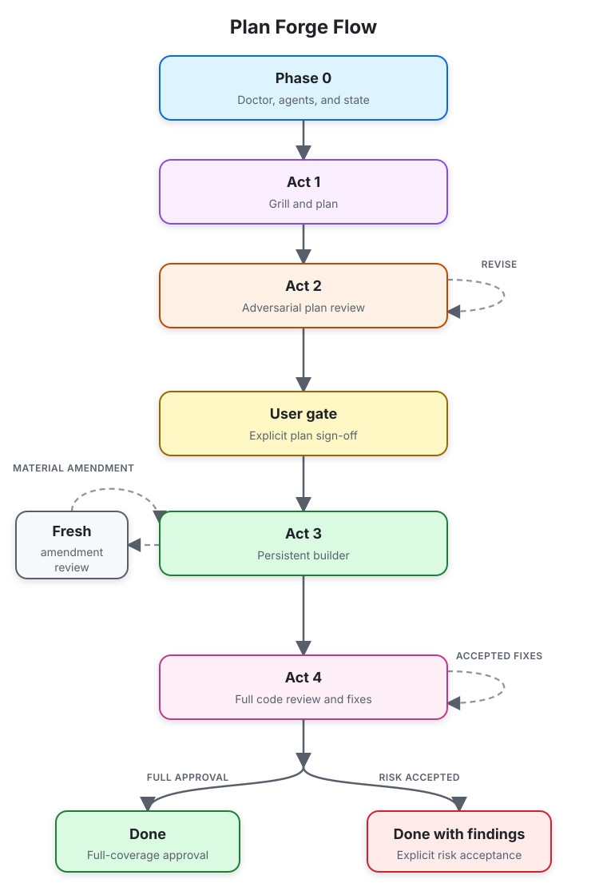

# Plan Forge Flow for Codex

## 1. Description and goal

Plan Forge Flow is a Codex plugin for non-trivial repository changes that
benefit from decision-complete planning, independent review, controlled
implementation, and a final code audit.

The `$forge` skill conducts planning and plan review read-only in native Codex
Plan mode. It presents the reviewed plan through Codex's native plan widget,
authenticates the resulting implementation action, and only then materializes
durable workflow state for implementation and code review.

## 2. Workflow



### Read-only readiness

In Plan mode, Forge may inspect the repository and run the read-only `doctor`,
`models`, `picker`, and `issue-approval` commands. `picker` returns exact
pagination metadata; `issue-approval` derives repository/transcript origin,
revision, nonce, hashes, and wrapper from a bounded JSON input without
materializing workflow state. `codex debug models` is the sole catalog source.
Forge offers only list-visible models whose CLI metadata declares
`multi_agent_version: v2`, matching the native sub-agent runtime, and uses the
same rows for efforts, display names, descriptions, default effort, and
priority. There is no session, native-schema, cache, static-policy, inferred,
or manual fallback. Catalog failure or an empty v2 intersection stops selection.

Managed reviewer/builder agent installation is a Default-mode setup action. If
setup is required, Forge stops planning, asks for a setup turn, and restarts
Plan mode after Codex reloads the agent schema.

### Act 1 — grill and canonical plan

Forge resolves the design tree one decision at a time through
`request_user_input`, using repository inspection when the code can answer a
question. The complete draft and decisions stay in model-visible conversation
state—Acts 1–2 create no `.forge/`, plan files, Git refs, excludes, journals,
or repository files.

The human plan has one canonical UTF-8/LF byte representation with exactly one
terminal newline. The same bytes are reviewed, previewed, hashed, placed in the
native approval wrapper, materialized as `PLAN.md`, and locked for building.

### Act 2 — fresh adversarial plan review

The user selects a reviewer model and effort from paginated
`request_user_input` pickers:

- models are ordered by ascending CLI priority and shown two per page;
- labels use CLI `display_name`, with slug and CLI description in the option;
- `More…` appears only when another page exists;
- efforts are non-`ultra`, with the CLI default first and CLI descriptions;
- a sole remaining choice is selected without an invalid one-option question.

Priority controls picker order only. Forge never asks for or compares the
orchestrator model or effort, and there is no reviewer-strength rule.

Every round spawns a fresh read-only reviewer with no inherited context. Its
prompt contains the complete current plan and complete review record. It ends
with strict `VERDICT: APPROVED` or `VERDICT: REVISE`. Forge remains the final
arbiter, records accepted/rejected findings with reasons, and passes the full
replacement evidence to the next fresh reviewer.

The initial review cap is five and invalid-verdict retry cap is two. At either
cap the user chooses one extra attempt, named risk acceptance, or stop.

### Native preview and approval

After review settles, Forge first shows the complete plan as normal Markdown.
Only after the preview is visible does the user choose the builder model and
effort through the same paginated picker contract. The builder choice is bound
to the previewed human-plan hash.

Forge then emits exactly one final `<proposed_plan>` block. It contains the
identical human plan plus one non-rendered, strict resume-envelope comment.
The native widget is the only approval surface; there is no separate approval
question and no tool call or text after the block.

If the plan changes, Forge increments its revision and invalidates the old
preview binding, builder choice, wrapper, and envelope before repeating the
preview and picker.

### Default-mode resume and materialization

Native implementation actions are supported: Desktop `Yes, implement this
plan`, Desktop's `PLEASE IMPLEMENT THIS PLAN:` form carrying the visible plan,
legacy `Implement the plan.`, and clear-context implementation. For the
embedded Desktop form, the carried plan must exactly match the human-plan bytes
in the immediately preceding signed wrapper. The prompt hook derives
Default mode from the matching transcript `turn_context`, authenticates the
immediate Forge wrapper relationship (or terminal carried origin), stores no
arbitrary prompt text, and only then tells the new context to run
`forge.mjs resume`.

Resume authenticates the origin transcript relationship, exact wrapper, plan
hash, repository/worktree identity, revision, and one-time nonce. Under a
repository lock it uses a durable plugin journal, staged idempotent artifacts,
fsync, a repository commit marker, and a retained nonce tombstone. Crashed
transactions reconcile; foreign partial state fails closed.

Only successful materialization creates the owned `PLAN.md`,
`PLAN-REVIEW-LOG.md`, `.forge/` state, managed exclude, and active-run marker.

### Act 3 — persistent builder

One workspace-write `forge_builder` uses the materialized builder selection for
the entire implementation. It receives exactly one locked plan step per
follow-up and may edit, but never stage or commit.

The orchestrator verifies every step's listed checks, or at least the
applicable build/typecheck and relevant tests when none are listed.
`complete --task` records that verification decision; it does not run checks.
The initial verification retry cap is three. A material amendment receives one
fresh plan review and must repeat native approval before build resumes.

### Act 4 — full code review and fixes

Act 4 reuses the exact reviewer selection from Act 2 while spawning a fresh
read-only reviewer every round. Review evidence attributes pre-existing and
in-run tracked changes and inventories every untracked file.

Safe text files up to 100 KB are included subject to a 1 MiB aggregate budget.
Oversized, binary, secret-like, or otherwise withheld evidence is recorded and
prevents full coverage unless the required explicit authorization is supplied.
Pre-existing findings are reported but fixed only after separate opt-in.

Approval requires `COVERAGE: FULL`. Accepted in-run findings return to the
persistent builder, are verified, and receive another fresh review. The
initial fix-round cap is three. The run ends as `done` after full-coverage
approval or `done-with-findings` after explicit user risk acceptance.

## 3. Requirements

- Codex 0.145 or newer
- The Codex `multi_agent` feature enabled
- A working `codex debug models` command
- Git
- Node.js 18 or newer
- A Git repository for the target change
- Permission to install managed agent definitions under `~/.codex/agents`

## 4. Installation

Add the repository as a Codex marketplace and install the plugin:

```text
codex plugin marketplace add https://github.com/dlin10/CodexPlugins.git
codex plugin add plan-forge-flow@dlin10-codex-plugins
```

Start a new Codex task. On first use, if `$forge` reports that its model-free
agent definitions need installation, switch to Default mode for that setup and
then start another new task so Codex exposes the roles.

To update:

```text
codex plugin marketplace upgrade dlin10-codex-plugins
codex plugin add plan-forge-flow@dlin10-codex-plugins
```

## 5. Usage and trust boundary

Open a Codex Plan-mode task in the target repository:

```text
Use $forge to plan, review, and implement <your change>.
```

An explicit `$forge` prompt submitted outside Plan mode is blocked with
instructions to toggle Plan mode using `/plan` or Shift+Tab. Forge also runs a
read-only `start-plan` preflight before Act 1 so implicit skill activation
fails closed when the prompt hook cannot establish Plan mode.

Before native approval, recovery depends on the retained Plan-mode transcript;
there is intentionally no repository-local Forge state. After approval,
`resume` materializes the run and `status` reports its durable phase, selected
models, pending work, and completed steps.

The CLI deterministically enforces state transitions, hashes, transcript
provenance, nonce replay protection, retry caps, ownership, and review
coverage. The orchestrator still judges reviewer findings and reports whether
verification commands passed. These are auditable responsibilities, not
claims inferred by the CLI.

Reviewer agents are read-only but may inspect repository files needed for
context. Secret-screening controls bulk inclusion in persisted review evidence;
it is not an access-control sandbox.

Cleanup keeps owned plan/review artifacts by default and always retains the
nonce tombstone. Artifact deletion requires an explicit pair-safe request.
Machine-wide agent or replay-ledger purges require separate explicit requests.

## 6. Attribution

Plan Forge Flow for Codex adapts the original Cursor Plan Forge Flow. The Act 1
interview derives from Matt Pocock's MIT-licensed `grill-me` prompt. See
[THIRD-PARTY-NOTICES.md](THIRD-PARTY-NOTICES.md).

This plugin is distributed under the [MIT License](LICENSE).
