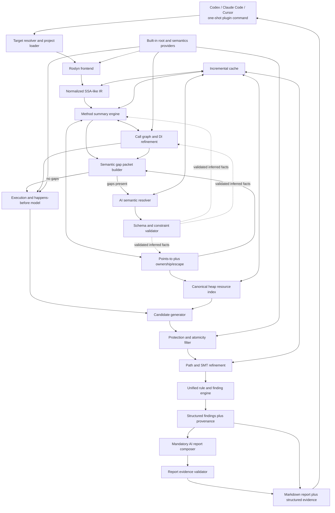

# Implementation Specification: Race Hunter

| Поле | Значение |
|---|---|
| Статус | Первый драфт для дальнейшей инженерной проработки |
| Дата | 2026-09-12 |
| Продуктовые требования | [PRD](PRD.md) |

## 1. Назначение и статус

Спецификация описывает предлагаемые архитектуру, компоненты, алгоритмы, модели данных, plugin integration и подход к проверке Race Hunter. Это исходный технический драфт для следующего агента; он требует доработки и не является завершённым планом реализации.

[PRD](PRD.md) задаёт обязательное поведение продукта, scope, метрики и критерии приёмки. Технические решения `TD-*`, логические схемы и примеры данных в этом документе задают основу реализации и подлежат уточнению. При противоречии с PRD приоритет имеет PRD; примеры не задают дополнительных продуктовых требований.

## 2. Архитектура



### 2.1. Компоненты

| Компонент | Ответственность | Не отвечает за |
|---|---|---|
| Plugin Command Adapter | Единая `/race-hunter` команда, target resolution, lifecycle run, передача отмены в host и возврат ссылки на отчёт | Analysis verdicts |
| Project Loader | MSBuild/Roslyn workspace, compilation boundary, coverage | Анализ concurrency |
| Roslyn Frontend | Symbols/IOperation/CFG → normalized IR | Framework-specific verdicts |
| Summary Engine | Local effects, symbolic propagation, fixpoint | Попарное сравнение всех methods |
| Call Graph Refiner | Targets, delegates, DI bindings, evidence | Heap alias самостоятельно |
| Points-to Engine | Heap regions, access paths, alias sets | Execution overlap |
| Ownership/Escape Engine | Thread confinement, shared/unknown classification | Lock semantics |
| Semantic Gap Builder | Bounded packets для reflection/dynamic/unresolved libraries | Домыслы о semantics |
| AI Semantic Resolver | При наличии semantic gaps — schema-constrained hypotheses о targets/effects/captures | Safety suppression и rule verdict |
| Inference Validator | Symbol/type/CFG/built-in-semantics checks, provenance и acceptance/rejection | Генерация narrative |
| Execution Model | Roots, instances, intervals, may-overlap, happens-before | Resource identity |
| Resource Index | Canonical access buckets и candidate lookup | Expensive path proof |
| Protection Engine | Locksets, atomics, modes, compound operations | DB protection |
| Refinement Engine | Candidate-local call/alias/path/SMT refinement | Initial whole-program discovery |
| Finding Engine | Единый rule decision, evidence mode, scoring, scenario skeleton, fingerprint | Свободный narrative |
| Cache Manager | Keys, invalidation, dependency graph | Semantic shortcuts |
| Built-in Provider Registry | Явная регистрация root/framework semantics implementations и symbol binding | Runtime/user extensions |
| AI Report Composer | Обязательные explanations, interleaving narrative, prioritization и fix suggestions | Изменение structured findings |
| Report Validator/Builder | Evidence-reference validation, Markdown artifact, structured sidecar и coverage | Добавление неподтверждённых фактов |

### 2.2. Dependency direction

Core IR и rule engine не зависят от Roslyn object model, plugin host, AI provider или конкретного framework. Каждый root provider преобразует framework-specific discovery в канонический `ExecutionRootDescriptor`; downstream engines не знают источник root. AI semantic resolver вызывается только при наличии оставшихся после детерминированного анализа semantic gaps и не имеет прямого доступа к mutable graph: он возвращает typed hypotheses, которые validator превращает в отдельно маркированные facts либо отклоняет. Unified rule engine принимает deterministic и validated inferred facts, но safety suppression разрешает только deterministic evidence. AI report composer получает immutable structured results и не может менять verdict. Codex, Claude Code и Cursor adapters отвечают только за lifecycle invocation и доставку report bundle общего формата с критериями parity из раздела 9.5.

### 2.3. Основные технические решения

- Roslyn используется как frontend; собственный normalized IR отделяет core от compiler API.
- Каждый метод анализируется отдельно; callers используют compositional summaries.
- Field-sensitive allocation-site points-to с ограниченным hybrid context sensitivity и ownership/escape выполняются до candidate pairing; доказанно unshared regions исключаются рано.
- Дешёвые фильтры и resource index предшествуют дорогому candidate-local refinement; глобальное декартово сравнение accesses не используется.
- Execution model описывает logical instances, framework invocations и spawn/join intervals независимо от OS threads.
- Защита определяется identity и operation semantics; SMT служит budgeted last-mile refinement.
- AI работает через bounded packets и validated facts; unified rules и deterministic safety gate остаются в core.
- Persistence-вызовы могут оставаться opaque calls, но DB identity, rules и protection model в heap engine не добавляются. Будущий persistent/distributed domain требует собственного resource/operation/protection model и отдельного PRD/SPEC. Архитектура, форма поставки и необходимость major version определяются в рамках той проработки.

## 3. Термины

| Термин | Определение |
|---|---|
| Execution root | Framework- или runtime-точка, из которой может начаться независимый execution instance: HTTP invocation, hosted service, thread/task branch и т. п. |
| Root provider | Изолированное расширение, которое обнаруживает roots конкретного framework и выдаёт core канонические root descriptors, multiplicity и evidence. |
| Execution instance | Одно логическое выполнение root/branch; не тождественно OS thread. |
| MayOverlap | Консервативное отношение: два execution interval могут существовать одновременно в одном процессе. |
| Happens-before | Доказанный порядок, исключающий одновременность конкретных accesses. |
| Heap region | Абстрактная identity объекта или множества объектов, обычно привязанная к allocation site, static storage или symbolic parameter. |
| Resource | Heap region плюс field/access path или модельная логическая ячейка коллекции. |
| Access | Read, write, read-modify-write или atomic/compound operation над resource. |
| Ownership | Классификация `Owned`, `ThreadConfined`, `Escaped`, `Shared` или `Unknown`. |
| Protection set | Набор identity синхронизаторов и режимов, удерживаемых во время access. |
| Method summary | Компактное symbolic описание эффектов метода без повторного анализа его тела в каждом caller. |
| Candidate | Пара accesses, прошедшая дешёвые resource/concurrency/conflict фильтры и требующая refinement. |
| Finding | Candidate, прошедший единый rule engine; может быть `Deterministic` или `AI-Assisted`, но всегда содержит structured evidence, confidence и provenance. |
| Confidence | Ранжирование полноты evidence, а не статистическая вероятность существования бага. |
| Semantic gap packet | Bounded набор source snippets, symbols, candidate targets, constraints и unknown reason, передаваемый AI resolver-у. |
| Inferred fact | Schema-valid AI hypothesis о target/effect/escape/ordering, прошедшая deterministic constraint validation и явно помеченная в evidence. |

## 4. Компоненты анализа и внутренние контракты

### 4.1. Загрузка и границы программы

Пользовательская команда, допустимые targets, coverage и terminal statuses определены в [PRD, разделах 4.1 и 5](PRD.md). Здесь задаётся способ запуска и загрузки.

**TD-006.** Один invocation обслуживается одним конечным analyzer process под управлением plugin adapter. Adapter дожидается terminal state и не оставляет daemon, watcher или фоновую работу после возврата результата.

**TD-007.** Analyzer executable является внутренней деталью plugin package: он не устанавливается как global command, не имеет поддерживаемого headless/CI entry point и принимает запуск только через versioned plugin-adapter protocol. Автоматизация команды в CI не является поддерживаемым сценарием.

**TD-005.** Project loading использует design-time build и MSBuild evaluation в той же trust boundary, что и обычная сборка repository. Analyzer не запускает application assemblies и по умолчанию не инициирует restore/network activity.

Первая версия поддерживает следующие target frameworks анализируемых SDK-style C# projects:

| Target framework | Стабильная версия C# по умолчанию |
|---|---|
| .NET 8 (`net8.0`) | C# 12 |
| .NET 9 (`net9.0`) | C# 13 |
| .NET 10 (`net10.0`) | C# 14 |

Более ранние стабильные language versions допустимы в пределах соответствующего target framework и опубликованного supported construct subset; preview frameworks, language features и SDK не входят в поддерживаемую matrix. Эта matrix относится к анализируемым проектам; runtime внутреннего analyzer process определяется при детализации packaging. Конкретные SDK feature bands, версии Roslyn/MSBuild и поддерживаемые сочетания фиксируются при доработке спецификации и проверяются compatibility corpus на Windows и Linux. Multi-targeted project анализируется по отдельным compilations; неподдержанный target явно отражается в coverage и исключает complete status для полного target.

### 4.2. Roslyn frontend и normalized IR

**TD-010.** Frontend должен использовать Roslyn symbols, `IOperation`, control-flow graph и data-flow facts, но не передавать Roslyn-specific objects за границу frontend layer.

**TD-011.** Каждый поддерживаемый method-like body преобразуется в SSA-подобный normalized IR с explicit basic blocks, branches, exceptional exits и source provenance.

**TD-012.** IR должен представлять как минимум:

- parameter/receiver/local/temporary values;
- allocation и assignment;
- field/property/array/collection load и store;
- read-modify-write dependency;
- direct, virtual, interface, delegate и local-function calls;
- return, capture и escape;
- spawn, join, await/order edges;
- acquire/release и synchronization modes;
- atomic operations;
- branch predicates и path condition references;
- unknown/opaque effects.

**TD-013.** Frontend должен сохранять source span, containing symbol, syntax kind и transformation provenance для каждого IR operation, используемого в finding.

**TD-014.** `x++`, `x += y`, property getter-compute-setter и эквивалентный разнесённый по CFG read/compute/write должны нормализоваться в dependency, позволяющую классифицировать non-atomic RMW.

**TD-015.** `async`/`await`, iterator и compiler-generated state machine анализируются на уровне исходной семантики; детали lowering не должны создавать ложные heap resources или execution roots.

### 4.3. Compositional interprocedural method summaries

**TD-020.** Analyzer должен вычислять summary для каждого analyzable метода и переиспользовать его во всех call sites.

**TD-021.** Summary должен содержать:

- symbolic heap accesses относительно `this`, arguments, statics, allocation sites и return value;
- operation kind и value dependency для RMW;
- escapes/captures/returns;
- points-to transfer facts;
- synchronization events и protection sets;
- spawn/join/order events;
- path predicates, при которых возникает effect;
- resolved и unresolved callees;
- unknown effects и причины uncertainty;
- source/evidence provenance;
- input and dependency hashes.

**TD-022.** На call site symbolic resources summary должны инстанцироваться фактическими receiver/arguments и их points-to sets.

Общий symbolic summary метода переиспользуется; context-specific instantiations/refinement results различаются по `(MethodId, ContextKey)` и relevant dependencies. Новый контекст не требует повторной нормализации всего method body или повторного whole-body анализа для каждого execution root.

**TD-023.** Рекурсивные strongly connected components call graph должны анализироваться до fixpoint с документированным widening и termination budget.

**TD-024.** Summary binary/schema format должен быть versioned. Summary, построенный другой несовместимой версией IR, engine/built-in provider set или compiler configuration, не переиспользуется.

**TD-025.** Для metadata-only method без source analyzer применяет built-in framework/library semantics provider либо явно регистрирует opaque effect. Неизвестный метод не считается no-op.

### 4.4. Call graph и refinement targets

**TD-030.** Initial call graph должен поддерживать direct calls, constructors, virtual/interface dispatch, delegates, lambdas, local functions и recognized reflection-free factory patterns.

**TD-031.** Virtual/interface target set должен последовательно сужаться с помощью type constraints, reachability, points-to facts и DI registrations/lifetimes из built-in framework semantics providers.

**TD-032.** Analyzer должен хранить причину включения каждого target: exact symbol, override set, points-to type, DI binding, delegate assignment, built-in semantics provider или fallback unknown.

**TD-033.** Expensive call graph refinement запускается только для targets, влияющих на shared access candidate, либо для построения необходимого evidence path.

**TD-034.** Если детерминированный анализ не смог разрешить reflection, `dynamic`, unresolved assembly, неизвестный library call или другую semantics boundary, analyzer создаёт bounded unknown node и semantic gap packet. Уже разрешённая конструкция не создаёт gap только из-за использования reflection/`dynamic`. Неограниченное соединение неизвестного вызова со всеми методами solution не допускается.

**TD-035.** Semantic gap packet должен содержать только релевантные call sites/source snippets, symbol signatures, receiver/argument types и points-to sets, nearby configuration constants, XML documentation/metadata, candidate targets, deterministic constraints и unknown reason codes.

**TD-036.** При наличии semantic gaps AI semantic resolver обязателен и должен возвращать schema-constrained hypotheses: possible call targets, reads/writes/RMW, captures/escapes, spawn/callback behavior, returned aliases и supporting evidence references. Ответ без evidence references или с invented symbol/location отклоняется.

**TD-037.** Validator должен проверять AI hypotheses против compilation symbols, type compatibility, accessible methods, visible CFG/data-flow facts и hard facts built-in semantics providers. Принятый факт получает `AI-Inferred` provenance и validation status; отклонённый не влияет на analysis.

**TD-038.** Accepted AI-inferred target/effect может расширить call graph, method summary, escape propagation и candidate set. Он не может удалить deterministic edge/effect или доказать synchronization/happens-before safety без отдельного deterministic подтверждения.

**TD-039.** Неразрешённый после AI gap остаётся bounded `Unknown` и перечисляется в coverage/report. Material gap — достижимый из root и способный изменить shared-state effects, alias/escape или overlap verdict — переводит run в `Incomplete`; нематериальный gap допускает complete status с scope note. Analyzer не придумывает target/effect только ради завершения pipeline.

### 4.5. Field-sensitive allocation-site points-to

**TD-040.** Базовая heap abstraction должна идентифицировать объекты по allocation site с ограниченным контекстом создания, static storage, modeled DI instance, symbolic parameter/receiver и bounded summary region.

**TD-041.** Points-to analysis должен быть field-sensitive: `H1.Left.Value` и `H1.Right.Value` не считаются одним resource без alias/summary evidence.

**TD-042.** Access path depth ограничивается внутренним budget, фиксированным в коде сервера; при превышении path сворачивается в wildcard region с явной потерей precision.

**TD-043.** Индексы arrays/spans и keys collections представлены компактным `ElementSelector` с тремя формами:

- `Exact`: доказанно известное типизированное значение, например индекс `0` или строковый key `"customer"`.
- `ExpressionOrRange`: простое символическое выражение (`i`, `i + 1`) либо консервативный диапазон возможных значений с известными guards. Переменные связаны с canonical value identities и analysis context, а не с текстом имени.
- `Unknown`: wildcard element, потенциально пересекающийся с любым элементом соответствующего resource. Неподдержанное выражение или превышение внутреннего complexity budget расширяет selector до безопасного диапазона либо `Unknown`, сохраняя uncertainty; возможные значения не отбрасываются.

Различие selectors доказывает только различие ячеек при доказанно непересекающихся значениях. Объекты, ссылки на которые лежат в разных ячейках, всё ещё могут alias. Для spans/slices сравнение использует underlying region и offset; разные локальные индексы сами по себе не доказывают disjointness. Numeric types, conversions и overflow должны быть учтены; если соответствующая семантика не поддержана, algebraic simplification не используется как доказательство безопасности.

Equality keys определяется фактическим comparer коллекции. Разные строки, hash codes или синтаксически разные expressions не доказывают разные keys при неизвестном/custom comparer без подтверждённой semantics. Дешёвые сравнения constants/ranges выполняются до SMT; сложные expressions и неизвестная equality остаются консервативными. Конкретная grammar expressions, поддерживаемые equality summaries и complexity limits уточняются в следующем драфте; limits фиксируются в коде сервера.

**TD-044.** Базовая политика — ограниченный hybrid context sensitivity с переиспользованием summaries и уточнением контекстов для оставшихся candidates:

- Для instance methods context учитывает абстрактный receiver (`receiver-object sensitivity`), определённый через allocation/DI region; различие имён переменных или runtime invocations само по себе не создаёт разные resource identities.
- Для static methods context различается по непосредственному месту вызова (`1-call-site sensitivity`), без хранения всей цепочки вызовов. Неизвестные receiver/call contexts остаются явно обозначенными summary contexts.
- Для fresh allocations, возвращаемых factory summary, непосредственное место вызова участвует в allocation context; у instance factory сохраняется связь с receiver. Возвращаемый существующий alias, static object или DI singleton сохраняет исходную identity и не превращается в отдельный объект для каждого call site.
- Базовый проход использует эти ограниченные контексты. Более глубокое различение caller/receiver/allocation contexts выполняется только для unresolved alias/dispatch/protection evidence оставшихся candidates согласно TD-033; всё приложение повторно с увеличенной глубиной не анализируется.
- Число контекстов на метод, глубина candidate-local refinement и правила widening ограничиваются constants в коде сервера. Конкретные значения определяются на correctness/performance corpus; порядок создания, объединения и уточнения контекстов детерминирован.
- При объединении контекстов сохраняется консервативное объединение may-targets, aliases и effects. Потеря precision явно отражается в uncertainty/coverage; отбросить неудобный контекст или вывести disjointness/confinement из достижения budget нельзя. Must-held protection и ordering должны оставаться доказанными для всех охваченных executions.

Различный `ContextKey` не является самостоятельным доказательством разных объектов, а одинаковый ключ может представлять несколько runtime instances. Преимущества выбранной политики по precision, времени и памяти необходимо подтвердить на .NET corpus, включая сравнение с простыми call-site/object-sensitive baselines. Методическая основа для такого сравнения: [Hybrid Context-Sensitivity for Points-To Analysis](https://yanniss.github.io/hybrid-context-pldi13.pdf); опубликованные результаты на Java не подменяют измерения Race Hunter.

**TD-045.** Lock identity использует тот же points-to mechanism, что и data resource identity. Одинаковое имя поля или тип lock не доказывают общую защиту.

### 4.6. Ownership и escape analysis

**TD-050.** Каждая heap region должна получить одну из классификаций: `Owned`, `ThreadConfined`, `Escaped`, `Shared`, `Unknown` с evidence chain.

**TD-051.** Объект может быть доказан `ThreadConfined`, если он создан внутри execution instance, не возвращается, не сохраняется в shared/static/escaped object, не передаётся неизвестному capturing call и не захватывается конкурирующим branch.

**TD-052.** Escape propagation должна учитывать field assignment, return, ref/out, closure capture, task/thread capture, delegate storage, collection insertion, static assignment и opaque calls.

**TD-053.** Region, захваченная двумя may-overlap branches или доступная из singleton/static root и многократно вызываемого execution root, классифицируется как `Shared` при отсутствии более точного доказательства.

**TD-054.** Conflicts над двумя доказанно разными owned regions не становятся candidates даже при одинаковом type/field.

**TD-055.** `Unknown` ownership не трактуется как thread confined; uncertainty влияет на confidence и coverage.

### 4.7. Execution и concurrency model

Обязательный набор execution sources задан в [PRD, разделе 3](PRD.md). Ниже описано их представление в execution model.

**TD-060.** Core model должен оперировать execution instances/intervals и отношениями `MayOverlap`/`HappensBefore`, а не предполагать соответствие logical flow одному OS thread.

**TD-061.** Built-in BCL semantics provider обнаруживает callbacks `System.Threading.Timer` по exact symbols поддерживаемых constructors и `Change` overloads. Root descriptor сохраняет callback target, timer identity, переданный `state`, captured aliases и source evidence; callback executions используют общие execution, ownership и conflict models.

- Invocation multiplicity учитывает доказанно отключённый timer, однократную активацию, периодические запуски и повторную активацию через `Change`. Одна однократная активация не размножается автоматически; несколько активаций одного timer могут overlap. Неизвестные параметры оставляют multiplicity неопределённой.
- Периодические callbacks одного timer могут overlap друг с другом, создающим timer execution instance и другими roots. Положительный период сам по себе не доказывает последовательность callbacks.
- Отключение через `Change` и обычный `Dispose()` не создают completion edge для уже допущенных callbacks. Успешно завершённый `await DisposeAsync()` либо подтверждённое ожидание notification от `Dispose(WaitHandle)` могут дать такой edge только для доказанно того же timer и завершившихся callback invocations. Это не доказывает завершение tasks без join или `async void` continuations, вышедших за границу возврата callback.

Контракты для детализации и проверки: [Timer](https://learn.microsoft.com/en-us/dotnet/api/system.threading.timer?view=net-10.0), [Change](https://learn.microsoft.com/en-us/dotnet/api/system.threading.timer.change?view=net-10.0), [Dispose](https://learn.microsoft.com/en-us/dotnet/api/system.threading.timer.dispose?view=net-10.0) и [DisposeAsync](https://learn.microsoft.com/en-us/dotnet/api/system.threading.timer.disposeasync?view=net-10.0).

**TD-062.** HTTP invocations считаются потенциально concurrent друг с другом внутри процесса. Фактическое sharing зависит от DI lifetime/escape/resource identity.

**TD-063.** Core должен получать framework roots только через `ExecutionRootProvider` contract. `Discover(context)` возвращает `RootDiscoveryResult` с canonical root descriptors и diagnostics покрытия. Descriptor содержит entry method/callback, instance bindings, invocation policy с областью действия, process scope, условия активации/завершения, ordering constraints и source-backed evidence. Логический контракт определён в разделе 11; core не должен содержать проверки конкретных framework type names.

**TD-064.** Один `BackgroundService.ExecuteAsync` на одном доказанном service instance не размножается автоматически. Он может overlap с HTTP, другими hosted services и своими spawned branches. Разные процессы не разделяют heap.

**TD-065.** Для `Task.Run` analyzer моделирует interval от spawn до completion и создаёт overlap с parent segment до доказанного join, а также с другими независимыми roots.

**TD-066.** Для `Task.WhenAll` task lifetimes аргументов могут overlap; continuation после успешного join имеет happens-before от completion всех tasks. Analyzer не должен ошибочно считать синхронные части вызовов параллельными до точки фактического task overlap.

**TD-067.** `Thread.Join`, awaited task completion и recognized completion barriers создают happens-before edge только при доказанной identity соответствующего execution handle.

**TD-068.** Iterations `Parallel.*` считаются may-overlap. Loop index/partition predicates передаются resource/path analysis, чтобы различать доказанно непересекающиеся elements.

**TD-069.** Execution model должен учитывать exception/cancellation paths: join или release, который может быть пропущен, не считается безусловным.

### 4.8. Resource identity и conflict semantics

**TD-070.** Heap resource имеет форму `(HeapRegion, AccessPath, ElementSelector?)` и стабильное внутреннее identity независимо от локального имени переменной. Element storage и общая структура коллекции моделируются отдельно: доказанно разные keys не устраняют конфликт concurrent mutations обычного `Dictionary`, затрагивающих общий structural resource. Effects и thread safety конкретных collection operations определяются built-in semantics providers; thread-safe APIs проверяются по TD-085.

**TD-071.** Access kinds: `Read`, `Write`, `ReadModifyWrite`, `AtomicRead`, `AtomicWrite`, `AtomicReadModifyWrite`, `CompoundOperation`, `UnknownEffect`.

**TD-072.** Два accesses конфликтуют, если они may refer to overlapping resource, могут overlap, минимум один является non-atomic write/RMW, не упорядочены happens-before и не имеют доказанной общей достаточной защиты.

**TD-073.** Lost-update finding требует data dependency от предшествующего read к последующему non-atomic write и конкурирующего write/RMW, способного инвалидировать прочитанное значение.

**TD-074.** Простые read/read пары не являются conflicts.

**TD-075.** Candidate index должен группировать accesses по canonical region/path prefix и execution compatibility. `Unknown` selectors сопоставляются со всеми потенциально пересекающимися concrete/range selectors того же resource; разбиение на buckets не должно терять такие пары. Запрещён full Cartesian comparison всех accesses solution.

**TD-076.** Candidate deduplication должна объединять одинаковую root/resource/call-path cause, сохраняя несколько representative source locations и occurrence count.

### 4.9. In-memory synchronization semantics

Поддерживаемые primitives и ожидаемая семантика защиты заданы в [PRD, разделах 3 и 4.2](PRD.md). Ниже — внутренние protection contracts.

**TD-080.** Analyzer должен моделировать source-level `lock` и `Monitor.Enter/Exit`, включая lock identity, lexical/CFG region, `try/finally` и условный успех `TryEnter`.

**TD-081.** Два conflict accesses считаются mutually excluded только если оба выполняются под совместимыми exclusive modes одного may-must-alias synchronization object и acquisition доказан на соответствующих paths.

**TD-085.** Thread-safe collection моделируется по операциям. Например, `GetOrAdd` может быть atomic относительно dictionary slot, но `ContainsKey` + indexer write остаётся compound candidate при overlap.

**TD-086.** Новая synchronization semantics добавляется built-in реализацией соответствующего semantics-provider interface и проходит contract validation. Runtime/user extensions не загружаются; неизвестный тип с методами `Lock/Unlock` не считается защитой по имени.

### 4.10. Path conditions и SMT refinement

**TD-090.** IR должен сохранять bounded path predicates для branch, null/type tests, enum/boolean equality, простых numeric comparisons, switch cases и index/key expressions.

**TD-091.** SMT запускается только после candidate indexing, ownership, overlap, operation и protection filters.

**TD-092.** Refinement query должна проверять satisfiability как минимум совместности guard A, guard B и resource selector equality/overlap. В SMT передаются только релевантные candidate expressions и predicates с необходимыми value dependencies, а не полное состояние heap/коллекции. Значения из независимых execution instances получают отдельные symbolic bindings; одинаковое имя `i` не означает одинаковое runtime value. `a[0]` и `a[1]` могут быть отсечены без SMT как разные ячейки, а для `a[i]` и `a[j]` проверяется возможность `i == j` вместе с guards обоих accesses. Неподдержанные части query ослабляются консервативно по TD-095.

**TD-093.** `UNSAT` подавляет candidate с сохранением diagnostic trace в debug mode. `SAT` сохраняет model/counterexample только в минимальной и безопасной для вывода форме. `UNKNOWN`/timeout не означает safe и снижает confidence.

**TD-094.** В коде сервера фиксируются лимит SMT-проверки одного кандидата 150 ms и global solver budget — не более 10% общего лимита запуска из раздела 10.5. При одинаковом hardware profile, входах и версиях engine/skill порядок candidates должен быть стабильным. Превышение solver budget даёт `UNKNOWN`/uncertainty и не означает safety.

**TD-095.** Неподдержанные predicates абстрагируются консервативно и перечисляются в finding uncertainty.

### 4.11. Finding generation, evidence и confidence

Rule families DCA1001–DCA1004 и требования к triage определены в [PRD, разделах 4.2 и 4.4](PRD.md). Scoring rubric и fingerprints ниже являются техническим предложением.

**TD-101.** Finding должен содержать: rule, severity, confidence label/score, `EvidenceMode`, canonical resource, access A/B, execution root/branch A/B, ordered code flows, alias evidence, concurrency evidence, protection analysis, path feasibility, AI contributions, uncertainty, scenario и stable fingerprint.

Сервер сохраняет полный набор structured findings и evidence для всех confidence levels, включая Low, с пометками generated origin. Правила включения в основной Markdown-отчёт заданы в skill (раздел 9.2).

Пользовательские suppressions поступают из локальных source attributes/comments и repository-wide списка точечных исключений, записанного непосредственно в skill. Каждая repository-wide запись привязана к конкретному repository и exact semantic anchors находки; отдельный пользовательский файл конфигурации плагина не вводится. Оба источника нормализуются в записи с semantic identity, provenance, обязательным непустым `reason` и необязательными `owner`/`expiry`. Конкретный синтаксис и формат записи предстоит определить в следующем драфте.

Сервер выполняет deterministic matching и проверку expiry при каждом запуске до передачи reportable findings в AI composer. Отсутствующий expiry означает бессрочное исключение; просроченная или невалидная запись не скрывает находку и отражается в диагностике. Suppression меняет только reportability: findings/evidence сохраняются, coverage не улучшается, safety proof не возникает. Suppressed summary содержит идентификатор finding, источник исключения, reason и owner/expiry при наличии. Новая semantic cause и находка из другого repository не наследуют исключение автоматически.

**TD-102.** Core формирует deterministic event skeleton вида `A reads v0 → B reads/writes → A writes f(v0) → update/effect lost`. Обязательный AI report composer превращает skeleton в читаемый narrative, но не должен придумывать runtime values/events, которых нет в structured evidence.

**TD-103.** Confidence score находится в диапазоне 0–100 и используется только для ranking. UI и документация явно говорят, что это не вероятность.

Базовая scoring rubric:

| Evidence dimension | Максимум |
|---|---:|
| Resource identity / alias | 25 |
| MayOverlap proof | 20 |
| Conflicting operation / RMW dependency | 20 |
| Protection analysis completeness | 20 |
| Path feasibility | 15 |

Рекомендуемые labels: `High` 80–100, `Medium` 55–79, `Low` 0–54. Unresolved target, wildcard region, opaque effect, solver unknown и incomplete built-in semantics coverage уменьшают соответствующий component score и перечисляются отдельно.

**TD-106.** Fingerprint должен быть устойчив к сдвигу строк и включать semantic anchors: rule, containing symbols, canonical resource shape, execution roots и operation roles. Изменение смысла finding должно менять fingerprint.

**TD-108.** Self-reported AI confidence не добавляет баллы напрямую. Баллы AI-assisted evidence определяются силой deterministic validation. Name-based либо weakly supported inference ограничивает finding уровнем `Medium`; `High` допустим только когда все необходимые inferred facts подтверждены exact symbol/type/source/config constraints и нет material unresolved gap.

**TD-109.** Fingerprint AI-assisted finding включает semantic hypothesis kind и supporting deterministic anchors, но не свободный текст AI response. Смена provider/model без изменения validated facts не должна сама по себе создавать другой finding.

### 4.12. Incremental analysis и cache

Эквивалентность warm/full scan, пересчёт без кэша и отказоустойчивость кэша заданы в [PRD, FR-19](PRD.md). Ниже — структура хранения и invalidation.

**TD-110.** Analyzer должен хранить content-addressed cache для IR, method summaries, dependency graph, call graph facts, resource buckets, deterministic refinement, validated AI inferences и report fragments.

**TD-111.** Cache key должен включать checksum source, project/compiler options, referenced assembly identity, analyzer/IR schema version, engine/built-in provider version, значимую конфигурацию анализируемого приложения и для AI/report artifacts — provider/model/prompt/schema identities, версию/hash skill и exact payload hash. Фиксированные серверные правила версионируются вместе с engine.

Context-specific summary instantiations и refinement artifacts дополнительно ключуются по canonical `ContextKey` и relevant dependencies; общий symbolic summary остаётся переиспользуемым. Cache не переносит context-specific facts в другой контекст без корректной инстанциации.

**TD-112.** Изменение метода invalidates его summary, affected recursive SCC, callers whose summaries depend on changed effects, связанные candidate buckets и findings. Незатронутые summaries переиспользуются.

**TD-113.** Changed-files mode обязан сравнивать изменённые accesses с cached unchanged accesses. Он не может анализировать только обе изменённые стороны пары.

### 4.13. Built-in framework semantics providers

**TD-120.** Internal provider contracts должны описывать:

- execution root и invocation multiplicity;
- spawn/join/ordering semantics;
- DI registration и lifetime (`Singleton`, scoped, transient, instance/factory при доступной информации);
- synchronization/atomic operation semantics;
- callback/delegate capture;
- ownership transfer и immutability;
- opaque external effects;
- supported package/version range.

**TD-121.** Текущий product scope должен компилировать в engine следующие built-in implementations:

- BCL semantics provider для tasks, threads, parallel, callbacks `System.Threading.Timer` и synchronization primitives;
- DI semantics provider для `Microsoft.Extensions.DependencyInjection` и hosting abstractions;
- `AspNetCoreRootProvider` для controllers/minimal APIs;
- `HostingRootProvider` для `BackgroundService`/`IHostedService`.

**TD-122.** Built-in semantics resolution должен быть привязан к exact symbol identity и supported version range, а не только к строковому имени метода.

**TD-123.** Built-in providers явно регистрируются в одном composition root и получают общий contract-test harness. Для `IExecutionRootProvider` единый fixture, состав cases и naming convention определены в разделе 11. Duplicate provider id, invalid supported-version declaration или conflicting semantics должны ломать build/test либо startup self-check.

**TD-124.** Отсутствующая или out-of-range built-in semantics implementation должна появляться в coverage report. Analyzer не должен молча применять несовместимую semantics.

**TD-125.** Новый root type должен добавляться одним built-in классом `IExecutionRootProvider`, одной регистрацией в composition root и provider-specific tests, без изменений normalized IR, points-to, ownership, candidate, protection, finding или report engines.

**TD-126.** Root provider не создаёт findings напрямую. Он выдаёт root descriptors, declarative invocation/ordering facts, evidence и diagnostics покрытия; общий deterministic core строит execution model и применяет единые правила анализа. Diagnostics не назначают severity/confidence findings или итоговый run status.

### 4.14. Условия запуска AI semantic/report layer

**TD-130.** AI layer имеет две раздельные роли: `SemanticGapResolver` до окончательного candidate/rule evaluation, обязательный только при наличии semantic gaps после детерминированного анализа, и `ReportComposer` после формирования structured findings, обязательный для каждого complete run.

При пустой gap queue resolver не вызывается и AI-запрос для него не отправляется; analyzer локально записывает в run metadata `semanticResolverInvoked=false` и `semanticResolverSkipReason=NoSemanticGaps`. Такой пропуск не делает run `Incomplete` и не препятствует `CompleteClean`/`CompleteWithFindings` при успешном завершении остальных обязательных фаз. При непустой queue resolver обязателен; его недоступность или failure дают `Incomplete`/`Failed`. Report composer остаётся обязательным в обоих случаях.

**TD-131.** `SemanticGapResolver` обрабатывает semantic gap packets из TD-034–TD-039 и возвращает только schema-valid hypotheses. Его validated inferred facts могут добавлять call targets/effects/candidates и тем самым приводить к `AI-Assisted` findings; они не могут удалять deterministic facts/findings.

**TD-132.** Все findings и analysis gaps должны сохраняться в structured form независимо от narrative. Report composer не получает права менять rule, severity, confidence components, fingerprint, source paths, evidence mode или run coverage; он только объясняет и группирует переданные данные.

**TD-133.** AI runtime — текущий host (Codex, Claude Code или Cursor). Будущий skill организует resolver/report работу через доступные host-у AI-сессии и субагентов; сервер передаёт bounded packets и валидирует результаты через versioned workflow contract. Правило использования host AI фиксируется в skill. Модель и её identity определяются текущим host-ом и записываются в evidence; plugin-specific выбор внешнего provider adapter не предусматривается. Cross-host conformance проверяется по критериям раздела 9.5: полное совпадение deterministic results при одинаковых semantic inputs и отдельные quality gates для AI каждого host-а.

**TD-135.** AI получает минимальные semantic gap/finding packets и необходимые source snippets, а не solution целиком. Provider, model, retention, data residency, prompt version, schema version и payload hashes записываются в run metadata.

**TD-136.** AI responses проходят schema validation, evidence-reference validation и contradiction checks. При ошибке допускается один bounded repair attempt; повторная ошибка делает AI phase incomplete и не публикует непроверенный narrative как готовый отчёт.

**TD-139.** AI-inferred synchronization, atomicity или happens-before fact не может подавить deterministic candidate. Для safety suppression требуется hard fact от built-in semantics provider либо deterministic proof.

**TD-140.** Cache AI results ключуется по payload hash, provider/model identity, prompt/schema version и relevant engine/built-in-provider version. Cache hit не освобождает response от schema/evidence validation.

## 5. Data model

Ниже приведена логическая схема; конкретное представление может быть immutable records/compact binary tables.

```text
MethodId
  AssemblyIdentity
  MetadataName
  GenericInstantiationShape

HeapRegion
  Id
  Kind: AllocationSite | Static | Parameter | Receiver | DiInstance | Summary
  Type
  Origin
  ContextKey
  Ownership
  PrecisionFlags[]

AccessPath
  Segments: Field | PropertyBackingField | Element | Wildcard
  MaxDepthReached

ResourceId
  HeapRegionId
  AccessPath
  ElementSelector?

ElementSelector
  Kind: Exact | ExpressionOrRange | Unknown
  ValueType
  ConstantOrExpressionOrRange?
  ValueBindings[]
  EqualitySemanticsRef?
  GuardId?
  PrecisionFlags[]

AccessEffect
  ResourceExpression
  Kind
  ValueDependency?
  GuardId
  ProtectionSetId
  ExecutionIntervalId
  SourceLocation
  Provenance[]

Protection
  PrimitiveKind
  SynchronizerRegion
  Mode
  AcquireGuard
  MustHold

RootDiscoveryResult
  Roots: ExecutionRootDescriptor[]
  Diagnostics: RootDiscoveryDiagnostic[]

ExecutionRootDescriptor
  StableRootId
  RootKind
  ProviderId
  EntryMethodOrCallback
  InstanceBindings
  InvocationPolicy
  ProcessScope
  ActivationCondition
  CompletionEvents[]
  OrderingConstraints[]
  DiscoveryEvidence[]
  PrecisionFlags[]

ExecutionInterval
  Kind
  RootOrSpawnSite
  Parent?
  StartEvent
  EndEvent
  Multiplicity
  ProcessScope

MethodSummary
  MethodId
  ContextKey
  AccessEffects[]
  Escapes[]
  PointsToTransfers[]
  Calls[]
  SpawnJoinEvents[]
  Guards[]
  UnknownEffects[]
  Provenance[]
  InputHash
  DependencyHash
  SchemaVersion

SemanticGapPacket
  GapId
  Kind: Reflection | Dynamic | UnresolvedDispatch | UnknownLibrary | ModelGap
  SourceAndSymbolEvidence[]
  DeterministicConstraints[]
  CandidateTargets[]
  AllowedHypothesisKinds[]
  PayloadHash

AIInference
  InferenceId
  GapId
  Kind: Target | Read | Write | RMW | Capture | Escape | Spawn | ReturnAlias
  Hypothesis
  SupportingEvidenceIds[]
  ModelConfidence
  ValidationStatus
  RejectionReasons[]
  ProviderModelPromptSchemaIdentity
```

### 5.1. Invariants

- Source location всегда сопровождается symbol identity; line number не используется как единственный anchor.
- `Atomic*` классифицируется только built-in-provider/frontend semantics, никогда по имени пользовательского метода.
- `Shared` относится к одному process scope. Одинаковый allocation site в двух процессах не означает одну heap region.
- `MustHold=true` требуется для suppression через lock. `MayHold` может повысить evidence, но не доказывает безопасность.
- Unknown facts сохраняют reason code и provenance.
- Все ID, попадающие в cache/fingerprint, имеют versioned canonical serialization.
- `ExecutionRootDescriptor` не содержит framework-specific runtime objects; provider identity хранится только для evidence, compatibility и diagnostics.
- Instance bindings, invocation scopes, guards и event references в root descriptors каноничны и проверяемы. Unknown binding/guard не трактуется как отсутствие запуска, независимый объект или доказанный ordering; coverage diagnostics сохраняются даже при пустом списке roots.
- AI inference без существующих `SupportingEvidenceIds` или со статусом, отличным от `Accepted`, не может попасть в call graph, summary или finding.
- `AIInference.Kind` намеренно не содержит `SynchronizationProof`/`HappensBeforeProof`: AI не может самостоятельно доказать safety suppression.

## 6. Analysis pipeline

### Phase 0. Workspace discovery

Разрешить target из plugin workspace/аргумента, загрузить solution graph, compiler inputs и package/reference identities, затем инициализировать compiled built-in provider registry. Создать initial coverage inventory: загруженные/пропущенные проекты, bodies и применимые providers.

### Phase 1. Frontend normalization

Параллельно по method bodies построить normalized IR и локальные CFG/data-flow facts. Вычислить source hashes. Переиспользовать валидный IR cache.

### Phase 2. Initial call graph

Создать exact edges, bounded virtual/interface sets, delegate/lambda edges и framework callbacks. Выполнить initial root discovery и сохранить `RootDiscoveryResult`: descriptors используют symbolic bindings, diagnostics дополняют coverage inventory и semantic gap packets до Phase 6. Отметить unresolved/dynamic/reflection boundaries.

### Phase 3. Local summaries

Вычислить reads/writes/RMW, symbolic resource paths, local allocations, escapes, captures, synchronization и spawn/join events без обхода callers.

### Phase 4. Interprocedural fixpoint

Инстанцировать callee summaries на call sites, обрабатывать recursive SCC, распространять effects/escapes и уточнять call targets до budgeted fixpoint.

### Phase 5. Points-to и ownership pruning

Построить allocation-site regions и field-sensitive points-to. Доказать owned/thread-confined regions и удалить их accesses из global concurrency index. Shared/unknown regions сохранить с precision flags.

### Phase 6. AI semantic-gap refinement при наличии gaps

Для semantic gaps, оставшихся после детерминированного анализа reflection, `dynamic`, unresolved dispatch и unknown libraries, построить bounded packets. Если queue пуста, записать локальную причину пропуска `NoSemanticGaps` и перейти к Phase 7 без вызова resolver. Иначе AI semantic resolver возвращает typed hypotheses; validator принимает только согласованные с symbols/types/CFG/built-in-provider facts. Accepted facts повторно запускают затронутые summaries, call graph, points-to и escape propagation до bounded fixpoint. Остальные gaps остаются `Unknown`.

### Phase 7. Execution graph

Core использует полученные `RootDiscoveryResult`, разрешает symbolic instance bindings и invocation scopes через points-to/DI facts и строит roots/intervals по declarative descriptors и built-in runtime semantics. При изменении discovery dependencies затронутые результаты обновляются; diagnostics объединяются с coverage inventory. Spawn/join/await/barrier образуют may-overlap/happens-before graph только с учётом подтверждённых guards и event/handle identities. Новые semantic gaps проходят workflow Phase 6 до final rule evaluation в пределах общего run deadline и fixpoint budget. Частично разрешённый descriptor сохраняет unknown facts; оставшиеся material discovery gaps обрабатываются по общим правилам `Incomplete`.

### Phase 8. Resource indexing и candidate generation

Канонизировать `(region, path, selector)` и поместить accesses в buckets. Сравнивать только bucket-overlap pairs с совместимым process scope и хотя бы одним write.

### Phase 9. Cheap safety filters

Удалить read/read, proven-disjoint alias/selectors, non-overlap/happens-before pairs, common must-held compatible protection и modeled atomic-safe combinations.

### Phase 10. Candidate-local refinement

Для оставшихся пар уточнить call targets, context, points-to, lock identity и path guards. Выполнить SMT query в budget. Unknown сохраняется как uncertainty.

### Phase 11. Rule evaluation

Применить DCA rules к deterministic и accepted AI-inferred facts, определить `EvidenceMode`, severity, component confidence, coverage impact и deduplicate related occurrences. Safety suppression использует только deterministic proofs.

### Phase 12. Structured evidence/scenario construction

Построить два минимальных code flow, concurrency proof, resource proof, protection decision и deterministic event skeleton. Проверить, что все source steps и AI supporting references имеют валидные IDs/spans.

### Phase 13. Mandatory AI report and cache update

Стабильно отсортировать structured findings, передать их AI report composer-у, проверить narrative references/contradictions и построить Markdown report bundle со structured sidecar. Вернуть plugin adapter итоговый status и атомарно обновить только полностью вычисленные cache entries. Невалидный AI report после repair attempt переводит run в `Incomplete`/`Failed`.

## 7. Conflict decision procedure

Базовое условие:

```text
Conflict(A, B) =
    SameProcessScope(A, B)
    && MayResourcesOverlap(A.Resource, B.Resource)
    && MayExecutionOverlap(A.Interval, B.Interval)
    && OperationsConflict(A.Operation, B.Operation)
    && !OrderedByHappensBefore(A, B)
    && !ProtectedByCommonSufficientPrimitive(A, B)
    && PathPairIsNotUnsatisfiable(A.Guard, B.Guard)
```

Для lost update требуется дополнительное условие:

```text
LostUpdate(A, B) =
    Conflict(A, B)
    && (
         A.Operation == NonAtomicRMW
         || B.Operation == NonAtomicRMW
       )
    && StaleReadCanInfluenceLaterWrite(A, B)
```

Результат каждой проверки — не только boolean, а `(True | False | Unknown, Evidence[])`. `False` подавляет candidate только там, где это безопасно по семантике проверки. `Unknown` переносится дальше и снижает confidence.

## 8. Finding schema

### 8.1. Предлагаемая логическая схема

```json
{
  "schemaVersion": "1.1",
  "findingId": "stable-fingerprint",
  "ruleId": "DCA1002",
  "title": "Non-atomic update of shared Counter",
  "severity": "high",
  "evidenceMode": "deterministic",
  "confidence": {
    "label": "high",
    "score": 94,
    "isProbability": false,
    "components": {
      "resourceIdentity": 25,
      "executionOverlap": 20,
      "operation": 20,
      "protection": 19,
      "pathFeasibility": 10
    }
  },
  "resource": {
    "domain": "managed-heap",
    "region": "allocation:SharedState.cs:18@Singleton",
    "accessPath": ["Counter"]
  },
  "accesses": [
    {
      "role": "A",
      "operation": "read-modify-write",
      "root": "HTTP PUT /counter",
      "source": "CounterService.cs:42",
      "codeFlow": ["..."],
      "heldProtection": []
    },
    {
      "role": "B",
      "operation": "read-modify-write",
      "root": "CounterRefreshWorker.ExecuteAsync",
      "source": "CounterRefreshWorker.cs:31",
      "codeFlow": ["..."],
      "heldProtection": []
    }
  ],
  "concurrencyEvidence": ["roots may overlap in one process", "singleton region shared"],
  "aliasEvidence": ["both receivers point to the same DI singleton region"],
  "protectionAnalysis": {
    "result": "unprotected",
    "commonProtection": []
  },
  "pathFeasibility": {
    "result": "sat",
    "solver": "engine-solver/version"
  },
  "scenario": [
    "A reads Counter = v0",
    "B reads Counter = v0",
    "A writes f(v0)",
    "B writes g(v0), overwriting A's update"
  ],
  "uncertainty": [],
  "aiContributions": [],
  "remediation": ["AI suggestion; verify manually: protect both accesses with the same lock. Check that every conflicting access uses that lock and that the acquisition order preserves application behavior."],
  "analysis": {
    "engineVersion": "x.y.z",
    "builtInProviders": ["bcl", "aspnetcore-roots", "hosting-roots"],
    "ai": {
      "semanticResolverInvoked": false,
      "semanticResolverSkipReason": "NoSemanticGaps",
      "acceptedInferenceCount": 0,
      "reportComposer": "host/provider/model/prompt-schema"
    },
    "coverageState": "complete-for-finding"
  }
}
```

Source fields в реальном JSON должны быть структурированными (`path`, `span`, `symbol`); строковая форма выше сокращена для читаемости.

Пример показывает finding из run без semantic gaps: resolver пропущен, AI report composer выполнен. Если resolver был вызван, `semanticResolverInvoked=true`, а `semanticResolverSkipReason=null`.

### 8.2. Human-readable finding

AI-composed human-readable finding должен отвечать в таком порядке и ссылаться на structured IDs:

1. Что может быть потеряно/повреждено.
2. Какой heap resource общий.
3. Где находится access A и его root/path.
4. Где находится access B и его root/path.
5. Почему они могут overlap.
6. Почему analyzer не нашёл достаточной общей защиты.
7. Минимальный interleaving.
8. `Deterministic` или `AI-Assisted`, включая принятые AI inference и supporting anchors.
9. Confidence и конкретные uncertainty.
10. Варианты remediation и отдельно помеченные AI fix suggestions: каждый с `verify manually` и конкретными проверками перед применением.

Допустимые категории AI fix suggestions в текущем in-memory scope:

| Категория | Примеры предложений | Что проверить вручную |
|---|---|---|
| Синхронизация и атомарность | Общий синхронизатор для конфликтующих accesses; атомарная операция | Охват всех конфликтующих accesses, identity синхронизатора, инварианты составной операции и порядок захвата блокировок |
| Владение и организация состояния | Устранение общего изменяемого состояния, отдельные instances, immutable snapshots, изменение ownership или DI lifetime | Сохранение требуемого sharing, lifetime, публикации состояния и поведения приложения |
| Порядок выполнения | Последовательное выполнение, явное ожидание завершения конкурирующей работы | Охват нужных execution instances, exception/cancellation paths и допустимость потери параллелизма |

Каждая рекомендация опирается на evidence конкретной finding, указывает предпосылки применимости и проверки из контекста кода. Для всех категорий обязательна пометка `verify manually`, независимо от confidence finding: уверенность в находке не доказывает корректность предложенного исправления. Skill задаёт эти правила, report validator проверяет evidence references, наличие пометки и содержательных указаний для ручной проверки. Плагин формирует рекомендации только в отчёте и не изменяет application code.

## 9. Plugin integration и artifacts

### 9.1. Target resolution

Плагин для Codex, Claude Code и Cursor предоставляет одну команду:

```text
/race-hunter [target]
```

`target` optional. При его отсутствии плагин использует активный workspace и применяет детерминированный порядок resolution: выбранная host-ом solution, единственная solution в workspace, затем project graph из workspace root. Если target нельзя определить однозначно, команда завершается `Failed` и всё равно создаёт короткий diagnostic report с найденными вариантами; она не переходит в интерактивный wizard.

Команда не имеет отдельных subcommands для baseline, provider management или report formatting. Повторная проверка после исправлений — новый независимый invocation той же команды.

### 9.2. Lifecycle одного invocation и правила skill

Параметры работы server/analyzer engine закрепляются в его коде; правила AI workflow и представления отчёта записываются непосредственно в будущем skill. Пользовательский файл конфигурации плагина и его schema version отсутствуют. Версии protocol, IR и structured report schemas сохраняются независимо от этого.

Будущий skill содержит следующие фиксированные правила:

| Правило | Значение |
|---|---|
| Минимальный confidence основного отчёта | Low: показывать High, Medium и Low |
| Представление Medium | Сразу после High, полный текст findings без сворачивания подробностей |
| Находки в generated code | Не включать в основной отчёт; generated code участвует в анализе |
| Source snippets | Включать короткие фрагменты после обязательной redaction |
| Пользовательские suppressions | Локальные source attributes/comments и repository-wide список в skill; reason обязателен, owner/expiry необязательны; сервер проверяет exact match и expiry |
| AI runtime | Текущий host |
| Semantic resolver | Обязателен при оставшихся semantic gaps; при пустой queue не вызывается |
| Report composer | Обязателен для каждого complete run |
| AI fix suggestions | Локальные и архитектурные предложения в in-memory scope; каждое с `verify manually` и конкретными проверками перед применением |
| Отдельный лимит времени AI | Отсутствует; действует общий deadline сервера |

Сервер отдаёт structured results со всеми confidence levels и generated-origin metadata. Skill формирует основной отчёт по указанным правилам; report validator проверяет, что в него включены все reportable findings, в том числе Low. AI не назначает собственный confidence threshold.

Lifecycle:

1. Plugin adapter фиксирует workspace, target, входы анализируемого приложения, версии engine/built-in-provider/skill и AI identities. Сервер создаёт run ID и общий deadline на 30 минут с начала invocation.
2. Запускает локальный deterministic analyzer и получает initial facts/semantic gap packets.
3. При непустой semantic gap queue skill использует AI текущего host-а через versioned workflow для semantic-gap resolution; validated facts возвращаются серверу. Skill учитывает идентификаторы всех запущенных AI-сессий/субагентов и их дочерних задач в рамках run. При пустой queue resolver пропускается с локальной причиной `NoSemanticGaps`.
4. Выполняет final rule evaluation и вызывает обязательный AI report composer над immutable structured results.
5. Проверяет evidence references/narrative и дожидается завершения фаз либо общего deadline/cancellation. По общему тайм-ауту сервер инициирует отмену, а skill через host отменяет все AI-сессии и субагентов этого run.
6. Создаёт report bundle даже для `Incomplete`/`Failed`, если доступна файловая система.
7. Возвращает в Codex/Claude Code/Cursor status, duration, counts и кликабельную ссылку на основной Markdown-отчёт.
8. Возвращает terminal response после остановки работ run; никакие AI-сессии, субагенты, watchers или другие его фоновые задачи не продолжают анализ.

### 9.3. Run status contract

Значения `CompleteWithFindings`, `CompleteClean`, `Incomplete`, `Failed` и `Cancelled` и их пользовательская семантика определены в [PRD, разделе 5](PRD.md). Adapter передаёт terminal status вместе с duration, counts и report location. Пропуск resolver при пустой gap queue не является ошибкой. Ошибка resolver при наличии gaps или обязательного report composer/validation использует non-complete status и technical fallback artifact. Общий тайм-аут запуска даёт `Incomplete` с причиной `OverallTimeout`; явная отмена пользователем/host-ом даёт `Cancelled`. Отмена работающих AI-сессий и субагентов выполняется в обоих случаях согласно разделу 10.6; protocol messages и cancellation handshake предстоит детализировать.

### 9.4. Report bundle

По умолчанию bundle создаётся в plugin-owned artifact directory вне source tree, чтобы не загрязнять repository. Он содержит:

```text
concurrency-analysis-<run-id>/
  report.md
  findings.json
  run-metadata.json
```

`report.md` — основной пользовательский artifact, сформированный обязательным AI composer-ом и проверенный против evidence. `findings.json` — versioned structured evidence для drill-down и аудита AI narrative. `run-metadata.json` содержит engine/skill/model/prompt/schema identities, timings, coverage и hashes, но не дублирует исходный код.

Обязательные разделы `report.md`:

1. Run status, target, timestamp, engine/built-in-provider/AI versions и duration.
2. Executive summary по severity/confidence/rule.
3. Coverage и явные unsupported/incomplete boundaries.
4. Секции findings в порядке High, Medium, Low; внутри каждой — группировка по shared resource и root cause. Medium findings полностью раскрыты при открытии отчёта.
5. Для каждой finding — два code paths, resource/alias evidence, overlap proof, protection analysis, interleaving, uncertainty и remediation.
6. Suppressed summary; Low findings входят в основную findings section.
7. Performance/cache diagnostics в appendix.

### 9.5. Host parity и developer experience

- Codex, Claude Code и Cursor adapters используют один analyzer binary с одинаковым built-in provider registry, schemas и prompts.
- Host-specific adapter не меняет deterministic facts/rules/scoring. AI-assisted facts проходят одинаковый validation contract и всегда несут host/model identity.

Conformance имеет два обязательных уровня:

1. **Deterministic/replay parity — 100%.** При одинаковых canonical inputs, engine/provider/skill/schema versions и semantic responses сравниваются normalized facts, structured finding set с fingerprints, severity/confidence, evidence, coverage и terminal status. Для проверки adapters тестовый harness воспроизводит одни и те же заранее записанные resolver/report responses во всех трёх hosts через обычный workflow и validators. Cases без semantic gaps проверяют отсутствие resolver invocation. Ни один semantic mismatch не допускается.
2. **Live-AI quality — отдельно для каждого host.** На общем утверждённом corpus каждый host выполняет PRD G1–G3 и G6: Recall ≥ 90% для полностью поддерживаемых конструкций, High-confidence precision ≥ 90% и обязательные требования к evidence. 100% опубликованных AI-derived facts/narrative проходят schema, reference и contradiction validation; AI не подавляет deterministic findings. Дополнительные validated AI-assisted findings и формулировки могут различаться между hosts и повторными запусками. Различия сохраняют provenance/uncertainty; unresolved material gap даёт `Incomplete` по TD-039. Метрики одного host-а не компенсируют нарушение порогов другим.

Replay — внутренний test mechanism. Он связывает response с canonical request/payload hash и prompt/schema versions и не подставляет ответ к другому packet. Recordings и результаты их validation задаются явно; replay не обходит validators и не создаёт пользовательского переключателя AI runtime. В warm/full differential suite используется та же привязка: на каждом revision совпадающие semantic requests получают одинаковые responses, а ожидания для изменённых packets задаются заново. Одних фиксированных model/prompt versions для точного сравнения live-AI runs недостаточно.

Semantic comparison нормализует абсолютный workspace prefix и порядок сериализации; из равенства исключаются run IDs, timestamps, timings, cache counters и сведения о текущем host transport. Эти поля остаются в metadata и проверяются на корректность отдельно. Evidence identities, uncertainty, gaps, severity/confidence и terminal status не исключаются из сравнения. Парные fixtures выполняются при одинаковых compiler/assembly inputs и контролируемых solver/deadline outcomes; timeout/cancellation имеют собственные cases с ожидаемым non-complete status. Проверка replay не заменяет live-AI evals.

AI evals используют независимо размеченные expected targets/effects/findings и evidence constraints; дословное совпадение narrative и процент сходства текстов не являются conformance criteria. Host/model, payload, prompt/schema и engine/skill versions записываются для каждого результата. Размер повторной live-AI выборки и правила агрегации метрик требуется детализировать следующим агентом без ослабления согласованных порогов и без выбора только удачных запусков.

Требования к представлению результатов и lifecycle:

- Пути и source spans в `report.md` кликабельны, когда plugin host поддерживает локальные ссылки.
- Секции findings следуют в порядке High, Medium, Low; внутри секции findings стабильно сортируются по severity, confidence score, project, resource и primary symbol.
- Для suppressed candidate diagnostic appendix может показать последнюю доказанную safety reason.
- Coverage показывает долю bodies/calls, применимость built-in semantics и root providers, а не только число findings.
- Длинный анализ может быть отменён, но не продолжает выполняться после terminal response команды.

### 9.6. Packaging

Один release плагина `race-hunter` содержит общий version-pinned analyzer engine с built-in provider implementations, semantic/report schemas, workflow skill и три тонких host adapter-а: Codex, Claude Code и Cursor. Когда host поддерживает portable Agent Plugins, используются общий skill и local MCP server; host-specific wrapper отвечает только за регистрацию `/race-hunter` и ссылку на artifact. Предлагаемый skill+MCP layout нужно сверить с [документацией Codex plugins](https://developers.openai.com/codex/build-plugins) при детализации packaging. Engine не поставляется пользователю как отдельный глобальный executable.

Plugin package должен быть self-contained либо выполнять preflight поддерживаемого local runtime до начала scan. Installation/update не запускают анализ автоматически. Версии adapter, engine, built-in provider registry, report schema и AI workflow записываются в каждый отчёт.

## 10. Precision strategy

### 10.1. Staged hybrid analysis

**Cheap compositional stage:** normalized effects, summaries, coarse target/points-to, ownership pruning, execution compatibility, resource buckets.

**AI semantic-gap stage, только при наличии gaps:** bounded packets для неразрешённых детерминированным анализом reflection, `dynamic`, dispatch и unknown libraries; schema-constrained hypotheses и deterministic validation. При пустой queue стадия пропускается без вызова resolver.

**Candidate refinement stage:** более точный context/alias, DI/dispatch refinement, lock identity, path predicates и SMT.

Дорогая precision оплачивается только для пары, у которой уже есть shared resource, conflict operations и возможный overlap.

### 10.2. Что является доказательством безопасности

Candidate подавляется, если доказано хотя бы одно:

- resources disjoint;
- region thread confined/owned одним non-overlapping instance;
- execution intervals не overlap или accesses упорядочены happens-before;
- path conjunction/resource equality UNSAT;
- обе операции покрыты одной достаточной atomic abstraction;
- оба conflict accesses must-hold один совместимый synchronization identity/mode.

AI inference самостоятельно не является доказательством безопасности и не может подавлять deterministic candidate.

Отсутствие информации не является доказательством безопасности.

### 10.3. Как ограничивается false-positive rate

- Не сравнивать accesses только по type/field name.
- Исключать unescaped allocations до global indexing.
- Использовать DI lifetimes и exact registrations для sharing/call targets.
- Сохранять field sensitivity и bounded context sensitivity.
- Требовать source-backed operation pair для High confidence.
- Отделять `AI-Assisted` от `Deterministic`, валидировать ссылки и ограничивать weak/name-based AI inference уровнем Medium.
- Понижать confidence при wildcard region, unresolved dispatch, opaque effects или unknown path.
- Показывать конкретные uncertainty и confidence для всех findings, включая Low, с группировкой по root cause.
- Deduplicate один root cause, а не выдавать warning на каждый transitive caller.
- Версионировать built-in provider registry вместе с engine и показывать semantics coverage gaps.

### 10.4. Ограниченная soundness

Analyzer стремится не пропускать defects внутри документированного supported subset. Для оставшихся после детерминированного анализа gaps в reflection, `dynamic`, dispatch и неизвестных libraries AI выполняет best-effort refinement, но это не создаёт гарантии soundness: неразрешённые gaps остаются `Unknown` и видны в coverage. Native/unsafe memory и runtime-generated code также остаются ограничениями. Релизная документация публикует supported construct matrix, AI-assisted classes и известные false-negative cases.

### 10.5. Внутренние performance budgets

Пользовательские P95/память targets и reference environments определены в [PRD, разделе 6.1](PRD.md). Дополнительные технические targets:

| Сценарий | Target |
|---|---|
| Cache reuse при изменении ≤ 1% method bodies | ≥ 90% method summaries, если dependency changes не требуют invalidation |
| Solver budget | 150 ms/candidate и ≤ 10% общего лимита запуска; значения фиксированы в коде сервера |
| Общий deadline run | 30 минут от начала invocation, включая все deterministic/AI phases, ожидание и throttling host-а; константа в коде сервера |

Сервер ведёт единый отсчёт общего deadline; переход между фазами, повторный AI-запрос и запуск субагента его не сбрасывают. Отдельные временные лимиты на semantic resolver, report composer, AI-сессию или AI-субагента не задаются: они используют оставшееся время общего run.

Остальные внутренние границы — access-path depth, число контекстов и глубина refinement для hybrid policy TD-044, recursive fixpoint, unknown-node bounds и AI payload sizes — предстоит определить в доработанной спецификации и закрепить в коде сервера. Они не являются пользовательскими настройками. Превышение analysis budget отражается в coverage/uncertainty; candidate ordering стабилен.

### 10.6. Cache publication и cancellation

Отмена охватывает все работы данного run:

1. При достижении общего 30-минутного deadline сервер переводит run в отмену с причиной `OverallTimeout`, прекращает новые analysis/AI задания и уведомляет skill/adapter.
2. Skill хранит привязку всех созданных AI-сессий и субагентов к run ID, включая дочерние задачи. Через механизмы текущего host-а он отменяет все работающие semantic resolver sessions/subagents; если report composer уже запущен, его работа также отменяется.
3. После начала отмены сервер отклоняет поздние AI-ответы для этого run: они не изменяют graph, findings, coverage или cache и не запускают следующий refinement/repair.
4. Skill/adapter подтверждает остановку созданных работ до terminal response. Протокол должен обеспечивать доставку отмены во время ожидания AI, а не только после возврата ответа модели.
5. По timeout сервер формирует technical fallback report из уже полученных результатов со статусом `Incomplete` и причиной `OverallTimeout`. Новый AI report/repair после deadline не запускается. При явной отмене пользователем/host-ом используется тот же порядок остановки работ со статусом `Cancelled`.

Кэш обновляется атомарно только полностью вычисленными entries. При cancellation частичные entries не публикуются как complete. Повреждённые, частичные и несовместимые entries отбрасываются с warning и пересчитываются; невозможность достоверного пересчёта отражается non-complete status.

Cache локален и не хранит исходный текст сверх минимальных source anchors. Возможность clean full scan без кэша реализуется в коде сервера для проверки эквивалентности и диагностики; пользовательский config switch не вводится.

### 10.7. Диагностические данные

Diagnostic appendix и `run-metadata.json` должны выдавать timings и counts по фазам, cache hit rate, число semantic gap packets, факт вызова semantic resolver либо причину пропуска, accepted/rejected AI inferences, unresolved calls, wildcard regions, candidates до/после каждого filter, SMT SAT/UNSAT/UNKNOWN/timeouts, AI token/latency data при доступности, memory high-water mark, coverage state, общий deadline, причину завершения и результат отмены AI-сессий/субагентов. Telemetry наружу — только opt-in и без source content.

## 11. Built-in execution-root provider contract

`ExecutionRootProvider` — единственная extension boundary для обнаружения новых framework roots. Логический контракт:

```text
IExecutionRootProvider
  ProviderId
  SupportedAssemblyVersions[]
  Discover(RootDiscoveryContext) -> RootDiscoveryResult

RootDiscoveryContext
  CompilationIndex
  SymbolResolver
  CallAndRegistrationIndex
  ConfigurationFacts
  EvidenceFactory

RootDiscoveryResult
  Roots: ExecutionRootDescriptor[]
  Diagnostics: RootDiscoveryDiagnostic[]

ExecutionRootDescriptor
  StableRootId
  RootKind
  ProviderId
  EntryMethodOrCallback
  InstanceBindings
  InvocationPolicy
  ProcessScope
  ActivationCondition
  CompletionEvents[]
  OrderingConstraints[]
  DiscoveryEvidence[]
  PrecisionFlags[]

InstanceBindings
  Receiver
  Arguments[]
  LifetimeOwner

InvocationPolicy
  Multiplicity: AtMostOnce | Repeated | Unknown
  SelfOverlap: MayOverlap | Serialized | Unknown
  ScopeBinding

OrderingConstraint
  BeforeEventRef
  AfterEventRef
  GuardRef
  EvidenceIds[]

RootDiscoveryDiagnostic
  ProviderId
  Code
  AffectedScope
  Reason
  EvidenceIds[]
```

Provider получает read-only discovery context и возвращает immutable данные; он не имеет доступа к candidate/finding engine, не назначает severity/confidence и не реализует отдельные concurrency rules. Поэтому ASP.NET root и будущий MassTransit/job-runner root после discovery проходят один и тот же execution, alias, protection и refinement pipeline.

Правила интерпретации результата:

- `StableRootId` основан на canonical provider/symbol/registration anchors и сохраняется при сдвиге строк. `EntryMethodOrCallback` и bindings используют canonical references; provider не передаёт в core Roslyn objects или исполняемые predicates.
- `InstanceBindings` описывает symbolic receiver, переданные arguments (включая timer `state`) и владельца lifecycle, например service/timer instance. Captured state связан с closure/delegate bindings и разрешается общим points-to/ownership analysis. Отсутствующий по семантике receiver явно отличается от неизвестного binding; создание нового descriptor не создаёт новый heap object.
- `InvocationPolicy` описывает число и пересечение invocations в указанном `ScopeBinding`. `AtMostOnce` относится к этому scope, а не ко всем instances типа. `Serialized` требует deterministic evidence и не запрещает overlap с другими roots/scopes. Неизвестная policy сохраняет возможность overlap; доказанно неактивный root задаётся через `ActivationCondition`.
- Activation/completion и ordering описываются canonical guards и event/handle references. Core применяет ограничение только при подтверждённых bindings, guard и evidence; пропускаемый по exception/cancellation path join не становится безусловным. Для timer сохраняется различие между callback return и завершением отделившейся asynchronous работы.
- `Diagnostics` включает код, затронутый scope, причину и evidence. В следующем драфте фиксируется набор кодов для неподдержанной assembly version, распознанного неподдержанного pattern и unresolved binding; исключение или неполное выполнение discovery тоже должно оставить diagnostic. Проверенная область без roots и gaps допускает пустой результат; непроверенная область не выдаётся за успешный пустой результат.
- Core валидирует references, scope, bindings и ordering evidence до использования результатов. Supported roots могут сохраняться вместе с diagnostics неподдержанных случаев. Diagnostics поступают в coverage; влияние на `Incomplete` определяется общими правилами material gaps, а не самим provider-ом. Неразрешённые semantic gaps передаются в обязательный при их наличии resolver workflow; неразрешённый после него material gap остаётся видимым.

Форматы bindings, guards, events, diagnostic codes и serialization требуется детализировать следующим агентом без изменения выбранной границы ответственности.

Первый этап поставляет built-in providers `AspNetCoreRootProvider` и `HostingRootProvider`; runtime roots `Task`, `Thread`, `Parallel` и callbacks `System.Threading.Timer` создаются built-in BCL semantics provider-ом.

Добавление нового framework root состоит из четырёх действий:

1. Создать built-in класс, реализующий `IExecutionRootProvider`.
2. Зарегистрировать один instance в composition root/immutable provider registry.
3. Добавить provider-specific discovery tests и пройти общий contract-test suite.
4. Выпустить новую версию plugin/engine.

Изменения normalized IR, execution graph, points-to, ownership, candidate, protection, finding, AI или report engines не требуются. Core не содержит `if (framework == ...)`; framework-specific symbol matching, configuration extraction и root evidence принадлежат реализации provider-а.

Contract tests для каждой built-in реализации должны включать positive/negative discovery, supported/out-of-range assembly versions, overload resolution, generic substitution, duplicate roots, stable IDs, instance bindings, invocation policy/scopes, activation/completion/ordering evidence и unsupported configuration cases. Проверяются пустой успешный результат, gaps без roots и supported roots одновременно с diagnostics. Изменение provider semantics, способное изменить findings, поставляется с новой engine/plugin version и release note.

Все built-in `IExecutionRootProvider` implementations проходят единый data-driven contract-test fixture. Provider добавляет cases и специфичные проверки; общий механизм запуска и validation переиспользуется:

- Case содержит небольшой C# project либо source files для тестовой compilation, target framework и точные assembly/package versions, а также независимо заданный ожидаемый `RootDiscoveryResult`: roots, их semantic properties и coverage diagnostics.
- Fixture строит compilation и read-only `RootDiscoveryContext`, вызывает `Discover`, передаёт результат общему core validator и сравнивает canonical structured data с expectations. Framework-specific discovery logic остаётся в provider-е.
- Сравнение проверяет entry points, bindings, invocation policy/scopes, activation/completion/ordering, evidence anchors, precision flags и diagnostics; оно не зависит от порядка сериализации. `StableRootId` проверяется отдельно при сдвиге строк, а evidence locations должны соответствовать актуальному source. Expectations не генерируются автоматически из результата проверяемого provider-а.
- Идентификатор case и имя теста имеют формат `Provider_Scenario_ExpectedOutcome`, например `AspNetCore_MinimalApi_ProducesHttpRoot`. В параметризованных запусках target framework и assembly version выводятся отдельно, чтобы однозначно определить упавшую комбинацию.
- Для каждого provider, включая synthetic provider, обязателен хотя бы один сквозной сценарий: обнаруженный root проходит общий analysis pipeline, участвует в structured finding и представлен в отчёте. Проверяется соответствие finding IDs и evidence; качество и формулировки AI narrative проверяются отдельными report evals без дословного сравнения полного отчёта.

Конкретный test framework, формат хранения cases и fixture API детализируются в следующем драфте с сохранением этого общего механизма и naming convention.

Runtime и пользовательские provider assemblies не поддерживаются. Расширяемость считается выполненной, если synthetic built-in provider добавляется новым class file и одной registry registration, создаёт `ExecutionRootDescriptor`, участвует в меж-root finding и отображается в отчёте без иных изменений core assemblies.

## 12. Validation и test strategy

### 12.1. Test layers

1. **IR golden tests:** C# snippet → canonical IR + provenance.
2. **Summary contract tests:** local/interprocedural effects, generic substitution, recursion/widening.
3. **Points-to/ownership tests:** separate allocations, fields, escapes, captures, DI instances, hybrid method/allocation contexts и консервативное объединение при достижении context budget.
4. **Execution tests:** roots, Task/WhenAll/Thread/Parallel, `System.Threading.Timer` callbacks, activation/reentrancy/disposal, join and exception paths.
5. **Synchronization tests:** same/different locks, modes, Interlocked, volatile, SemaphoreSlim, compound collections.
6. **Path/SMT tests:** exact/symbolic/range/unknown selectors, key equality, structural collection effects, SAT, UNSAT, unknown, timeout and deterministic budgets.
7. **Framework/root-provider integration tests:** общий contract-test fixture для ASP.NET Core, hosting и synthetic built-in root provider across supported versions, включая DI bindings; минимум один root-to-finding/report сценарий для каждого provider по разделу 11.
8. **AI semantic resolver evals:** пропуск при пустой queue, отсутствие gaps для детерминированно разрешённых constructs, обязательный вызов при наличии gaps, reflection/dynamic/unknown-library packets, schema adherence, accepted/rejected hypotheses, invented-reference rejection и unresolved fallback.
9. **AI report evals:** factual grounding against finding IDs, no invented locations/events, complete uncertainty disclosure и useful fixes.
10. **Plugin/report tests:** 100% deterministic/replay parity между Codex, Claude Code и Cursor, отдельные live-AI quality gates каждого host-а по разделу 9.5, one-shot lifecycle, Markdown/JSON schema compatibility и stable fingerprints.
11. **Incremental differential tests:** warm result equals clean full scan after randomized edits при фиксированных versions и одинаковых replay responses на соответствующие semantic packets.
12. **Scale benchmarks:** 100 KLOC and 1 MLOC reference repositories с учётом общего deadline, deterministic/AI phase timings и cache reuse.
13. **Robustness corpus:** malformed/incomplete projects, generated code, multi-targeting, AI unavailable/malformed response, cancellation всех AI-сессий/субагентов при общем timeout, late AI responses и corrupt cache.
14. **Root extensibility contract:** новый synthetic built-in `IExecutionRootProvider` обнаруживает entry points и создаёт обычные core candidates без изменений downstream core assemblies.

### 12.2. Ground-truth corpus

Corpus должен включать:

- минимальные isolated cases для каждого supported construct;
- semantically equivalent coding styles;
- realistic multi-project call chains;
- hard negatives: per-request/scoped state, distinct allocation sites, same/different locks, sequential awaits, disjoint indices, mutually exclusive paths;
- seeded production-like defects;
- reflection, `dynamic`, unresolved dispatch и unknown-library cases с ожидаемыми accepted/rejected AI inferences;
- независимо размеченные реальные examples с documented adjudication;
- DB/ORM examples, подтверждающие отсутствие DB verdicts в текущем scope.

Разметку High-confidence precision принимает минимум два reviewer-а; disagreement разрешается documented adjudication, а не удалением неудобного case.

### 12.3. Regression policy

- Любой подтверждённый false positive/negative получает минимальный regression case.
- Изменение deterministic/replay finding set на corpus блокирует release без reviewed expectation update. Live-AI findings оцениваются по независимой разметке и quality gates раздела 9.5; допустимые различия не требуют дословного или полного set equality.
- Warm/full differential mismatch при одинаковых semantic inputs и replay responses всегда release blocker.
- Изменение built-in provider тестируется отдельно от прочих core changes.
- AI prompt/schema/model upgrade запускает отдельный frozen eval corpus для каждого host-а; изменения validated facts/findings проходят review относительно ground truth. Изменение обязательных semantic expectations требует reviewed update; нарушение quality gates блокирует release.

### 12.4. Технические acceptance checks

Эти проверки дополняют продуктовые критерии [PRD, раздел 7](PRD.md):

- **TC-01:** Interprocedural finding проходит минимум три project/method layers без повторного whole-body анализа на каждом root; evidence сохраняет provenance всех summary substitutions.
- **TC-02:** Resource-index benchmark подтверждает отсутствие глобального all-accesses Cartesian algorithm.
- **TC-03:** Synthetic built-in `IExecutionRootProvider` добавляется одним class file, одной registry registration и provider-specific tests; участвует в меж-root finding и отчёте без изменений downstream core assemblies.
- **TC-04:** Duplicate provider ID, invalid supported-version declaration и conflicting semantics обнаруживаются build/test либо startup self-check; matching использует symbol identity и version range.
- **TC-05:** При пустой gap queue semantic resolver не вызывается, фиксируются `semanticResolverInvoked=false` и `NoSemanticGaps`; при непустой queue он обязателен. AI prompt/model/schema upgrades проверяются frozen eval corpus; cached responses повторно проходят schema/evidence validation.
- **TC-06:** Report validator отвергает invented source locations, symbols, runtime values и scenario events. После одного неуспешного bounded repair attempt возвращаются technical fallback и non-complete status.
- **TC-07:** Warm/full differential suite включает ≥ 1 000 randomized edit sequences и проверку изменённого access против unchanged cached access. Парные runs получают одинаковые replay responses на совпадающие semantic packets; изменённый payload не переиспользует stale response.
- **TC-08:** Performance targets PRD и внутренние budgets раздела 10.5 проходят три последовательных benchmark runs без ухудшения correctness corpus.
- **TC-09:** При отсутствии gaps и успешных остальных фазах недоступность неиспользуемого resolver не препятствует `CompleteClean`/`CompleteWithFindings`. При наличии gaps его failure даёт `Incomplete`/`Failed`. AI report composer вызывается в обоих сценариях, его failure всегда исключает complete status.
- **TC-10:** Серверный deadline 30 минут охватывает AI и ожидание; отдельный AI timeout отсутствует. По deadline отменяются все AI-сессии/субагенты run, включая дочерние; поздние ответы игнорируются, новые AI/repair задачи не стартуют. `Incomplete`/`OverallTimeout` с technical fallback возвращается после остановки работ.
- **TC-11:** Без пользовательского configuration file skill формирует основной отчёт с секциями High/Medium/Low в этом порядке, с полностью раскрытыми Medium findings, без findings в generated code и с короткими redacted source snippets. Сервер сохраняет все structured findings; report validator проверяет полноту включения reportable findings и отсутствие сворачивания Medium. AI runtime определяется текущим host-ом.
- **TC-12:** `System.Threading.Timer` corpus на .NET 8/9/10 включает callback-vs-HTTP/hosted-service и callback-vs-callback conflicts, sharing через `state`/captures, повторную активацию через `Change`, доказанно неактивированный timer и единственную однократную активацию без повторного запуска. Обычный `Dispose()` и отключение timer не подавляют conflicts с незавершёнными callbacks; доказанное ожидание завершения исключает только действительно упорядоченные accesses и не распространяется на дочернюю работу без join или `async void` continuations. Общая доказанная защита сохраняет обычные negative cases.
- **TC-13:** Локальные и repository-wide suppressions скрывают только exact semantic match и сохраняют finding в structured results и suppressed summary. Запись с непустым reason действует без owner/expiry; пустой reason, некорректный или истёкший expiry не скрывают finding. Проверены сохранение matching при сдвиге строк, отсутствие matching после изменения semantic cause и отсутствие переноса repository-wide исключения на другой repository; suppression не меняет coverage или evidence.
- **TC-14:** Report evals включают локальные и архитектурные AI fix suggestions всех допустимых категорий. Предложение без `verify manually`, конкретных проверок перед применением или связи с evidence не принимается валидатором; High confidence не отменяет эти требования. Проверено сохранение application code без изменений при генерации рекомендаций.
- **TC-15:** Hybrid context corpus различает независимые receivers и fresh objects из разных factory call sites, но сохраняет sharing для возвращаемого alias/static/singleton object. Искусственно малый context budget не теряет may-effects/candidates и не создаёт неподтверждённую protection/confinement/disjointness. Проверены переиспользование symbolic summaries, изоляция context-specific cache facts, candidate-local refinement и стабильность результатов при ином порядке обхода. Precision, время и peak memory сравниваются с call-site/object-sensitive baselines на том же .NET corpus.
- **TC-16:** `RootDiscoveryResult` различает успешное отсутствие roots и неподдержанную/непроверенную область даже при пустом `Roots`. Неизвестные bindings и неподтверждённый ordering не доказывают безопасность. Corpus проверяет `AtMostOnce` на конкретном service instance, повторные timer callbacks с общим `state`, roots вместе с coverage diagnostics и оставшиеся неразрешёнными material discovery gaps с non-complete status. Новый synthetic provider использует те же descriptors, validation и downstream engines.
- **TC-17:** Selector corpus различает заведомо разные array cells и disjoint ranges, но сохраняет candidates при `Unknown`, неизвестном comparer, возможном равенстве индексов из независимых executions и alias объектов из разных cells. Проверяются overlapping spans/slices, консервативный fallback для неподдержанного overflow/conversion, conflicts общей структуры обычного `Dictionary` при разных keys и сохранение operation-specific guarantees thread-safe collections. Уменьшение selector complexity budget не теряет возможные пересечения; SMT получает только candidate-relevant expressions/guards и соблюдает TD-094.
- **TC-18:** Каждая built-in реализация `IExecutionRootProvider`, включая synthetic provider, проходит общий fixture с именами `Provider_Scenario_ExpectedOutcome`, явно заданными version inputs и ожидаемыми roots/diagnostics. Positive, negative и unsupported cases проверяются через общий core validator. Минимум один сквозной case на provider подтверждает участие root в finding и отчёте; проверки structured data не зависят от формулировок AI narrative.
- **TC-19:** Cross-host suite подтверждает 100% semantic equality deterministic/replay results по разделу 9.5, включая findings, severity/confidence, evidence, coverage и terminal status. Проверены отсутствие resolver invocation без gaps, одинаковая validation записанных responses и отклонение ответа для другого payload. Каждый host отдельно проходит live-AI quality gates PRD G1–G3/G6; invented evidence и подавление deterministic findings не допускаются. Допустимые различия AI-assisted findings/narrative не скрывают uncertainty или material gaps.

## 13. Риски и mitigation

| Риск | Последствие | Mitigation |
|---|---|---|
| Alias explosion | Время/память и шум | Allocation-site + field sensitivity, ownership pruning, bounded contexts, candidate-local refinement |
| Call graph explosion | Ложные paths | Type/points-to/DI refinement, bounded unknown nodes, evidence penalties |
| Framework drift | Неверная concurrency semantics | Version ranges, symbol identity, built-in-provider contract tests, coverage warnings |
| Async semantics modeled слишком грубо | False positives/negatives | Source-level task lifetime model, explicit spawn/join tests, exception/cancellation paths |
| Custom synchronization не распознана | False positives | Новая built-in semantics-provider implementation, visible unknown protection, suppressions with reason |
| Слишком агрессивная модель защиты | False negatives | Suppress only on must-hold/common identity proof; negative contract tests |
| SMT unpredictability | Долгий или нестабильный one-shot run | Small supported theory, stable candidate order, per-query/global budgets, UNKNOWN retained |
| Stale incremental cache | Пропущенный defect | Full dependency keys, atomic entries, differential testing, fail-safe cache discard |
| Слишком много legacy findings | Отчёт перестают читать | Resource/root-cause grouping, deduplication, confidence sections и сортировка внутри них по severity, suppressions с reason при сохранении всех confidence levels |
| Неполный проект загрузился как clean | Ложное чувство безопасности | Explicit `Incomplete` status, prominent coverage section, запрет clean wording |
| Codex, Claude Code и Cursor adapters/models расходятся | Semantic mismatch deterministic results или ухудшение AI quality в отдельном host-е | Thin adapters, 100% deterministic/replay parity, отдельные live-AI quality gates, общие schemas/prompts/validator и host/model identity в evidence |
| Новый root требует правок core | Архитектура перестаёт расширяться | Канонический provider contract, registry и synthetic built-in-provider acceptance test |
| LLM подрывает доверие | Hallucinated target/cause/fix, data leak | Bounded packets, schema/constraint/reference validation, deterministic safety gate, mandatory redaction и separate evidence mode |
| AI runtime недоступен или throttled | One-shot run не создаёт полноценный отчёт | Общий deadline, отмена AI-сессий/субагентов, cached validated inferences, technical fallback report и explicit `Incomplete`/`Failed` |
| Scope снова смешается с DB | Архитектурная путаница | Heap domain discriminator, no DB rule/semantics в текущем scope, explicit future domain boundary |
| Reflection/dynamic/unknown library inference ошибочна | False positive/negative | Candidate target bounds, source anchors, type/CFG validation, Medium cap для weak inference, frozen evals |
| Unsafe/native/runtime-generated gaps | False negatives | Published support matrix, uncertainty/coverage, targeted future built-in semantics |

## 14. Дальнейшая инженерная проработка

Продуктовые решения текущего релиза зафиксированы в [PRD](PRD.md); будущие направления описаны в его разделе 8.

### 14.1. Что требуется уточнить в следующем драфте

1. Детализировать выбранную hybrid policy TD-044: canonical method/allocation contexts, правила refinement/merging и конкретные limits; подтвердить precision/cost на .NET corpus. Детализировать выбранную модель selectors TD-043: canonical expressions/ranges, equality summaries, поддерживаемую SMT theory и остальные precision/termination budgets.
2. Детализировать component interfaces, DTO, canonical IDs, schema evolution и cache invalidation dependencies; логические схемы разделов 5 и 8 пока не являются полными serialization contracts.
3. Детализировать выбранный root-provider contract раздела 11: canonical bindings/guards/events, diagnostics и validation; уточнить API и формат cases выбранного общего test fixture, version binding и supported overload/configuration matrix без framework logic в core.
4. Детализировать conformance suite по выбранным критериям раздела 9.5: replay recordings, canonical request/result comparison, размер live-AI выборки и агрегацию метрик для каждого host-а. Описать adapter protocol, lifecycle, доставку cancellation, учёт AI-сессий/субагентов, errors, payload limits и validation/repair workflow.
5. Детализировать инструкции будущего skill для согласованных правил отчёта и AI workflow из раздела 9.2; конкретизировать серверные constants и оставшиеся внутренние analysis budgets без пользовательского configuration file.
6. Детализировать benchmark measurement points и учёт deterministic/AI timings при общем deadline 30 минут, включающем ожидание и throttling; отдельный AI budget не вводится.
7. Определить этапы реализации и детализацию acceptance fixtures по зависимостям компонентов. Порядок разработки и rollout milestones этим черновиком не фиксируются.
8. Зафиксировать SDK feature bands и версии Roslyn/MSBuild для поддержки .NET 8, .NET 9 и .NET 10 со стабильными C# versions без preview; проверить matrix на Windows и Linux.
9. Определить синтаксис локальных source suppressions и repository-wide записей в skill, repository identity, exact semantic matching, формат expiry и диагностику невалидных записей с соблюдением FR-18.
